> 工作流可以分为三个大板块：工作流管理 (前后端交互-画布存储)、工作流校验、工作流执行

## 工作流管理

> 对于前端来讲，工作流就是一张canvas画布。用户可以在画布中，创建不同功能的节点。

> 节点类型可以分为：开始和结束节点 （默认）、LLM节点、子工作流 (嵌套)、插件 (外部工具-例如MCP、OCR)、业务逻辑节点 (选择、循环、分类、批处理(并发)、变量聚合)、数据库节点(SQL、CRUD)、知识库节点(RAG、增删、变量赋值)、图像处理节点、音视频处理节点、组件(JSON序列化、HTTP请求)、定时触发器节点(定时触发任务)

工作流大体执行流程如下

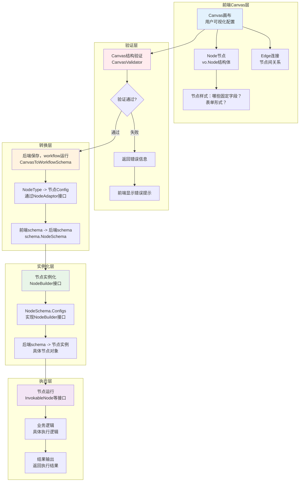

### 1.1 画布和后端结构

前端的画布采用DSL (JSON) 形式存储，每次更新画布都是将DSL传给后端。DSL的后端结构如下所示，主要包含节点 (node)、 边 (edge)、 版本

```go
type Canvas struct {
	Nodes    []*Node `json:"nodes"`
	Edges    []*Edge `json:"edges"`
	Versions any     `json:"versions"`
}
```

#### 1.1.1 节点数据

画布中的节点会转换为后端中 `backend/domain/workflow/entity/vo/canvas.go` 中的 Node 结构体， 后端存储的结构体如下

```go
// Node 工作流节点的完整定义
// 节点是工作流的基本执行单元，每个节点代表一个特定的功能或操作
type Node struct {
    // 节点的唯一标识符，用于在画布中定位和引用节点
	ID      string    `json:"id"` 
    // 节点类型，决定节点的功能和行为（如LLM、API调用、条件判断等）
	Type    BlockType `json:"type"`
    // 节点的元数据信息，包含前端显示相关的配置 (前端的一些extendInfo)
	Meta    any       `json:"meta"`
    // 节点的核心数据，包含输入输出配置和具体参数，例如LLM的配置、MCP的配置、异常处理
	Data    *Data     `json:"data"`
    // 子节点列表，用于复合节点（如循环、条件分支）的嵌套结构
	Blocks  []*Node   `json:"blocks,omitempty"`
    // 节点内部的连线，用于复杂节点的内部逻辑连接
	Edges   []*Edge   `json:"edges,omitempty"`
    // 节点的版本号，用于节点定义的版本控制
	Version string    `json:"version,omitempty"` 
    // 父节点引用，不序列化到JSON，用于内存中的树形结构导航
	parent *Node 
}
```

节点的核心数据`Data`如下所示

```go
type Data struct {
    // 节点的显示元数据，如标题、icon等
	Meta    *NodeMeta `json:"nodeMeta,omitempty"`
    // 节点的输出定义，可以是 []*Variable 或 []*Param 类型
	Outputs []any     `json:"outputs,omitempty"`
    // 节点的输入配置，包含所有输入参数和设置
	Inputs  *Inputs   `json:"inputs,omitempty"`
    // 节点在画布上的尺寸信息，用于前端显示
	Size    any       `json:"size,omitempty"`     
}

```

节点的输入参数 `inputs`

```go
// Inputs 节点输入配置的综合结构
// 这是一个联合结构，包含了所有可能的节点输入配置，不同类型的节点使用不同的字段子集
type Inputs struct {
	// 通用输入配置
	InputParameters    []*Param        `json:"inputParameters"`              // 节点的输入参数列表，定义节点需要的数据输入
	Content            *BlockInput     `json:"content"`                      // 节点的主要内容输入，通常用于文本处理或提示词
	TerminatePlan      *TerminatePlan  `json:"terminatePlan,omitempty"`      // 终止计划，定义节点完成后的行为
	StreamingOutput    bool            `json:"streamingOutput,omitempty"`    // 是否启用流式输出，用于实时返回处理结果
	CallTransferVoice  bool            `json:"callTransferVoice,omitempty"`  // 语音通话转接设置，用于语音相关节点
	ChatHistoryWriting string          `json:"chatHistoryWriting,omitempty"` // 聊天历史记录写入配置
	LLMParam           any             `json:"llmParam,omitempty"`           // LLM参数，可能是LLMParam、IntentDetectorLLMParam或QALLMParam类型
	FCParam            *FCParam        `json:"fcParam,omitempty"`            // 功能调用参数，用于配置工作流、插件或知识库的调用
	SettingOnError     *SettingOnError `json:"settingOnError,omitempty"`     // 错误处理配置，定义节点出错时的处理策略

	// 循环控制相关
	LoopType           LoopType    `json:"loopType,omitempty"`           // 循环类型：数组循环、计数循环或无限循环
	LoopCount          *BlockInput `json:"loopCount,omitempty"`          // 循环次数，用于计数循环
	VariableParameters []*Param    `json:"variableParameters,omitempty"` // 循环变量参数

	// 条件分支相关
	Branches []*struct {
		Condition struct {
			Logic      LogicType    `json:"logic"`      // 条件逻辑：AND或OR
			Conditions []*Condition `json:"conditions"` // 具体的条件列表
		} `json:"condition"`
	} `json:"branches,omitempty"` // 分支条件配置，用于条件判断节点

	// 批处理配置
	NodeBatchInfo *NodeBatch `json:"batch,omitempty"` // 节点批处理模式配置

	// 特定节点类型的配置（使用嵌入结构体实现类型多态）
	*TextProcessor      // 文本处理器配置：拼接、分割等操作
	*SubWorkflow        // 子工作流配置：调用其他工作流
	*IntentDetector     // 意图检测配置：识别用户意图
	*DatabaseNode       // 数据库操作配置：增删改查
	*HttpRequestNode    // HTTP请求配置：API调用
	*KnowledgeIndexer   // 知识库索引配置：文档处理和索引
	*CodeRunner         // 代码执行器配置：运行自定义代码
	*PluginAPIParam     // 插件API参数配置
	*VariableAggregator // 变量聚合器配置：合并多个变量
	*VariableAssigner   // 变量赋值器配置：设置变量值
	*QA                 // 问答节点配置：处理问题和答案
	*Batch              // 批处理配置：批量处理数据
	*Comment            // 注释节点配置：添加说明文字

	OutputSchema string `json:"outputSchema,omitempty"` // 输出模式定义，描述节点输出数据的结构
}
```

#### 1.1.2 边数据

边主要是包含输入节点、输出节点的ID，还有输入的端口和输出的端口 （输入输出端口都是只存在于`业务逻辑节点`中）

```go
// Edge 工作流连线定义
// 连线定义了节点之间的连接关系，确定工作流的执行顺序和数据流向
type Edge struct {
    // 源节点ID，连线的起始节点
	SourceNodeID string `json:"sourceNodeID"` 
    // 目标节点ID，连线的终止节点
	TargetNodeID string `json:"targetNodeID"`
    // 源端口ID，用于多输出端口的节点，指定具体的输出端口
	SourcePortID string `json:"sourcePortID,omitempty"`
    // 目标端口ID，用于多输入端口的节点，指定具体的输入端口
	TargetPortID string `json:"targetPortID,omitempty"` 
}

```

#### 1.1.3 大语言模型节点 (NoteTypeLLM)

##### LLM节点类图如下图所示

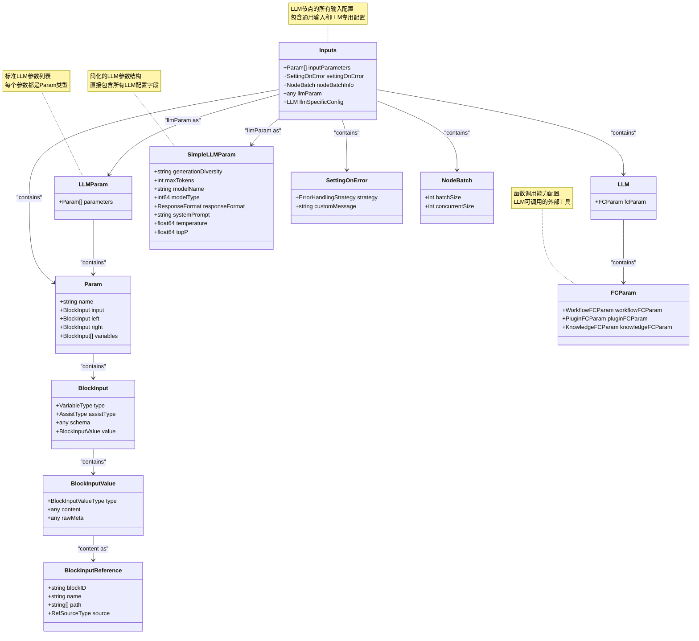

##### LLM参数 - `SimpleLLMParam`

`SimpleLLMParam`如下所示，主要包含多样性程度、最大Token、模型名称、模型类型、响应格式、系统提示词、`Temperature`温度、`TopP` 核采样参数

【注意】`generationDiversity`多样性程度 是高层的预设策略（如"创意/平衡/精确"模式），而 `temperature`和 `topP`是底层的具体算法参数，前者通过内置的参数组合来简化配置，后者则提供精确的随机性控制（temperature调节概率分布平滑度，topP限制候选词汇范围）。

简单说：generationDiversity = "我要什么风格"，temperature = "要多随机"，topP = "考虑多少词汇"。

```go
// SimpleLLMParam 简化的大语言模型参数配置
// 提供直接的字段映射方式配置LLM参数，适用于简单的模型调用场景
type SimpleLLMParam struct {
	// GenerationDiversity 生成多样性配置
	// 控制模型输出的多样性程度，影响生成内容的创新性
	GenerationDiversity string `json:"generationDiversity"`
	// MaxTokens 最大生成令牌数
	// 限制模型单次生成的最大token数量，控制输出长度
	MaxTokens int `json:"maxTokens"`
	// ModelName 模型名称
	// 指定要使用的具体模型名称，如gpt-3.5-turbo、gpt-4等
	ModelName string `json:"modelName"`
	// ModelType 模型类型标识
	// 用于区分不同类型的模型，如聊天模型、补全模型等
	ModelType int64 `json:"modelType"`
	// ResponseFormat 响应格式配置
	// 指定模型输出的格式，支持文本、JSON、Markdown等格式
	ResponseFormat model.ResponseFormat `json:"responseFormat"`
	// SystemPrompt 系统提示词
	// 定义模型的系统级指令，设定模型的角色和行为规范
	SystemPrompt string `json:"systemPrompt"`
	// Temperature 温度参数
	// 控制模型输出的随机性，范围通常为0.0-1.0，值越高输出越随机
	// 通过调整softmax概率分布的平滑度来影响词汇选择的确定性
	Temperature float64 `json:"temperature"`
	// TopP 核采样参数
	// 控制模型生成时考虑的词汇概率质量，影响输出的多样性和质量
	// 通过设置概率累积阈值来限制候选词汇的范围，范围通常为0.0-1.0
	TopP float64 `json:"topP"`
}
```

##### LLM中的函数调用参数 `**FcParam**`

functionCalling （大语言模型节点的“技能”）中需要用到的参数

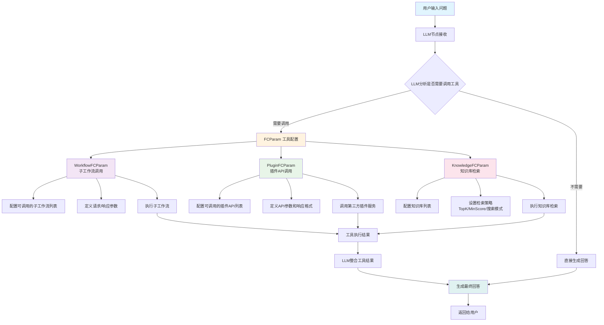

函数调用参数 `FcParam`主要包含三种模式：子工作流调用、插件API调用、知识库检索

```go
// FCParam 函数调用参数配置
// 用于配置工作流中不同类型的函数调用能力，包括子工作流调用、插件API调用和知识库检索调用
type FCParam struct {
	// WorkflowFCParam 工作流函数调用参数配置
	// 配置当前工作流可以调用的子工作流列表及其参数设置
	WorkflowFCParam *struct {
		// WorkflowList 可调用的工作流列表
		// 每个工作流项包含工作流标识、版本信息和函数调用设置
		WorkflowList []struct {
			// WorkflowID 工作流唯一标识符
			WorkflowID string `json:"workflow_id"`
			// WorkflowVersion 工作流版本号
			WorkflowVersion string `json:"workflow_version"`
			// PluginID 关联的插件ID（如果工作流基于插件）
			PluginID string `json:"plugin_id"`
			// PluginVersion 插件版本号
			PluginVersion string `json:"plugin_version"`
			// IsDraft 是否为草稿版本
			IsDraft bool `json:"is_draft"`
			// FCSetting 函数调用设置
			// 定义调用该工作流时的请求和响应参数结构
			FCSetting *struct {
				// RequestParameters 请求参数列表
				// 定义调用工作流时需要传入的参数
				RequestParameters []*workflow.APIParameter `json:"request_params"`
				// ResponseParameters 响应参数列表
				// 定义工作流执行完成后返回的参数
				ResponseParameters []*workflow.APIParameter `json:"response_params"`
			} `json:"fc_setting,omitempty"`
		} `json:"workflowList,omitempty"`
	} `json:"workflowFCParam,omitempty"`

	// PluginFCParam 插件函数调用参数配置
	// 配置当前工作流可以调用的插件API列表及其参数设置
	PluginFCParam *struct {
		// PluginList 可调用的插件列表
		// 每个插件项包含插件标识、API信息和函数调用设置
		PluginList []struct {
			// PluginID 插件唯一标识符
			PluginID string `json:"plugin_id"`
			// ApiId API接口唯一标识符
			ApiId string `json:"api_id"`
			// ApiName API接口名称
			ApiName string `json:"api_name"`
			// PluginVersion 插件版本号
			PluginVersion string `json:"plugin_version"`
			// IsDraft 是否为草稿版本
			IsDraft bool `json:"is_draft"`
			// FCSetting 函数调用设置
			// 定义调用该插件API时的请求和响应参数结构
			FCSetting *struct {
				// RequestParameters 请求参数列表
				// 定义调用插件API时需要传入的参数
				RequestParameters []*workflow.APIParameter `json:"request_params"`
				// ResponseParameters 响应参数列表
				// 定义插件API执行完成后返回的参数
				ResponseParameters []*workflow.APIParameter `json:"response_params"`
			} `json:"fc_setting,omitempty"`
		}
	} `json:"pluginFCParam,omitempty"`

	// KnowledgeFCParam 知识库函数调用参数配置
	// 配置当前工作流的知识库检索功能及其全局设置
	KnowledgeFCParam *struct {
		// GlobalSetting 知识库检索全局设置
		// 定义知识库检索的通用配置参数
		GlobalSetting *struct {
			// SearchMode 搜索模式
			// 定义知识库检索使用的搜索算法模式
			SearchMode int64 `json:"search_mode"`
			// TopK 返回结果数量
			// 定义知识库检索返回的最大结果数量
			TopK int64 `json:"top_k"`
			// MinScore 最小相似度分数
			// 定义知识库检索结果的最小相似度阈值
			MinScore float64 `json:"min_score"`
			// UseNL2SQL 是否启用自然语言转SQL功能
			UseNL2SQL bool `json:"use_nl2_sql"`
			// UseRewrite 是否启用查询重写功能
			UseRewrite bool `json:"use_rewrite"`
			// UseRerank 是否启用结果重排序功能
			UseRerank bool `json:"use_rerank"`
			// NoRecallReplyCustomizePrompt 无召回结果时的自定义回复提示词
			NoRecallReplyCustomizePrompt string `json:"no_recall_reply_customize_prompt"`
			// NoRecallReplyMode 无召回结果时的回复模式
			NoRecallReplyMode int64 `json:"no_recall_reply_mode"`
		} `json:"global_setting,omitempty"`
		// KnowledgeList 可检索的知识库列表
		// 定义当前工作流可以检索的知识库集合
		KnowledgeList []*struct {
			// ID 知识库唯一标识符
			ID string `json:"id"`
		} `json:"knowledgeList,omitempty"`
	} `json:"knowledgeFCParam,omitempty"`
}
```

1.  子工作流调用
    

```json
{
  "workflowFCParam": {
    "workflowList": [
      {
        "workflow_id": "7509120431183544356",
        "workflow_version": "v0.0.1", 
        "plugin_id": "7509121334769795126",
        "is_draft": false,
        "fc_setting": {
          "request_params": [...],  // 调用参数
          "response_params": [...]  // 返回参数
        }
      }
    ]
  }
}
```

2.  插件API调用
    

```json
{
  "pluginFCParam": {
    "pluginList": [
      {
        "plugin_id": "7509353177339133952",
        "api_id": "7509353598782816256", 
        "api_name": "周公解梦",
        "plugin_version": "0",
        "fc_setting": {
          "request_params": [
            {
              "name": "title",
              "desc": "查询解梦标题，例如：梦见蛇",
              "type": 1,
              "is_required": true
            }
          ],
          "response_params": [...]
        }
      }
    ]
  }
}
```

3.  知识库检索
    

```json
{
  "knowledgeFCParam": {
    "knowledgeList": [
      {
        "id": "7512369185624686592",
        "name": "旅游景点"
      }
    ],
    "global_setting": {
      "top_k": 3, // 
      "min_score": 0.5,
      "search_mode": 0,
      "use_rerank": true,
      "use_rewrite": true,
      "use_nl2_sql": true,
      "no_recall_reply_mode": 0,
      "no_recall_reply_customize_prompt": "抱歉，您的问题超出了我的知识范围"
    }
  }

```

#### 1.1.4 BlockInput结构

`BlockInput`是工作流系统中的数据绑定核心，它解决了一个关键问题：如何在工作流节点之间传递和配置数据。`BlockInput = "这个输入框里放什么数据，从哪里来"`

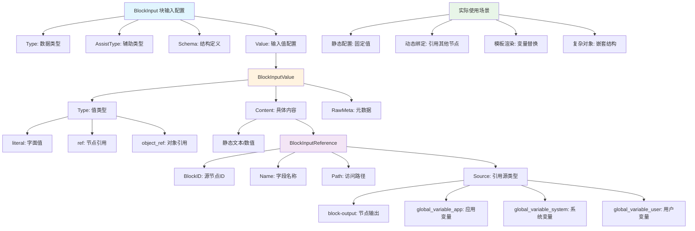

`BlockInput`结构如下所示

```go
type BlockInput struct {
    Type       VariableType     // 数据类型：string、number、object等
    AssistType AssistType       // 辅助类型：更具体的类型描述
    Schema     any              // 结构定义：复杂对象的内部结构
    Value      *BlockInputValue // 值配置：具体的数据来源
}
```

三种数据流来源：常量`literal`、节点引用`ref`、对象引用 `Object Ref`

1.  常量`literal`
    

```go
{
  "type": "string",
  "value": {
    "type": "literal",
    "content": "Hello World",
    "rawMeta": {"type": 1}
  }
}
```

2.  节点引用`ref` (最常用的)
    

```go
{
  "type": "string", 
  "value": {
    "type": "ref",
    "content": {
      "blockID": "100001",
      "name": "output",
      "source": "block-output"
    }
  }
}
```

3.   对象引用


```go
{
  "type": "object",
  "schema": [{"name": "name", "type": "string"}],
  "value": {
    "type": "object_ref",
    "content": {
      "blockID": "100001", 
      "name": "person",
      "source": "block-output"
    }
  }
}
```

#### 1.1.5 知识库节点 (RAG)

##### RAG完整流程图

一个完整的RAG流程如下：

查询重写优化 （小模型）-> 自然语言转SQL （NL2SQL）-> 向量检索 (语义搜索/混合搜索/全量搜索) -> 相似度过滤 (最小相似度阈值) -> 结果重排序 (Rerank) -> TopK结果截取 -> 构建新的上下文提示词

```mermaid
graph LR
    A[用户输入查询] --> B[查询预处理]
    
    B --> B1[UseRewrite: 查询重写]
    B1 --> B2[优化查询语义]
    B2 --> B3[UseNL2SQL: 自然语言转SQL]
    
    B3 --> C[向量检索阶段]
    C --> C1[文档向量化]
    C --> C2[查询向量化] 
    C1 --> C3[向量相似度计算]
    C2 --> C3
    
    C3 --> D[SearchMode: 搜索策略]
    D --> D1[0: 语义搜索<br/>Semantic Search]
    D --> D2[1: 混合搜索<br/>Hybrid Search]
    D --> D3[20: 全文搜索<br/>Full-text Search]
    
    D1 --> E[初步结果筛选]
    D2 --> E
    D3 --> E
    
    E --> E1[MinScore: 相似度过滤]
    E1 --> E2[过滤低质量结果]
    
    E2 --> F[UseRerank: 结果重排序]
    F --> F1[深度语义匹配]
    F1 --> F2[重新排序结果]
    
    F2 --> G[TopK: 结果截取]
    G --> G1[选择前K个最佳结果]
    
    G1 --> H{是否有合适结果?}
    H -->|有| I[构建增强上下文]
    H -->|无| J[NoRecallReplyMode处理]
    
    J --> J1[0: 使用自定义提示词]
    J --> J2[1: 其他处理模式]
    J1 --> K[返回无结果回复]
    J2 --> K
    
    I --> L[RAG生成阶段]
    L --> L1[组合查询+检索内容]
    L1 --> L2[LLM生成增强回答]
    
    L2 --> M[返回最终答案]
    K --> M
    
    style A fill:#e1f5fe
    style B fill:#fff3e0
    style C fill:#f3e5f5
    style D fill:#e8f5e8
    style F fill:#fce4ec
    style L fill:#e0f2f1
```

##### 向量检索规则

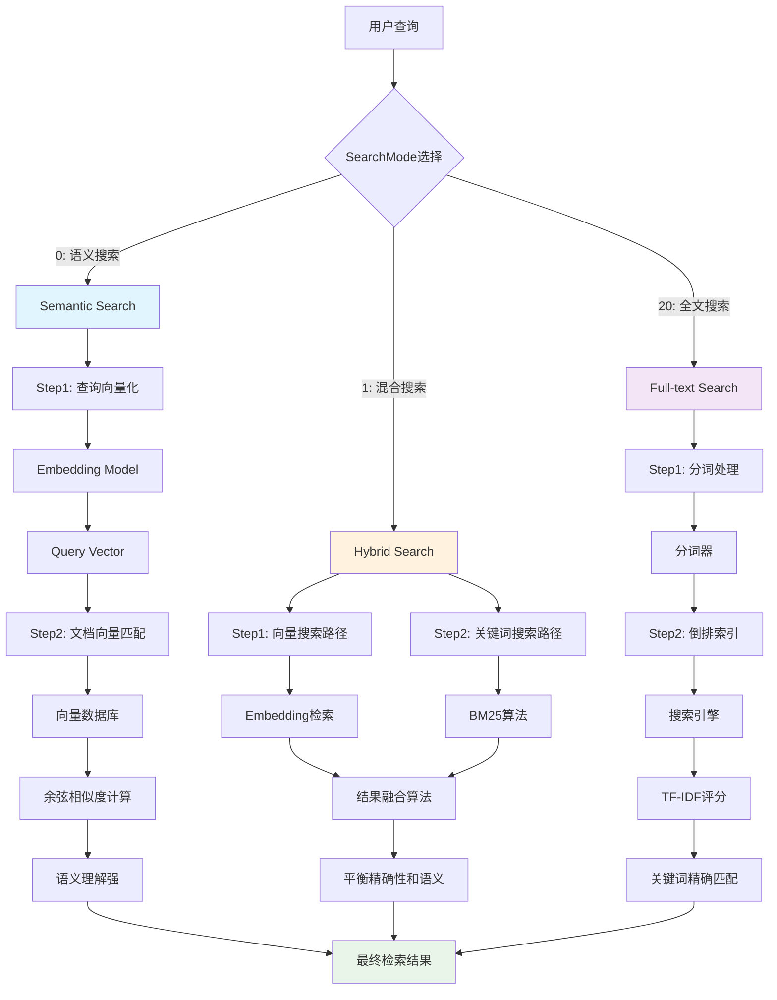

1.  语义搜索 （准）: 使用 Embedding 模型计算向量相似度，理解深层语义，处理同义词和概念匹配。
    
2.  混合搜索 （全面）: 结合向量搜索 + BM25 关键词搜索，平衡语义理解和精确匹配。
    
3.  全文搜索 （快）: 传统的倒排索引和TF-IDF，精确的关键词匹配，速度快
    

【算法说明】

*   Embedding向量检索：将文本通过编码器转为向量和DB中的向量计算cos相似度最后返回TopK的结果
    

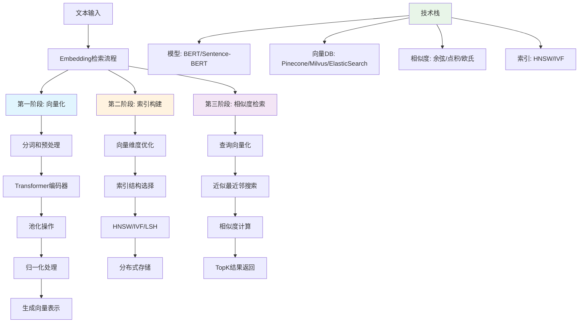

*   倒排索引：将文档切分成独立的词汇单元，建立从词汇到文档的映射索引
    
*   TF-IDF (词频-逆文档频率)：TF（词频）： 计算一个词在文档中出现的词次数， 用于衡量词汇的重要性。IDF （逆文档频率）：衡量词汇在整个语料库中的重要性。 
    

```python
TF(t,d) = 词汇t在文档d中出现的次数 / 文档d的总词数
IDF(t) = log(文档总数 / 包含词汇t的文档数)
TF-IDF = sigmoid (TF(t,d) * IDF(t))
```

缺点：不能考虑词汇的位置，忽略了词汇的相关性；不利于稀疏性 （短文档很多词汇 `TF-IDF=0`）

*   BM25 算法：在 `TF-IDF` (词频-逆文档频率) 基础上，解决了词频饱和问题和文档长度归一化问题。
    

##### ReRank 规则

Rerank就是根据多个检索方式得到的结果进行整合，然后根据RRF算法重新排序的过程

```python
RRF: score = 1/(rank + k) # 默认 k = 60 
```

rerank模型的时序图

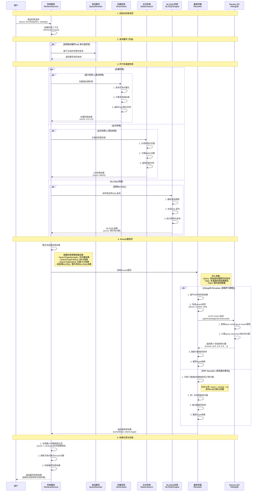

##### 知识库节点结构

```go
// Knowledge 知识库节点配置
// 用于配置独立的知识库检索节点，定义数据源参数和处理策略
// 与LLM节点中的KnowledgeFCParam不同，这是专门的知识库检索步骤
type Knowledge struct {
	// DatasetParam 数据集参数配置
	// 定义知识库的数据源配置，包括数据库连接、文件路径等信息
	// 每个Param包含具体的数据源配置项
	DatasetParam []*Param `json:"datasetParam,omitempty"`
	// StrategyParam 知识库处理策略参数
	// 定义文档解析、分块、索引等各个环节的处理策略和参数
	StrategyParam StrategyParam `json:"strategyParam,omitempty"`
}

// StrategyParam 知识库处理策略参数配置
// 定义知识库从文档解析到向量索引的完整处理流程策略
type StrategyParam struct {
	// ParsingStrategy 文档解析策略配置
	// 定义如何解析和提取不同类型文档的内容
	ParsingStrategy struct {
		// ParsingType 解析类型
		// 定义文档解析的方式，如自动识别、手动指定等
		// 常见值：auto（自动识别）、manual（手动指定）、custom（自定义）
		ParsingType string `json:"parsingType,omitempty"`
		// ImageExtraction 是否提取图片
		// 控制是否从文档中提取图片内容进行处理
		// true表示提取图片，false表示忽略图片内容
		ImageExtraction bool `json:"imageExtraction"`
		// TableExtraction 是否提取表格
		// 控制是否从文档中提取表格结构和数据
		// true表示解析表格结构，false表示将表格视为普通文本
		TableExtraction bool `json:"tableExtraction"`
		// ImageOcr 是否启用图片OCR识别
		// 控制是否对提取的图片进行光学字符识别
		// true表示对图片进行OCR文字识别，false表示忽略图片中的文字
		ImageOcr bool `json:"imageOcr"`
	} `json:"parsingStrategy,omitempty"`
	// ChunkStrategy 文档分块策略配置
	// 定义如何将长文档切分成适合向量化的小块
	ChunkStrategy struct {
		// ChunkType 分块类型
		// 定义文档分块的策略类型
		// 常见值：fixed（固定长度）、semantic（语义分块）、sentence（句子分块）
		ChunkType string `json:"chunkType,omitempty"`
		// SeparatorType 分隔符类型
		// 定义用于分块的分隔符类型
		// 常见值：auto（自动选择）、newline（换行符）、paragraph（段落）、custom（自定义）
		SeparatorType string `json:"separatorType,omitempty"`
		// Separator 自定义分隔符
		// 当SeparatorType为custom时，指定具体的分隔符字符串
		Separator string `json:"separator,omitempty"`
		// MaxToken 最大令牌数
		// 定义每个文档块的最大token数量，控制块的大小
		// 通常设置为模型的上下文窗口大小，如512、1024等
		MaxToken int64 `json:"maxToken,omitempty"`
		// Overlap 重叠比例
		// 定义相邻文档块之间的重叠比例，避免语义信息在边界处丢失
		// 取值范围0.0-1.0，常见值为0.1-0.2（10%-20%重叠）
		Overlap float64 `json:"overlap,omitempty"`
	} `json:"chunkStrategy,omitempty"`
	// IndexStrategy 索引策略配置
	// 定义向量索引的构建策略，如索引类型、参数等
	// 具体结构依赖于使用的向量数据库类型（如HNSW、IVF等）
	IndexStrategy any `json:"indexStrategy"`
}
```

#### 1.1.6 交互节点

> 交互节点就是需要让用户做出反馈的节点

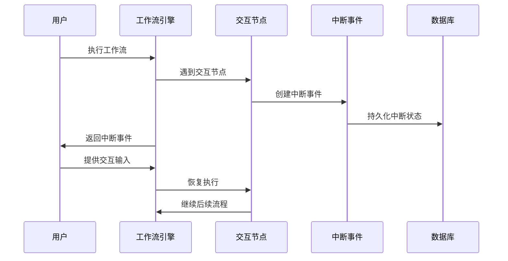

### 1.2 如何从画布转换为后端类？如何转换为执行态？

前端传入画布的 DSL语言（JSON）给后端之后，会解析为上方的后端结构。画布中的每个节点都会变成 `canvas.go`中的 `Node`结构体。但是转换后的 `Node`结构体只是一个存储态，如果需要执行工作流还需要将 `Node`结构体从存储态转为运行态。后端 schema 的 `NodeSchema`结构体就是 针对用于表达工作流的运行态的

#### 1.2.1 转换流程图

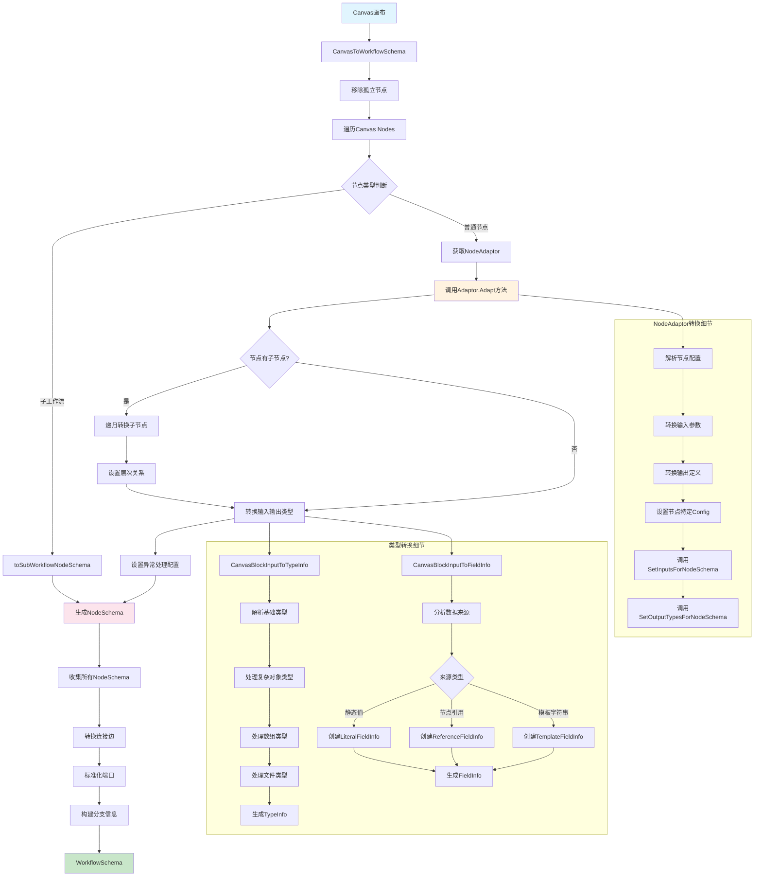

#### 1.2.2 转换后的NodeSchema结构

```go
// NodeSchema 工作流节点的统一描述和配置结构
// 包含实例化一个节点所需的所有信息，是Canvas Node转换后的后端执行结构
type NodeSchema struct {
	// Key 节点在Eino图中的唯一标识符
	// 节点在执行过程中可能需要这个信息，例如：
	// - 使用此Key查询工作流状态中属于当前节点的数据
	Key vo.NodeKey `json:"key"`

	// Name 节点在Canvas画布上指定的显示名称
	// 节点可能会在Canvas上显示这个名称作为输入/输出的一部分
	Name string `json:"name"`

	// Type 节点的类型标识
	// 对应entity.NodeType枚举，决定节点的具体行为和功能
	Type entity.NodeType `json:"type"`

	// Configs 节点特定的配置信息
	// 每个节点类型定义自己的配置结构体，不包含字段映射或静态值信息
	// 这些配置是节点实现的内部配置，与工作流编排无关
	// 实际类型应该实现两个接口：
	// - NodeAdaptor: 提供从vo.Node到NodeSchema的转换
	// - NodeBuilder: 提供从NodeSchema到实际节点实例的实例化
	Configs any `json:"configs,omitempty"`

	// InputTypes 节点输入字段的类型信息映射
	// 键为字段名，值为对应的类型信息，用于类型检查和验证
	InputTypes map[string]*vo.TypeInfo `json:"input_types,omitempty"`
	// InputSources 节点输入字段的映射信息
	// 定义每个输入字段的数据来源，如来自其他节点的输出或静态值
	InputSources []*vo.FieldInfo `json:"input_sources,omitempty"`

	// OutputTypes 节点输出字段的类型信息映射
	// 键为字段名，值为对应的类型信息，用于下游节点的类型推导
	OutputTypes map[string]*vo.TypeInfo `json:"output_types,omitempty"`
	// OutputSources 节点输出字段的映射信息
	// 注意：仅适用于复合节点，如NodeTypeBatch或NodeTypeLoop
	OutputSources []*vo.FieldInfo `json:"output_sources,omitempty"`

	// ExceptionConfigs 节点的异常处理策略配置
	// 包含超时、重试、错误处理类型等异常处理相关设置
	ExceptionConfigs *ExceptionConfig `json:"exception_configs,omitempty"`
	// StreamConfigs 节点的流式处理特性配置
	// 定义节点是否支持流式输入/输出等流处理能力
	StreamConfigs *StreamConfig `json:"stream_configs,omitempty"`

	// SubWorkflowBasic 子工作流的基本信息
	// 仅当节点类型为NodeTypeSubWorkflow时使用
	SubWorkflowBasic *entity.WorkflowBasic `json:"sub_workflow_basic,omitempty"`
	// SubWorkflowSchema 子工作流的完整Schema信息
	// 仅当节点类型为NodeTypeSubWorkflow时使用，包含子工作流的完整定义
	SubWorkflowSchema *WorkflowSchema `json:"sub_workflow_schema,omitempty"`

	// FullSources 节点输入字段映射来源的完整信息
	// 包含更详细的信息，如字段是否为流式字段，或字段是否为包含子字段映射的对象
	// 用于需要处理流式输入的节点
	// 在NodeMeta中设置InputSourceAware = true来启用此功能
	FullSources map[string]*SourceInfo

	// Lambda 直接设置节点为Eino Lambda
	// 注意：不可序列化，仅用于内部测试
	Lambda *compose.Lambda
}
```

#### 1.2.3 转换结构前后对比

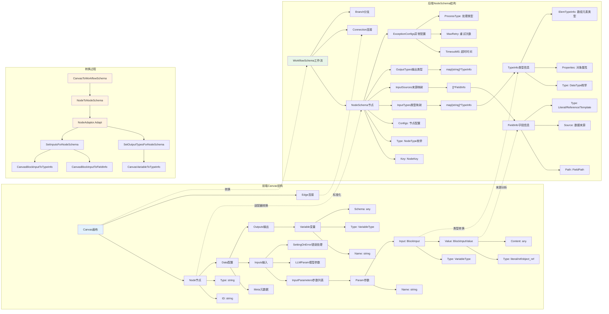

【转换过程】

`canvas`到 `NodeSchema`的转换过程是Coze Studio工作流系统中的核心架构设计，它通过适配器模式将前端面向用户的可视化画布结构转换为后端面向执行的标准化 `Schema`结构。在这个过程中，前端的 `Canvas`包含了用户在画布上拖拽配置的 `Node`节点和 `Edge`连接，每个`Node`节点包含字符串类型的`ID`和`Type`、用户配置的`Data`数据（包括输入参数、输出定义、元数据等），这些数据以灵活的 \`any \`类型和嵌套结构存储以适应前端的动态配置需求；而转换后的`NodeSchema`则采用强类型的结构化设计，将**节点类型**转换为**枚举**、将**输入输出**转换为 `TypeInfo`和`FieldInfo`的映射关系、将**数据来源分析**为**具体的引用路径**，并添加了执行时需要的 **异常处理配置**、**流式处理配置**等运行时信息。这个转换过程之所以必要，是因为前端Canvas需要保持高度的灵活性和可扩展性来支持用户的各种配置操作和UI交互，而后端执行引擎则需要严格的类型安全、明确的数据流向和优化的执行性能，两者的设计目标和约束条件完全不同，因此需要通过这个转换层来实现前后端的解耦，同时确保用户在画布上的每一个配置都能准确无误地转换为可执行的工作流逻辑，并且这种转换过程还支持复杂的节点类型（如子工作流、批处理节点）、数据类型推导、字段映射分析等高级特性，为整个工作流系统的稳定运行和功能扩展提供了坚实的基础。

### 1.3 工作流执行过程分析

##### 工作流执行图 (细节)

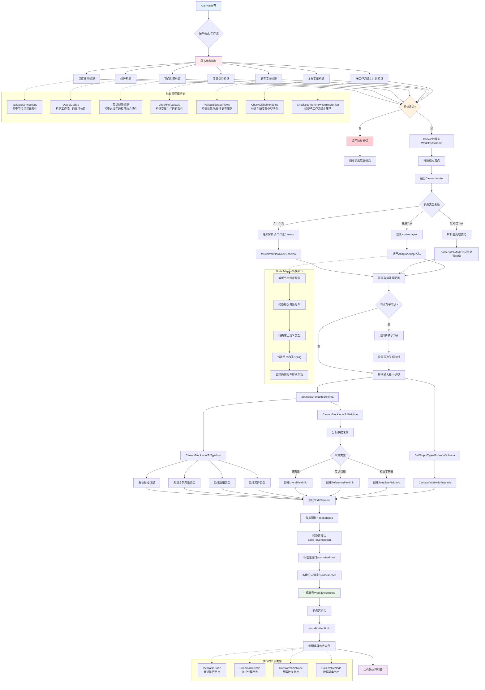

*   **前端交互层**：前端 `Canvas`层是用户交互的起点，`Canvas`画布承载着用户的可视化配置，其中包含 `Node`（以`vo.Node`结构体表示）和`Edge`连接关系，这里的关键问题是"节点样式：哪些固定字段？表单形式？"，实际上每个节点都有标准化的元数据定义（如节点类型、显示名称、图标等固定字段）和动态的配置表单（根据节点类型展示不同的参数配置界面），前端`schema`采用灵活的JSON结构来适应各种节点类型的配置需求。
    
*   **验证层**：验证层通过`CanvasValidator`对画布结构进行全面检查，包括节点连接完整性、循环依赖检测、配置合法性验证等多个维度，确保只有结构正确的工作流才能进入后续的转换和执行阶段，如果验证失败，系统会返回具体的错误信息给前端，帮助用户快速定位和修正问题。
    
*   **转换层**：转换层是整个架构的核心枢纽，负责"后端保存，workflow运行"的关键转换过程，通过`CanvasToWorkflowSchema`函数协调整个转换流程，其中最重要的是`NodeType`到节点`Config`的转换，这通过`NodeAdaptor`接口实现，每个节点类型都有对应的适配器负责将前端的灵活配置转换为后端的强类型`NodeSchema`结构，实现了"前端schema -> 后端schema"的标准化转换。
    
*   **节点实例化层**：实例化层通过`NodeBuilder`接口将抽象的`NodeSchema`转换为具体的可执行节点实例，这里的关键是`NodeSchema.Configs`字段必须实现`NodeBuilder`接口，从而能够根据配置信息创建实际的节点对象，实现了"后端schema -> 节点实例"的最终转换，为执行层提供了统一的节点实例接口。
    
*   **执行层**：执行层是整个流程的最终目标，节点实例通过实现`InvokableNode`等执行接口来提供具体的业务逻辑处理能力，工作流引擎负责按照既定的执行顺序调度各个节点，处理数据流转和状态管理，最终产生业务执行结果并返回给用户。
    

## 工作流校验

### 2.1 工作流验证流程

#### 2.1.1 核心验证流程

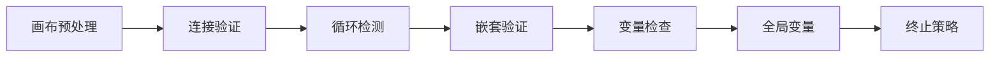

#### 2.1.2 完整验证流程

```mermaid
%% 点击 “绘图” 按钮即可预览
graph LR
    A["1. 画布预处理<br/>• JSON反序列化<br/>• 清理孤立节点<br/>• 创建验证器实例"] --> H["2. 连接关系验证<br/>ValidateConnections"]
    H --> H1["• 检查节点连接完整性<br/>• 验证端口连接正确性<br/>• 检查分支节点完整性"]
    H1 --> I{发现问题?}
    I -->|是| Z["返回验证错误"]
    I -->|否| J["3. 循环依赖检测<br/>DetectCycles"]
    
    J --> J1["• 构建依赖关系图<br/>• DFS算法检测环<br/>• 标识循环路径"]
    J1 --> K{发现循环?}
    K -->|是| Z
    K -->|否| L["4. 嵌套流程验证<br/>ValidateNestedFlows"]
    
    L --> L1["• 检查批处理节点嵌套<br/>• 验证循环节点嵌套<br/>• 防止过深嵌套"]
    L1 --> M{嵌套违规?}
    M -->|是| Z
    M -->|否| N["5. 引用变量检查<br/>CheckRefVariable"]
    
    N --> N1["• 验证变量可达性<br/>• 检查参数名规范<br/>• 验证作用域正确性"]
    N1 --> O{变量引用错误?}
    O -->|是| Z
    O -->|否| P["6. 全局变量验证<br/>CheckGlobalVariables"]
    
    P --> P1["• 验证变量类型匹配<br/>• 检查数组元素类型<br/>• 验证变量声明"]
    P1 --> Q{全局变量错误?}
    Q -->|是| Z
    Q -->|否| R["7. 子工作流终止策略<br/>CheckSubWorkFlowTerminatePlanType"]
    
    R --> R1["• 验证终止计划配置<br/>• 检查版本一致性<br/>• 验证子工作流存在性"]
    R1 --> S{终止策略错误?}
    S -->|是| Z
    S -->|否| T["主工作流验证完成"]
    
    T --> U["子工作流递归验证"]
    U --> U1["• 解析画布获取子工作流<br/>• 筛选项目级工作流<br/>• 批量获取工作流信息"]
    U1 --> U2["对每个子工作流<br/>重复验证流程"]
    U2 --> V["汇总所有验证结果"]
    
    V --> W["错误信息转换<br/>• Issue -> ValidateErrorData<br/>• 节点错误/路径错误分类"]
    W --> X["返回验证结果<br/>ValidateTreeResponse"]
    
    style A fill:#e1f5fe
    style H fill:#e8f5e8
    style J fill:#e8f5e8
    style L fill:#e8f5e8
    style N fill:#e8f5e8
    style P fill:#e8f5e8
    style R fill:#e8f5e8
    style U fill:#fff8e1
    style Z fill:#ffebee
```

#### 2.1.3 工作流验证流程技术实现总结

Coze Studio 的工作流验证采用**分层递进式验证架构**，从 API 层的 `ValidateTree` 接口开始，经过应用服务层的参数预处理，最终调用领域服务层的核心验证引擎 `validateWorkflowTree`。验证流程包含七个关键步骤：

**1. 画布预处理阶段** - 首先将 JSON 格式的画布结构反序列化为内存对象，然后调用 `adaptor.PruneIsolatedNodes` 清理没有连接关系的孤立节点，最后创建配置完整的 `CanvasValidator` 验证器实例并执行可达性分析，构建节点间的连通关系图。

**2. 连接关系验证** - `ValidateConnections` 方法通过遍历所有节点和边，构建出度映射表和端口映射表来实现。对于每个节点，检查其输出端口是否正确连接，特别是分支节点（如条件判断、错误处理）必须确保所有期望的端口都有连接。算法会递归验证嵌套节点的连接关系，确保数据流的完整性。

**3. 循环依赖检测** - `DetectCycles` 使用深度优先搜索（DFS）算法实现。首先构建反向依赖关系图（`controlSuccessors`），然后对每个未访问的节点启动 DFS 遍历。在遍历过程中维护当前路径栈，当发现路径中已存在的节点时，即检测到循环依赖，算法会提取并返回完整的循环路径。

**4. 嵌套流程验证** - `ValidateNestedFlows` 通过检查可达性分析结果中的 `nestedReachability` 结构实现。如果一个节点既有嵌套结构，又在其嵌套结构中还有更深层的嵌套（即 `len(nestedReachableNodes.nestedReachability) > 0`），则判定为违反嵌套规则，防止批处理和循环节点的过度嵌套导致执行异常。

**5. 引用变量检查** - `CheckRefVariable` 采用递归作用域分析算法。定义内部函数 `inputBlockVerify` 解析每个输入参数的引用信息，检查引用的节点是否在当前或父级作用域的可达范围内。通过 `combinedReachable` 映射表合并当前层级和父级可达节点，实现作用域继承机制。同时验证参数名称的规范性（必须以字母开头，只能包含字母数字下划线）。

**6. 全局变量验证** - `CheckGlobalVariables` 首先收集所有变量分配节点（`NodeTypeVariableAssigner`）的变量定义，然后通过 `VariablesMetaGetter` 获取应用或智能体的变量元数据进行对比。验证包括基础类型匹配和数组元素类型的深度检查，确保工作流中使用的全局变量与系统定义一致。

**7. 子工作流终止策略验证** - `CheckSubWorkFlowTerminatePlanType` 通过递归收集所有子工作流节点，分别获取草稿版本和已发布版本的画布信息。对每个子工作流，查找其结束节点的终止计划配置，与当前节点的终止类型进行匹配验证，确保子工作流的输出处理策略与调用方期望一致。

整个验证过程采用**快速失败策略**，任何步骤发现问题立即返回错误信息，同时支持**递归子工作流验证**，通过 `getAllSubWorkflowIdentities` 提取所有子工作流标识，对每个子工作流重复执行完整的验证流程，最终汇总所有验证结果，确保整个工作流树的结构完整性、逻辑正确性和执行安全性。

### 2.2 工作流验证算法

#### 2.2.1 连接检测算法

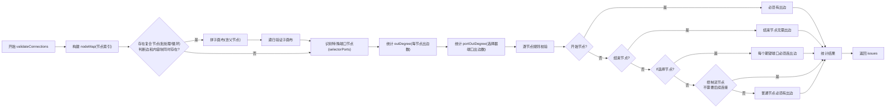
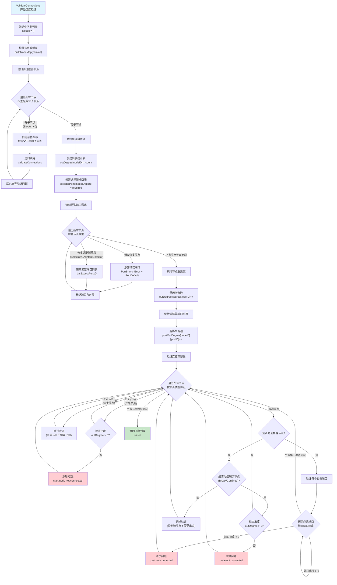

#### 2.2.2 循环依赖检测算法（检查有向图是否有环）

##### 整体检测流程

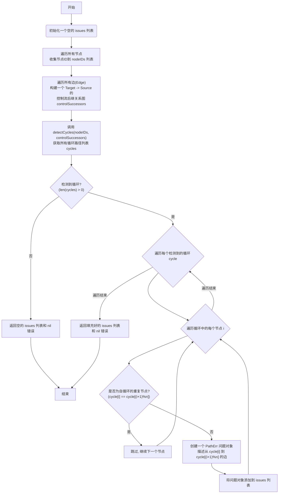

##### 节点循环依赖检测具体流程

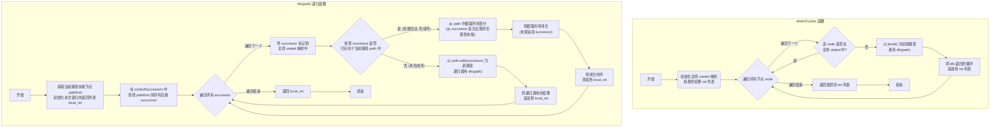

##### 为什么要建立反向依赖？能否直接用正向依赖

*   语义贴近依赖回溯：谁指向我=我的上游，在发现回边(Back Edge)时更直观地“截取路径形成闭环”。
    
*   全局去重更自然：一旦在 DFS 中触达某节点，就标记 visited\[successor\]=true，外层不再从它重复起根，减少重复遍历。
    

##### 为什么需要建立自循环节点不处理？

自循环的部分很容易就看出来了，而且前端是不会放行的自循环的节点的

#### 2.2.3 嵌套节点检测算法

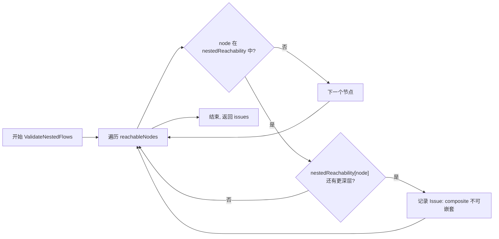

## 工作流执行

### 3.1 工作流执行交互策略

工作流执行可以分为两种：同步策略和异步策略

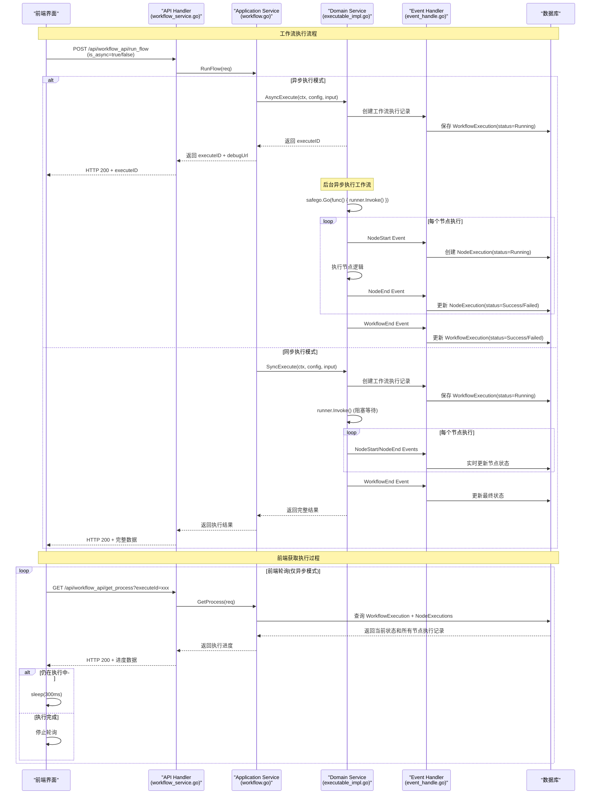

#### 不同策略的使用场景

**同步策略：**

*   **前台任务（TaskType = "foreground"）**：需要立即返回结果的场景
    
*   **简单的工作流执行**：执行时间较短，用户需要等待结果
    
*   **调试模式**：开发者需要立即看到执行结果
    
*   **工具调用**：作为其他系统的工具被调用时
    

**异步策略：**

*   **后台任务（TaskType = "background"）**：长时间运行的工作流
    
*   **批量处理**：需要处理大量数据的场景
    
*   **定时任务**：不需要用户等待的定期执行任务
    
*   **资源密集型工作流**：避免阻塞用户界面
    

### 3.2 工作流执行交互-异步策略

异步策略采用分层存储机制：

*   MySQL：存储结构化的执行记录（状态、元数据、最终结果）
    
*   Redis （流式模式）：存储流式输出的增量数据（临时缓存，有过期时间） 
    

#### 3.2.1 异步策略前端轮询流程

```mermaid
sequenceDiagram
    participant Client as "前端客户端"
    participant API as "API层"
    participant Service as "WorkflowService"
    participant MySQL as "MySQL数据库"
    participant Redis as "Redis缓存"
    participant Executor as "工作流执行器<br/>(异步)"

    Note over Client, Executor: 异步策略：数据存储与前端轮询流程

    Client->>API: POST /async-execute
    API->>Service: AsyncExecute(config, input)
    Service->>MySQL: CreateWorkflowExecution(executeID)
    Service-->>Executor: 启动异步执行
    API-->>Client: 返回executeID

    Note over Executor: 异步执行开始
    Executor->>MySQL: UpdateWorkflowExecution(Running)
    
    loop 节点执行过程
        Executor->>MySQL: CreateNodeExecution()
        
        alt 流式输出节点
            Executor->>Redis: UpdateNodeExecutionStreaming()<br/>存储增量输出
            Note over Redis: key: "wf:node_exec:output:{nodeID}"<br/>过期时间: nodeExecDataExpiry
        else 普通节点
            Executor->>MySQL: UpdateNodeExecution()<br/>存储最终结果
        end
    end
    
    Executor->>MySQL: UpdateWorkflowExecution(Success/Failed)

    Note over Client: 前端轮询机制
    loop 轮询获取状态
        Client->>API: GET /execution/{executeID}
        API->>Service: GetExecution(executeID, includeNodes=true)
        Service->>MySQL: 查询工作流执行状态
        Service->>MySQL: 查询所有节点执行记录
        
        loop 加载节点输出数据
            Service->>Redis: loadNodeExecutionFromRedis()<br/>获取流式输出
            alt Redis中存在数据
                Redis-->>Service: 返回最新输出数据
            else Redis中无数据
                Service->>MySQL: 从数据库获取最终结果
            end
        end
        
        Service-->>API: 完整执行信息(状态+节点数据)
        API-->>Client: 返回执行状态和结果
        
        alt 执行未完成
            Client->>Client: 等待间隔时间
        else 执行完成
            Note over Client: 停止轮询
        end
    end
```

#### 3.2.2 异步如何实现？

```mermaid
sequenceDiagram
    participant Client as "客户端"
    participant API as "API层"
    participant WF as "WorkflowRunner"
    participant EventChan as "事件通道<br/>(chan *Event)"
    participant Handler as "HandleExecuteEvent<br/>(goroutine)"
    participant Repo as "Repository<br/>(数据库)"
    participant Callback as "节点回调<br/>(callback.go)"
    participant SW as "StreamWriter<br/>(可选)"

    Note over Client, SW: 异步工作流执行完整流程

    Client->>API: AsyncExecute(config, input)
    
    API->>WF: NewWorkflowRunner(config)
    API->>WF: Prepare(ctx)
    
    Note over WF: 生成执行ID，创建事件通道
    WF->>Repo: CreateWorkflowExecution(executeID)
    WF->>EventChan: make(chan *Event)
    
    Note over WF, Handler: 启动异步事件处理goroutine
    WF-->>Handler: go HandleExecuteEvent(eventChan)
    
    API-->>Client: 返回执行ID (立即返回)
    
    Note over WF, Callback: 工作流开始执行
    WF->>Callback: OnStart(WorkflowStart)
    Callback->>EventChan: 发送WorkflowStart事件
    
    EventChan->>Handler: 接收WorkflowStart事件
    Handler->>Repo: 更新工作流状态为Running
    Handler->>SW: 发送状态消息(可选)
    
    loop 节点执行循环
        Note over Callback: 节点开始执行
        Callback->>EventChan: 发送NodeStart事件
        EventChan->>Handler: 接收NodeStart事件
        Handler->>Repo: CreateNodeExecution()
        
        Note over Callback: 节点执行中...
        
        alt 节点成功
            Callback->>EventChan: 发送NodeEnd事件
            EventChan->>Handler: 接收NodeEnd事件
            Handler->>Repo: UpdateNodeExecution(Success)
            Handler->>SW: 发送节点输出(可选)
        else 节点失败
            Callback->>EventChan: 发送NodeError事件
            EventChan->>Handler: 接收NodeError事件
            Handler->>Repo: UpdateNodeExecution(Failed)
        else 流式输出
            Callback->>EventChan: 发送NodeStreamingOutput事件
            EventChan->>Handler: 接收流式事件
            Handler->>Repo: UpdateNodeExecutionStreaming()
            Handler->>SW: 发送增量内容
        end
    end
    
    Note over Callback: 工作流执行完成
    Callback->>EventChan: 发送WorkflowSuccess事件
    EventChan->>Handler: 接收WorkflowSuccess事件
    
    Note over Handler: 等待Exit节点完成
    Handler->>Handler: 检查lastNodeDone标志
    
    Handler->>Repo: UpdateWorkflowExecution(Success)
    Handler->>SW: 发送最终状态消息
    
    Note over Handler: 事件循环结束，清理资源
    Handler->>SW: Close() (如果存在)
    
    Note over Client: 客户端可通过轮询或WebSocket获取状态
```

#### 3.2.3 异步的流式工作流如何保证流式输出？如何存储SSE消息？

异步策略不等于无SSE支持。实际上，Coze Studio提供了两种异步模式：

*   纯异步模式（AsyncExecute）：无SSE，纯轮询
    
*   异步流式模式（StreamExecute）：异步执行 + SSE实时推送
    

```mermaid
graph TD
    A[SSE消息处理机制] --> B[实时消息]
    A --> C[持久化数据]
    
    B --> B1["StateMessage<br/>工作流状态变更"]
    B --> B2["DataMessage<br/>节点输出内容"]
    B --> B3["FunctionCall<br/>工具调用信息"]
    B --> B4["ToolResponse<br/>工具响应"]
    
    B1 --> B1a["通过StreamWriter<br/>实时推送"]
    B2 --> B2a["增量内容<br/>实时推送"]
    B3 --> B3a["调用参数<br/>实时推送"]
    B4 --> B4a["响应结果<br/>实时推送"]
    
    C --> C1["MySQL存储"]
    C --> C2["Redis缓存"]
    
    C1 --> C1a["WorkflowExecution<br/>工作流执行记录"]
    C1 --> C1b["NodeExecution<br/>节点执行记录"]
    C1 --> C1c["InterruptEvent<br/>中断事件"]
    
    C2 --> C2a["流式输出增量数据<br/>key: wf:node_exec:output:{id}"]
    C2 --> C2b["临时缓存，有过期时间<br/>nodeExecDataExpiry"]
    
    style B fill:#e1f5fe
    style C fill:#f3e5f5
    style B1a fill:#c8e6c9
    style B2a fill:#c8e6c9
    style B3a fill:#c8e6c9
    style B4a fill:#c8e6c9
```

1.  实时推送：SSE消息通过 StreamWriter 实时发送，不存储
    
2.  状态持久化：只有关键状态信息存储到数据库
    
3.  增量数据缓存：流式输出的增量数据临时存储在Redis
    

#### 3.2.4 异步的工作流如何保证消息不堆积？

主要是采用超时取消策略，将消息队列的队列上限阈值设置的小一点。如果超出阈值，直接抛出异常。

```mermaid
graph TD
    A[异步工作流消息防堆积机制] --> B[流式输出增量策略]
    A --> C[工具响应缓存合并]
    A --> D[中断事件阻塞确认]
    A --> E[超时与取消机制]
    A --> F[内存通道管理]
    
    B --> B1["只发送增量片段<br/>避免重复传输"]
    B --> B2["上一帧优先发送<br/>降低网络抖动"]
    B --> B3["StreamEnd标记<br/>及时收尾"]
    
    C --> C1["本地缓存拼接<br/>减少网络传输"]
    C --> C2["EOF时统一发送<br/>避免碎片消息"]
    
    D --> D1["event.done通道<br/>确保落库完成"]
    D --> D2["避免竞态条件<br/>防止重复恢复"]
    
    E --> E1["前台/后台超时配置<br/>ForegroundRunTimeout/BackgroundRunTimeout"]
    E --> E2["定时检查取消标志<br/>cancelTicker机制"]
    E --> E3["优雅退出清理<br/>资源释放"]
    
    F --> F1["goroutine + chan<br/>内存发布订阅"]
    F --> F2["事件循环处理<br/>顺序消费"]
    F --> F3["StreamWriter管理<br/>自动关闭"]
```

### 3.3 工作流执行过程

#### 3.3.1 工作流执行-调试过程

##### 3.3.1.1 调试过程-执行过程 （不包含工作流执行过程）

> 工作流编辑模式，进行调试，采用异步模式执行。

```mermaid
sequenceDiagram
    participant Client as 客户端
    participant AS as ApplicationService
    participant Check as checkUserSpace
    participant Domain as WorkflowDomainSVC
    participant Impl as executableImpl
    participant Repo as Repository
    participant Canvas as CanvasAdaptor
    participant Compose as WorkflowCompose
    participant Nodes as NodesConverter
    participant Runner as WorkflowRunner

    Client->>AS: TestRun(ctx, req)
    
    Note over AS: 第一步：验证用户权限
    AS->>Check: checkUserSpace(ctx, userID, spaceID)
    Check-->>AS: 权限验证结果
    
    Note over AS: 第二步：构建执行配置
    AS->>AS: 构建ExecuteConfig对象
    
    Note over AS: 第三步：调用域服务异步执行
    AS->>Domain: AsyncExecute(ctx, exeCfg, input)
    Domain->>Impl: AsyncExecute(ctx, config, input)
    
    Note over Impl: 第四步：获取工作流实体
    Impl->>Impl: Get(ctx, GetPolicy)
    Impl->>Repo: 查询工作流数据
    Repo-->>Impl: 返回工作流实体
    
    Note over Impl: 第五步：权限检查（如果是应用工作流）
    alt 应用工作流且发布模式
        Impl->>Impl: checkApplicationWorkflowReleaseVersion
        Impl->>Repo: 检查版本权限
        Repo-->>Impl: 验证结果
    end
    
    Note over Impl: 第六步：解析画布配置
    Impl->>Impl: sonic.UnmarshalString(canvas)
    Impl->>Canvas: CanvasToWorkflowSchema(ctx, canvas)
    Canvas-->>Impl: 返回工作流模式
    
    Note over Impl: 第七步：创建工作流对象
    Impl->>Compose: NewWorkflow(ctx, workflowSC, opts...)
    Compose-->>Impl: 返回工作流实例
    
    Note over Impl: 第八步：转换输入参数
    Impl->>Nodes: ConvertInputs(ctx, input, wf.Inputs(), opts...)
    Nodes-->>Impl: 返回转换后的输入
    
    Note over Impl: 第九步：准备执行环境
    Impl->>Runner: NewWorkflowRunner(...).Prepare(ctx)
    Runner-->>Impl: 返回执行ID和选项
    
    Note over Impl: 第十步：设置调试最新执行ID
    alt 调试模式
        Impl->>Repo: SetTestRunLatestExeID(ctx, wfID, operator, executeID)
    end
    
    Note over Impl: 第十一步：异步运行工作流
    Impl->>Compose: wf.AsyncRun(cancelCtx, convertedInput, opts...)
    
    Impl-->>Domain: 返回executeID
    Domain-->>AS: 返回executeID
    AS-->>Client: 返回TestRunResponse
```

##### 3.3.1.2 工作流执行过程 （DAG执行流程）

> eino框架 DAG执行流程

❶ **执行模式选择阶段**

```go
var runWrapper runnableCallWrapper
runWrapper = runnableInvoke
if isStream {
    runWrapper = runnableTransform
}

```

根据`isStream`参数选择执行包装器(wrapper function)。这就像选择传送带的工作模式：同步模式一次处理一批货物，流式模式则是连续不断地处理数据流。

❷ **管理器初始化阶段**

```go
cm := r.initChannelManager(isStream)
tm := r.initTaskManager(runWrapper, opts...)

```

创建通道管理器(channel manager)和任务管理器(task manager)。通道管理器负责节点间的数据流转，任务管理器负责并发执行控制，类似于工厂的物流系统和人员调度系统。

❸ **检查点恢复阶段** 检查是否存在检查点(checkpoint)进行状态恢复。如果有检查点，就从断点继续执行；如果没有，就从START节点开始全新执行。这如同游戏的存档系统，可以从上次中断的地方继续。

❄ **主执行循环阶段**

```go
for step := 0; ; step++ {
    // 三阶段执行模式
    err = tm.submit(nextTasks)
    completedTasks = tm.wait()
    nextTasks, result, isEnd, err = r.calculateNextTasks(...)
}

```

这是核心的三阶段循环：提交任务 → 等待完成 → 计算下一个任务。每轮循环都会检查上下文取消、最大步数限制，以及各种中断情况。

```mermaid
sequenceDiagram
    participant Client as 客户端
    participant Runner as runner
    participant CM as channelManager
    participant TM as taskManager
    participant Handler as 回调处理器
    participant Node as 节点执行器

    Client->>Runner: run(ctx, isStream, input, opts)
    
    note over Runner: 选择执行包装器
    alt isStream == true
        Runner->>Runner: runWrapper = runnableTransform
    else isStream == false
        Runner->>Runner: runWrapper = runnableInvoke
    end
    
    note over Runner: 初始化管理器
    Runner->>CM: initChannelManager(isStream)
    CM-->>Runner: channelManager实例
    Runner->>TM: initTaskManager(runWrapper, opts)
    TM-->>Runner: taskManager实例
    
    note over Runner: 处理选项和检查点
    Runner->>Runner: extractOption(chanSubscribeTo, opts)
    Runner->>Runner: getCheckPointInfo(opts)
    
    alt 存在检查点
        Runner->>Runner: 加载检查点状态
        Runner->>CM: loadChannels(checkpoint.Channels)
        Runner->>Runner: restoreTasks(...)
    else 无检查点
        Runner->>Handler: onGraphStart(ctx, input, isStream)
        Handler-->>Runner: 处理后的ctx和input
        Runner->>Runner: calculateNextTasks([startTask])
    end
    
    note over Runner: 主执行循环
    loop 直到完成或达到最大步数
        Runner->>TM: submit(nextTasks)
        TM->>Node: 并发执行任务
        Node-->>TM: 任务完成结果
        TM-->>Runner: completedTasks
        
        note over Runner: 处理中断
        Runner->>Runner: resolveInterruptCompletedTasks(tempInfo, completedTasks)
        
        alt 存在子图中断或重运行节点
            Runner->>Runner: handleInterruptWithSubGraphAndRerunNodes(...)
            Runner-->>Client: 返回中断错误
        else 存在before/after中断
            Runner->>Runner: handleInterrupt(...)
            Runner-->>Client: 返回中断错误
        else 正常完成
            Runner->>Runner: calculateNextTasks(ctx, completedTasks)
            alt 到达END节点
                Runner->>Handler: onGraphEnd(ctx, result, isStream)
                Handler-->>Runner: 处理后的结果
                Runner-->>Client: 返回最终结果
            else 继续执行
                note over Runner: 检查before中断点
                alt 命中before中断点
                    Runner->>Runner: handleInterrupt(...)
                    Runner-->>Client: 返回中断错误
                else 继续下一轮循环
                    note over Runner: nextTasks准备就绪
                end
            end
        end
    end
```

##### 3.3.1.3 DAG图中节点队列 （执行顺序）

> DAG图中节点执行顺序，如何获取节点队列

```mermaid
flowchart TD
    A[开始执行run方法] --> B["声明: var nextTasks []*task"]
    B --> C{是否存在检查点?}
    
    C -->|有检查点| D[从检查点恢复]
    D --> E[restoreTasks方法]
    E --> F[nextTasks = 恢复的任务列表]
    
    C -->|无检查点| G[全新执行]
    G --> H[创建START任务]
    H --> I["task{nodeKey: START, output: input}"]
    I --> J[calculateNextTasks方法]
    J --> K[nextTasks = 初始计算结果]
    
    F --> L[进入主执行循环]
    K --> L
    
    L --> M[tm.submit提交当前nextTasks]
    M --> N[tm.wait等待任务完成]
    N --> O[获得completedTasks]
    O --> P[calculateNextTasks再次计算]
    P --> Q[更新nextTasks为新任务列表]
    
    Q --> R{检查END节点}
    R -->|到达END| S[返回最终结果]
    R -->|未到达| T{检查中断条件}
    
    T -->|有中断| U[处理中断并返回]
    T -->|无中断| M
    
    style B fill:#e1f5fe
    style F fill:#c8e6c9
    style K fill:#c8e6c9
    style Q fill:#fff3e0
    style S fill:#ffcdd2
```
> calculateNextTasks 方法的具体执行流程

```mermaid
sequenceDiagram
    participant Caller as 调用方(主循环)
    participant CNT as calculateNextTasks
    participant RCT as resolveCompletedTasks
    participant CB as calculateBranch
    participant CM as channelManager
    participant CT as createTasks

    Caller->>CNT: calculateNextTasks(ctx, completedTasks, isStream, cm, optMap)
    
    note over CNT: 第一阶段：解析已完成任务
    CNT->>RCT: resolveCompletedTasks(ctx, completedTasks, isStream, cm)
    
    note over RCT: 处理每个已完成任务
    loop 遍历completedTasks
        RCT->>RCT: 处理控制依赖关系
        RCT->>RCT: 复制任务输出数据
        RCT->>CB: calculateBranch(分支计算)
        CB-->>RCT: 返回分支选择的节点列表
        RCT->>RCT: 合并直接写入目标和分支目标
        RCT->>RCT: 为多后继节点复制数据
        RCT->>RCT: 构建writeChannelValues映射
    end
    
    RCT-->>CNT: 返回(writeChannelValues, controls, err)
    
    alt 出现异常
        CNT-->>Caller: 返回错误
    end
    
    note over CNT: 第二阶段：更新通道状态
    CNT->>CM: updateAndGet(ctx, writeChannelValues, controls)
    
    note over CM: 通道管理器内部处理
    CM->>CM: 更新通道值
    CM->>CM: 更新依赖关系
    CM->>CM: 检查哪些节点准备就绪
    CM-->>CNT: 返回(nodeMap, err)
    
    alt 出现异常
        CNT-->>Caller: 返回错误
    end
    
    note over CNT: 第三阶段：处理执行结果
    alt len(nodeMap) == 0 (Node节点的Map为空)
        CNT-->>Caller: 直接返回空列表
    else nodeMap包含节点
        alt nodeMap[END]存在
            note over CNT: 到达图的结束节点
            CNT-->>Caller: 返回(nil, endResult, true, nil)
        else 未到达END
            note over CNT: 第四阶段：创建下一批任务
            CNT->>CT: createTasks(ctx, nodeMap, optMap)
            
            note over CT: 为每个准备好的节点创建任务
            loop 遍历nodeMap
                CT->>CT: 查找节点的chanCall配置
                CT->>CT: 设置检查点转发(如果是子图)
                CT->>CT: 创建task实例
                CT->>CT: 添加到nextTasks列表
            end
            
            CT-->>CNT: 返回(nextTasks, err)
            
            alt 出现异常
                CNT-->>Caller: 返回错误
            else 成功创建任务
                CNT-->>Caller: 返回(nextTasks, nil, false, nil)
            end
        end
    end
```
> 流程图

```mermaid
flowchart LR
    A[calculateNextTasks开始] --> B[第一阶段：调用resolveCompletedTasks]
    
    B --> C[遍历completedTasks列表]
    C --> D[处理控制依赖关系]
    D --> E[复制任务输出数据]
    E --> F[调用calculateBranch计算分支]
    F --> G[合并直接目标和分支目标]
    G --> H[为多后继节点复制数据]
    H --> I[构建writeChannelValues映射]
    I --> J{还有未处理任务?}
    J -->|是| C
    J -->|否| K[返回writeChannelValues和controls]
    
    K --> L[第二阶段：调用cm.updateAndGet]
    L --> M[更新通道值]
    M --> N[更新依赖关系]
    N --> O[检查哪些节点准备就绪]
    O --> P[返回nodeMap]
    
    P --> Q{nodeMap为空?}
    Q -->|是| R[返回空任务列表]
    Q -->|否| S{包含END节点?}
    
    S -->|是| T[提取END节点结果]
    T --> U[返回final result和isEnd=true]
    
    S -->|否| V[第三阶段：调用createTasks]
    V --> W[遍历nodeMap中的节点]
    W --> X[查找节点的chanCall配置]
    X --> Y{节点是子图?}
    Y -->|是| Z[设置检查点转发]
    Y -->|否| AA[直接处理]
    Z --> AA
    AA --> BB[创建task实例]
    BB --> CC[设置任务上下文和选项]
    CC --> DD[添加到nextTasks列表]
    DD --> EE{还有未处理节点?}
    EE -->|是| W
    EE -->|否| FF[返回nextTasks列表]
    
    FF --> GG[返回nextTasks和isEnd=false]
    
    style B fill:#e1f5fe
    style L fill:#fff3e0
    style V fill:#e8f5e8
    style T fill:#ffebee
    style GG fill:#f3e5f5
```

##### 3.3.1.4 超详细执行流程

> 假如现在开始节点(start)连接了 \[A，B，C\] 三个节点，且B节点还连接了E节点。 另外，\[A，E，C\] 三个节点都连接 end节点。

```mermaid
sequenceDiagram
    participant Client as "客户端"
    participant Runner as "Runner执行器"
    participant CM as "ChannelManager"
    participant TM as "TaskManager"
    participant CP as "CheckPointer"
    participant StartTask as "START任务"
    participant NodeA as "节点A任务"
    participant NodeB as "节点B任务"
    participant NodeC as "节点C任务"
    participant NodeE as "节点E任务"
    participant EndTask as "END任务"

    Note over Client, EndTask: 工作流详细执行序列：START→[A,B,C]→E→END

    Client->>Runner: invoke(ctx, input, opts)
    activate Runner
    
    Note over Runner: 第1阶段：初始化执行环境
    Runner->>Runner: 选择执行包装器(runnableInvoke)
    Runner->>CM: initChannelManager(isStream=false)
    activate CM
    CM->>CM: 创建所有节点通道
    CM->>CM: 初始化依赖关系映射
    CM-->>Runner: 通道管理器实例
    deactivate CM
    
    Runner->>TM: initTaskManager(runWrapper, opts)
    activate TM
    TM->>TM: 配置并发执行参数
    TM-->>Runner: 任务管理器实例
    deactivate TM

    Note over Runner: 第2阶段：全新执行初始化
    Runner->>Runner: calculateNextTasks(startTask)
    activate Runner
    Runner->>Runner: resolveCompletedTasks([startTask])
    Runner->>Runner: 生成START输出副本
    Runner->>Runner: 为A、B、C创建数据映射
    Runner->>CM: updateAndGet(writeValues, controls)
    activate CM
    CM->>CM: 更新START→A通道数据
    CM->>CM: 更新START→B通道数据  
    CM->>CM: 更新START→C通道数据
    CM->>CM: 检查A、B、C节点就绪状态
    CM-->>Runner: nodeMap{A: inputA, B: inputB, C: inputC}
    deactivate CM
    Runner->>Runner: createTasks([A, B, C])
    Runner-->>Runner: nextTasks=[taskA, taskB, taskC]
    deactivate Runner

    Note over Runner, EndTask: 第3阶段：主执行循环开始

    Note over Runner, TM: 循环1：并发执行A、B、C
    Runner->>TM: submit([taskA, taskB, taskC])
    activate TM
    
    par 并发执行A、B、C
        TM->>NodeA: 执行节点A逻辑
        activate NodeA
        NodeA->>NodeA: 处理输入数据
        NodeA-->>TM: 返回A的输出结果
        deactivate NodeA
    and
        TM->>NodeB: 执行节点B逻辑
        activate NodeB
        NodeB->>NodeB: 处理输入数据
        NodeB-->>TM: 返回B的输出结果
        deactivate NodeB
    and
        TM->>NodeC: 执行节点C逻辑
        activate NodeC
        NodeC->>NodeC: 处理输入数据
        NodeC-->>TM: 返回C的输出结果
        deactivate NodeC
    end
    
    Runner->>TM: wait()
    TM-->>Runner: completedTasks=[taskA, taskB, taskC]
    deactivate TM

    Runner->>Runner: calculateNextTasks([taskA, taskB, taskC])
    activate Runner
    Runner->>Runner: resolveCompletedTasks([taskA, taskB, taskC])
    Runner->>Runner: 处理A→END数据映射
    Runner->>Runner: 处理B→E数据映射
    Runner->>Runner: 处理C→END数据映射
    Runner->>CM: updateAndGet(writeValues, controls)
    activate CM
    CM->>CM: 更新A→END通道数据
    CM->>CM: 更新B→E通道数据
    CM->>CM: 更新C→END通道数据
    CM->>CM: 检查E节点就绪状态(仅B→E满足)
    CM->>CM: 检查END节点就绪状态(A、C满足，等待E)
    CM-->>Runner: nodeMap{E: inputE}
    deactivate CM
    Runner->>Runner: createTasks([E])
    Runner-->>Runner: nextTasks=[taskE]
    deactivate Runner

    Note over Runner, TM: 循环2：执行E节点
    Runner->>TM: submit([taskE])
    activate TM
    TM->>NodeE: 执行节点E逻辑
    activate NodeE
    NodeE->>NodeE: 处理来自B的输入数据
    NodeE-->>TM: 返回E的输出结果
    deactivate NodeE
    
    Runner->>TM: wait()
    TM-->>Runner: completedTasks=[taskE]
    deactivate TM

    Runner->>Runner: calculateNextTasks([taskE])
    activate Runner
    Runner->>Runner: resolveCompletedTasks([taskE])
    Runner->>Runner: 处理E→END数据映射
    Runner->>CM: updateAndGet(writeValues, controls)
    activate CM
    CM->>CM: 更新E→END通道数据
    CM->>CM: 检查END节点就绪状态
    CM->>CM: 发现A、C、E都已完成，END就绪
    CM-->>Runner: nodeMap{END: mergedInput}
    deactivate CM
    Runner-->>Runner: 检测到END节点，isEnd=true
    deactivate Runner

    Note over Runner: 第4阶段：返回最终结果
    Runner-->>Client: 返回END节点的合并输出
    deactivate Runner
```

【代码分析】

1.  工作流结构
    

```plaintext
START → [A, B, C] (并发)
B → E
[A, E, C] → END (汇聚)
```

2.  依赖关系在代码中的表示
    

```go
// 每个节点都有一个 dagChannel 来跟踪其依赖状态
type dagChannel struct {
    ControlPredecessors map[string]dependencyState  // 控制依赖状态
    Values              map[string]any              // 来自前驱的数据
    DataPredecessors    map[string]bool             // 数据依赖映射
}
// 您的工作流在初始化时建立如下依赖关系：
// A: ControlPredecessors = {"start": dependencyStateWaiting}
// B: ControlPredecessors = {"start": dependencyStateWaiting}
// C: ControlPredecessors = {"start": dependencyStateWaiting}
// E: ControlPredecessors = {"B": dependencyStateWaiting}
// END: ControlPredecessors = {"A": dependencyStateWaiting, "C": dependencyStateWaiting, "E": dependencyStateWaiting}
```

3.   执行过程的代码实现


*   **第一轮循环：START → \[A,B,C\]**
    

```go
// 1. START任务完成后，调用 resolveCompletedTasks()
func (r *runner) resolveCompletedTasks(ctx context.Context, completedTasks []*task, isStream bool, cm *channelManager) {
    // START任务的输出会被分发给 A、B、C 三个后继节点
    for _, t := range completedTasks {  // t.nodeKey = "start"
        // t.call.writeTo = ["A", "B", "C"]
        for i, next := range t.call.writeTo {  // next = "A", "B", "C"
            writeChannelValues[next]["start"] = vs[i]  // 为每个后继分配START的输出副本
        }
    }
}
// 2. 通道管理器更新状态
func (cm *channelManager) updateAndGet() {
    // 为A、B、C节点报告START依赖已完成
    for target, fromMap := range writeChannelValues {
        ch := cm.channels[target]  // target = "A", "B", "C"
        ch.reportValues(fromMap)      // 报告数据值
        ch.reportDependencies(["start"])  // 报告START依赖已就绪
    }
    
    // 检查哪些节点就绪
    result := make(map[string]any)
    for target, ch := range cm.channels {
        value, ready, _ := ch.get(isStream)
        if ready {  // A、B、C的START依赖都满足，全部就绪
            result[target] = value
        }
    }
    // 返回 {"A": inputA, "B": inputB, "C": inputC} -> 作为下一轮的任务节点
}
```

*   **第二轮循环：A、B、C完成 → 只有E就绪**
    

```go
// A、B、C完成后的状态更新
func (r *runner) resolveCompletedTasks() {
    // A完成：A.output → END
    writeChannelValues["end"]["A"] = outputA
    
    // B完成：B.output → E  
    writeChannelValues["E"]["B"] = outputB
    
    // C完成：C.output → END
    writeChannelValues["end"]["C"] = outputC
}
// 通道状态检查
func (cm *channelManager) updateAndGet() {
    // E节点检查：ControlPredecessors = {"B": dependencyStateReady} ✓
    // E就绪，返回 {"E": inputE}
    
    // END节点检查：ControlPredecessors = {
    //   "A": dependencyStateReady ✓, 
    //   "C": dependencyStateReady ✓, 
    //   "E": dependencyStateWaiting ✗  // E还未完成
    // }
    // END未就绪，不在返回结果中
}
```

*   **第三轮循环：****E完成** **→** **触发合并**
    

```go
// E节点完成后
func (r *runner) resolveCompletedTasks([taskE]) {
    writeChannelValues["end"]["E"] = map[string]any{
        "nodeE_result": "final_processing_from_E",
        "status": "complete",
    }
}

// END节点最终就绪检查
func (endChannel *dagChannel) get(isStream=false) (any, bool, error) {
    // 所有依赖都已满足：A✓, C✓, E✓
    
    // 收集所有前驱的数据
    valueList := []any{
        // 来自A的数据
        map[string]any{
            "nodeA_result": "processed_data_from_A",
            "timestamp": "2024-01-01T10:00:00Z",
        },
        // 来自C的数据  
        map[string]any{
            "nodeC_result": "processed_data_from_C",
            "analysis": "completed", 
        },
        // 来自E的数据
        map[string]any{
            "nodeE_result": "final_processing_from_E",
            "status": "complete",
        },
    }
    names := []string{"A", "C", "E"}
    
    // 调用数据合并
    mergeOpts := &mergeOptions{
        streamMergeWithSourceEOF: false,
        names: names,
    }
    
    mergedValue, err := mergeValues(valueList, mergeOpts)
    // 返回合并结果
    return mergedValue, true, nil
}
```

4.  数据合并机制
    

```mermaid
flowchart TD
    subgraph "您的工作流拓扑"
        START[START节点<br/>输入: 原始数据] 
        A[节点A<br/>输出: outputA]
        B[节点B<br/>输出: outputB]
        C[节点C<br/>输出: outputC]
        E[节点E<br/>输入: outputB<br/>输出: outputE]
        END_NODE[END节点<br/>等待: outputA, outputC, outputE]
    end
    
    START --> A
    START --> B
    START --> C
    B --> E
    A --> END_NODE
    C --> END_NODE  
    E --> END_NODE

    subgraph "数据合并详细过程"
        subgraph "第1轮: START完成"
            S1[START输出被复制3份]
            S1 --> A1[A接收: 副本1]
            S1 --> B1[B接收: 副本2]
            S1 --> C1[C接收: 副本3]
        end
        
        subgraph "第2轮: A,B,C完成"
            A2[A完成: outputA → END]
            B2[B完成: outputB → E]
            C2[C完成: outputC → END]
            
            A2 --> END1[END.Values:<br/>A: outputA<br/>C: outputC<br/>E: 等待中...]
            C2 --> END1
            B2 --> E1[E.Values:<br/>B: outputB]
        end
        
        subgraph "第3轮: E完成"
            E2[E完成: outputE → END]
            E2 --> END2[END.Values:<br/>A: outputA<br/>C: outputC<br/>E: outputE]
        end
        
        subgraph "数据合并阶段"
            END2 --> MERGE{检查合并策略}
            
            MERGE -->|map类型| MAP_MERGE[Map合并策略<br/>mergeMap函数]
            MERGE -->|自定义类型| CUSTOM_MERGE[自定义合并函数<br/>用户注册的函数]
            MERGE -->|流数据| STREAM_MERGE[流合并策略<br/>streamReader.merge]
            
            MAP_MERGE --> MAP_RESULT["合并结果示例:<br/>{<br/>  'nodeA_result': valueA,<br/>  'nodeC_result': valueC,<br/>  'nodeE_result': valueE<br/>}"]
            
            CUSTOM_MERGE --> CUSTOM_RESULT[按用户定义逻辑<br/>合并struct/其他类型]
            
            STREAM_MERGE --> STREAM_RESULT[按时序合并流数据<br/>支持源EOF标识]
        end
    end

    style START fill:#e3f2fd
    style END_NODE fill:#e8f5e8
    style MERGE fill:#fff3e0
    style MAP_RESULT fill:#f3e5f5
    style CUSTOM_RESULT fill:#f3e5f5  
    style STREAM_RESULT fill:#f3e5f5
```

【Map合并 - 代码执行过程】

```go
// mergeValues函数识别为map类型，调用mergeMap
func mergeMap(typ, valueList) {
    merged := make(map[string]any)
    
    // 合并来自A的map
    for k, v := range valueList[0] {  // A的数据
        merged[k] = v  // {"nodeA_result": "...", "timestamp": "..."}
    }
    
    // 合并来自C的map
    for k, v := range valueList[1] {  // C的数据
        if merged[k] != nil {
            // 键冲突检查：如果A和C有相同的键，会报错
            return nil, fmt.Errorf("duplicated key ('%v') found", k)
        }
        merged[k] = v  // {"nodeC_result": "...", "analysis": "..."}
    }
    
    // 合并来自E的map
    for k, v := range valueList[2] {  // E的数据  
        if merged[k] != nil {
            return nil, fmt.Errorf("duplicated key ('%v') found", k)
        }
        merged[k] = v  // {"nodeE_result": "...", "status": "..."}
    }
    
    // 最终合并结果
    return map[string]any{
        "nodeA_result": "processed_data_from_A",
        "timestamp": "2024-01-01T10:00:00Z", 
        "nodeC_result": "processed_data_from_C",
        "analysis": "completed",
        "nodeE_result": "final_processing_from_E", 
        "status": "complete",
    }, nil
}
```

### 3.4 全局状态机是什么？

```mermaid
graph TD
    A[工作流执行请求] --> B[WorkflowExecution 实体]
    B --> C[状态机状态管理]
    C --> D[数据库持久化]
    
    C --> E[Running 运行中]
    C --> F[Success 成功]
    C --> G[Failed 失败]
    C --> H[Cancel 取消]
    C --> I[Interrupted 中断]
    
    I --> J[InterruptEvent 中断事件]
    J --> K[中断事件持久化]
    J --> L[中断事件恢复]
    
    D --> M[workflow_execution 表]
    K --> N[interrupt_event 表]
    
    O[状态转换控制] --> C
    O --> P[UpdateWorkflowExecution]
    O --> Q[状态验证逻辑]
```

## 工作流发布

### 4.1 工作流发布流程

```mermaid
sequenceDiagram
    participant Client as 客户端
    participant Handler as "PublishProject<br/>Handler"
    participant AppSvc as "APPApplicationService"
    participant DomainSvc as "AppService<br/>(Domain层)"
    participant PluginSvc as "Plugin服务"
    participant WorkflowSvc as "Workflow服务"
    participant AppRepo as "APP仓储"
    participant EventBus as "项目事件总线"

    Client->>Handler: POST /api/intelligence_api/publish/publish_project
    Handler->>Handler: 参数绑定与验证
    
    alt 参数验证失败
        Handler-->>Client: 400 Bad Request
    end
    
    Handler->>AppSvc: PublishAPP(ctx, req)
    AppSvc->>AppSvc: ValidateDraftAPPAccess(草稿权限验证)
    AppSvc->>AppSvc: getConnectorPublishConfigs(获取连接器发布配置)
    
    AppSvc->>DomainSvc: PublishAPP(ctx, publishReq)
    
    Note over DomainSvc: 发布前检查阶段
    DomainSvc->>DomainSvc: checkCanPublishAPP(检查版本是否已存在)
    DomainSvc->>AppRepo: CheckAPPVersionExist(检查版本)
    AppRepo-->>DomainSvc: 版本存在状态
    
    alt 版本已存在
        DomainSvc-->>AppSvc: 返回错误
        AppSvc-->>Handler: 错误响应
        Handler-->>Client: 500 Internal Server Error
    end
    
    Note over DomainSvc: 创建发布版本阶段
    DomainSvc->>DomainSvc: createPublishVersion(创建发布版本)
    DomainSvc->>AppRepo: GetDraftAPP(获取草稿应用)
    AppRepo-->>DomainSvc: 草稿应用信息
    DomainSvc->>AppRepo: CreateAPPPublishRecord(创建发布记录)
    AppRepo-->>DomainSvc: 发布记录ID
    
    Note over DomainSvc: 资源打包与发布阶段
    DomainSvc->>DomainSvc: publishByConnectors(按连接器发布)
    
    par 并行打包资源
        DomainSvc->>PluginSvc: packPlugins(打包插件)
        PluginSvc->>PluginSvc: PublishAPPPlugins(发布应用插件)
        PluginSvc-->>DomainSvc: 插件打包结果
    and
        DomainSvc->>WorkflowSvc: packWorkflows(打包工作流)
        WorkflowSvc->>WorkflowSvc: ReleaseApplicationWorkflows(发布应用工作流)
        WorkflowSvc-->>DomainSvc: 工作流打包结果
    end
    
    alt 资源打包失败
        DomainSvc->>AppRepo: UpdateAPPPublishStatus(更新为打包失败)
        DomainSvc->>DomainSvc: packResourcesFailedPostProcess(失败后处理)
        DomainSvc-->>AppSvc: 返回失败结果
    else 资源打包成功
        DomainSvc->>AppRepo: UpdateConnectorPublishStatus(更新连接器状态)
        DomainSvc->>AppRepo: UpdateAPPPublishStatus(更新为发布完成)
        DomainSvc-->>AppSvc: 返回成功结果
    end
    
    AppSvc-->>DomainSvc: 发布结果
    
    alt 发布成功
        AppSvc->>EventBus: PublishProject(发布项目更新事件)
        EventBus->>EventBus: 更新搜索索引
    end
    
    AppSvc-->>Handler: 发布响应
    Handler->>Handler: 构造JSON响应
    Handler-->>Client: 200 OK + PublishRecordID
```

### 4.2 工作流打包过程

```mermaid
sequenceDiagram
    participant PublishService as "App发布服务"
    participant CrossWorkflow as "跨域工作流服务"
    participant WorkflowDomain as "工作流领域服务"
    participant WorkflowRepo as "工作流仓储"
    participant Validator as "工作流验证器"
    participant Database as "数据库"

    Note over PublishService: 工作流打包发布流程开始
    PublishService->>CrossWorkflow: packWorkflows调用
    Note right of PublishService: 传入appID、version、<br/>pluginIDs、connectorIDs

    CrossWorkflow->>WorkflowDomain: ReleaseApplicationWorkflows
    
    Note over WorkflowDomain: 第一阶段：获取应用工作流
    WorkflowDomain->>WorkflowRepo: MGet获取应用所有草稿工作流
    WorkflowRepo-->>WorkflowDomain: 返回工作流列表

    Note over WorkflowDomain: 第二阶段：工作流验证
    loop 遍历每个工作流
        WorkflowDomain->>Validator: validateWorkflowTree验证
        Validator->>Validator: 解析Canvas结构
        Validator->>Validator: 清理孤立节点
        Validator->>Validator: 验证节点连接关系
        Validator->>Validator: 检测循环依赖
        Validator->>Validator: 验证嵌套流程
        Validator->>Validator: 检查变量可达性
        Validator-->>WorkflowDomain: 返回验证问题列表
        
        alt 存在验证问题
            WorkflowDomain-->>CrossWorkflow: 返回验证失败信息
            CrossWorkflow-->>PublishService: 工作流打包失败
        end
    end

    Note over WorkflowDomain: 第三阶段：资源引用替换
    loop 遍历每个工作流
        WorkflowDomain->>WorkflowDomain: 解析Canvas JSON
        WorkflowDomain->>WorkflowDomain: replaceRelatedWorkflowOrExternalResourceInWorkflowNodes
        Note right of WorkflowDomain: 替换插件引用为发布版本<br/>替换子工作流引用
        WorkflowDomain->>WorkflowDomain: 重新序列化Canvas
    end

    Note over WorkflowDomain: 第四阶段：创建发布版本
    loop 遍历每个工作流
        WorkflowDomain->>WorkflowDomain: 构建VersionInfo对象
        Note right of WorkflowDomain: 包含版本号、Canvas、<br/>输入输出参数等信息
        WorkflowDomain->>WorkflowRepo: CreateVersion创建版本记录
        WorkflowRepo->>Database: 插入工作流版本数据
        Database-->>WorkflowRepo: 版本创建成功
        WorkflowRepo-->>WorkflowDomain: 返回创建结果
    end

    Note over WorkflowDomain: 第五阶段：连接器关联
    loop 遍历每个连接器
        WorkflowDomain->>WorkflowRepo: BatchCreateConnectorWorkflowVersion
        Note right of WorkflowDomain: 为连接器批量创建<br/>工作流版本关联关系
        WorkflowRepo->>Database: 插入连接器-工作流版本映射
        Database-->>WorkflowRepo: 关联创建成功
        WorkflowRepo-->>WorkflowDomain: 返回关联结果
    end

    WorkflowDomain-->>CrossWorkflow: 工作流发布成功，返回空问题列表
    CrossWorkflow-->>PublishService: 工作流打包完成

    Note over PublishService: 工作流打包发布流程结束
```