# Coze工作流-QA

> 工作流可以分为三个大板块：工作流管理 (前后端交互-画布存储)、工作流校验、工作流执行

## 工作流管理

> 对于前端来讲，工作流就是一张canvas画布。用户可以在画布中，创建不同功能的节点。

> 节点类型可以分为：开始和结束节点 （默认）、LLM节点、子工作流 (嵌套)、插件 (外部工具-例如MCP、OCR)、业务逻辑节点 (选择、循环、分类、批处理(并发)、变量聚合)、数据库节点(SQL、CRUD)、知识库节点(RAG、增删、变量赋值)、图像处理节点、音视频处理节点、组件(JSON序列化、HTTP请求)、定时触发器节点(定时触发任务)

工作流大体执行流程如下

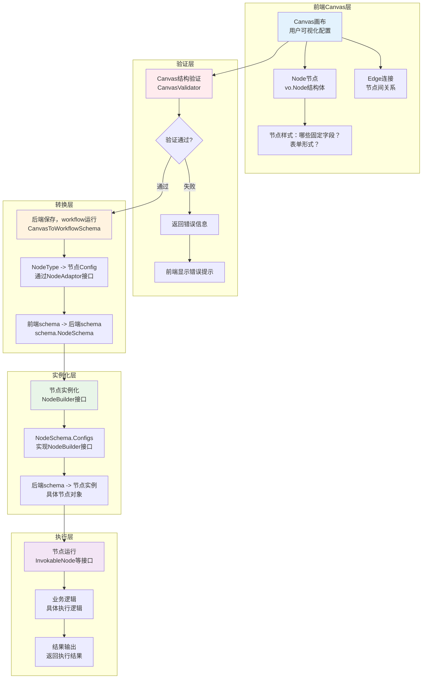

### 1.1 画布和后端结构

前端的画布采用DSL (JSON) 形式存储，每次更新画布都是将DSL传给后端。DSL的后端结构如下所示，主要包含节点 (node)、 边 (edge)、 版本

```go
type Canvas struct {
	Nodes    []*Node `json:"nodes"`
	Edges    []*Edge `json:"edges"`
	Versions any     `json:"versions"`
}
```

#### 1.1.1 节点数据

画布中的节点会转换为后端中 `backend/domain/workflow/entity/vo/canvas.go` 中的 Node 结构体， 后端存储的结构体如下

```go
// Node 工作流节点的完整定义
// 节点是工作流的基本执行单元，每个节点代表一个特定的功能或操作
type Node struct {
    // 节点的唯一标识符，用于在画布中定位和引用节点
	ID      string    `json:"id"` 
    // 节点类型，决定节点的功能和行为（如LLM、API调用、条件判断等）
	Type    BlockType `json:"type"`
    // 节点的元数据信息，包含前端显示相关的配置 (前端的一些extendInfo)
	Meta    any       `json:"meta"`
    // 节点的核心数据，包含输入输出配置和具体参数，例如LLM的配置、MCP的配置、异常处理
	Data    *Data     `json:"data"`
    // 子节点列表，用于复合节点（如循环、条件分支）的嵌套结构
	Blocks  []*Node   `json:"blocks,omitempty"`
    // 节点内部的连线，用于复杂节点的内部逻辑连接
	Edges   []*Edge   `json:"edges,omitempty"`
    // 节点的版本号，用于节点定义的版本控制
	Version string    `json:"version,omitempty"` 
    // 父节点引用，不序列化到JSON，用于内存中的树形结构导航
	parent *Node 
}
```

节点的核心数据`Data`如下所示

```go
type Data struct {
    // 节点的显示元数据，如标题、icon等
	Meta    *NodeMeta `json:"nodeMeta,omitempty"`
    // 节点的输出定义，可以是 []*Variable 或 []*Param 类型
	Outputs []any     `json:"outputs,omitempty"`
    // 节点的输入配置，包含所有输入参数和设置
	Inputs  *Inputs   `json:"inputs,omitempty"`
    // 节点在画布上的尺寸信息，用于前端显示
	Size    any       `json:"size,omitempty"`     
}

```

节点的输入参数 `inputs`

```go
// Inputs 节点输入配置的综合结构
// 这是一个联合结构，包含了所有可能的节点输入配置，不同类型的节点使用不同的字段子集
type Inputs struct {
	// 通用输入配置
	InputParameters    []*Param        `json:"inputParameters"`              // 节点的输入参数列表，定义节点需要的数据输入
	Content            *BlockInput     `json:"content"`                      // 节点的主要内容输入，通常用于文本处理或提示词
	TerminatePlan      *TerminatePlan  `json:"terminatePlan,omitempty"`      // 终止计划，定义节点完成后的行为
	StreamingOutput    bool            `json:"streamingOutput,omitempty"`    // 是否启用流式输出，用于实时返回处理结果
	CallTransferVoice  bool            `json:"callTransferVoice,omitempty"`  // 语音通话转接设置，用于语音相关节点
	ChatHistoryWriting string          `json:"chatHistoryWriting,omitempty"` // 聊天历史记录写入配置
	LLMParam           any             `json:"llmParam,omitempty"`           // LLM参数，可能是LLMParam、IntentDetectorLLMParam或QALLMParam类型
	FCParam            *FCParam        `json:"fcParam,omitempty"`            // 功能调用参数，用于配置工作流、插件或知识库的调用
	SettingOnError     *SettingOnError `json:"settingOnError,omitempty"`     // 错误处理配置，定义节点出错时的处理策略

	// 循环控制相关
	LoopType           LoopType    `json:"loopType,omitempty"`           // 循环类型：数组循环、计数循环或无限循环
	LoopCount          *BlockInput `json:"loopCount,omitempty"`          // 循环次数，用于计数循环
	VariableParameters []*Param    `json:"variableParameters,omitempty"` // 循环变量参数

	// 条件分支相关
	Branches []*struct {
		Condition struct {
			Logic      LogicType    `json:"logic"`      // 条件逻辑：AND或OR
			Conditions []*Condition `json:"conditions"` // 具体的条件列表
		} `json:"condition"`
	} `json:"branches,omitempty"` // 分支条件配置，用于条件判断节点

	// 批处理配置
	NodeBatchInfo *NodeBatch `json:"batch,omitempty"` // 节点批处理模式配置

	// 特定节点类型的配置（使用嵌入结构体实现类型多态）
	*TextProcessor      // 文本处理器配置：拼接、分割等操作
	*SubWorkflow        // 子工作流配置：调用其他工作流
	*IntentDetector     // 意图检测配置：识别用户意图
	*DatabaseNode       // 数据库操作配置：增删改查
	*HttpRequestNode    // HTTP请求配置：API调用
	*KnowledgeIndexer   // 知识库索引配置：文档处理和索引
	*CodeRunner         // 代码执行器配置：运行自定义代码
	*PluginAPIParam     // 插件API参数配置
	*VariableAggregator // 变量聚合器配置：合并多个变量
	*VariableAssigner   // 变量赋值器配置：设置变量值
	*QA                 // 问答节点配置：处理问题和答案
	*Batch              // 批处理配置：批量处理数据
	*Comment            // 注释节点配置：添加说明文字

	OutputSchema string `json:"outputSchema,omitempty"` // 输出模式定义，描述节点输出数据的结构
}
```

#### 1.1.2 边数据

边主要是包含输入节点、输出节点的ID，还有输入的端口和输出的端口 （输入输出端口都是只存在于`业务逻辑节点`中）

```go
// Edge 工作流连线定义
// 连线定义了节点之间的连接关系，确定工作流的执行顺序和数据流向
type Edge struct {
    // 源节点ID，连线的起始节点
	SourceNodeID string `json:"sourceNodeID"` 
    // 目标节点ID，连线的终止节点
	TargetNodeID string `json:"targetNodeID"`
    // 源端口ID，用于多输出端口的节点，指定具体的输出端口
	SourcePortID string `json:"sourcePortID,omitempty"`
    // 目标端口ID，用于多输入端口的节点，指定具体的输入端口
	TargetPortID string `json:"targetPortID,omitempty"` 
}

```

#### 1.1.3 大语言模型节点 (NoteTypeLLM)

##### LLM节点类图如下图所示


##### LLM参数 - `SimpleLLMParam`

`SimpleLLMParam`如下所示，主要包含多样性程度、最大Token、模型名称、模型类型、响应格式、系统提示词、`Temperature`温度、`TopP` 核采样参数

【注意】`generationDiversity`多样性程度 是高层的预设策略（如"创意/平衡/精确"模式），而 `temperature`和 `topP`是底层的具体算法参数，前者通过内置的参数组合来简化配置，后者则提供精确的随机性控制（temperature调节概率分布平滑度，topP限制候选词汇范围）。

简单说：generationDiversity = "我要什么风格"，temperature = "要多随机"，topP = "考虑多少词汇"。

```go
// SimpleLLMParam 简化的大语言模型参数配置
// 提供直接的字段映射方式配置LLM参数，适用于简单的模型调用场景
type SimpleLLMParam struct {
	// GenerationDiversity 生成多样性配置
	// 控制模型输出的多样性程度，影响生成内容的创新性
	GenerationDiversity string `json:"generationDiversity"`
	// MaxTokens 最大生成令牌数
	// 限制模型单次生成的最大token数量，控制输出长度
	MaxTokens int `json:"maxTokens"`
	// ModelName 模型名称
	// 指定要使用的具体模型名称，如gpt-3.5-turbo、gpt-4等
	ModelName string `json:"modelName"`
	// ModelType 模型类型标识
	// 用于区分不同类型的模型，如聊天模型、补全模型等
	ModelType int64 `json:"modelType"`
	// ResponseFormat 响应格式配置
	// 指定模型输出的格式，支持文本、JSON、Markdown等格式
	ResponseFormat model.ResponseFormat `json:"responseFormat"`
	// SystemPrompt 系统提示词
	// 定义模型的系统级指令，设定模型的角色和行为规范
	SystemPrompt string `json:"systemPrompt"`
	// Temperature 温度参数
	// 控制模型输出的随机性，范围通常为0.0-1.0，值越高输出越随机
	// 通过调整softmax概率分布的平滑度来影响词汇选择的确定性
	Temperature float64 `json:"temperature"`
	// TopP 核采样参数
	// 控制模型生成时考虑的词汇概率质量，影响输出的多样性和质量
	// 通过设置概率累积阈值来限制候选词汇的范围，范围通常为0.0-1.0
	TopP float64 `json:"topP"`
}
```

##### LLM中的函数调用参数 `**FcParam**`

functionCalling （大语言模型节点的“技能”）中需要用到的参数

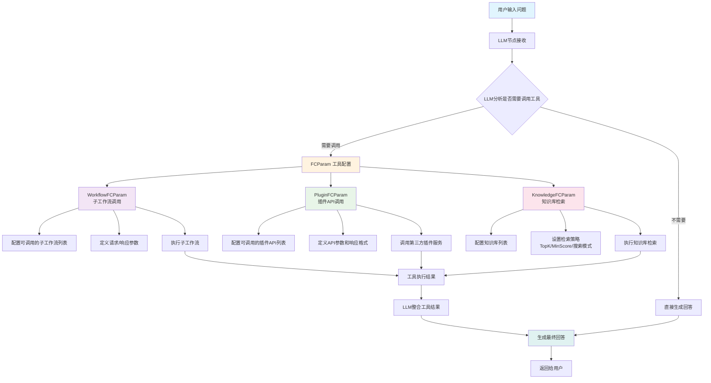

函数调用参数 `FcParam`主要包含三种模式：子工作流调用、插件API调用、知识库检索

```go
// FCParam 函数调用参数配置
// 用于配置工作流中不同类型的函数调用能力，包括子工作流调用、插件API调用和知识库检索调用
type FCParam struct {
	// WorkflowFCParam 工作流函数调用参数配置
	// 配置当前工作流可以调用的子工作流列表及其参数设置
	WorkflowFCParam *struct {
		// WorkflowList 可调用的工作流列表
		// 每个工作流项包含工作流标识、版本信息和函数调用设置
		WorkflowList []struct {
			// WorkflowID 工作流唯一标识符
			WorkflowID string `json:"workflow_id"`
			// WorkflowVersion 工作流版本号
			WorkflowVersion string `json:"workflow_version"`
			// PluginID 关联的插件ID（如果工作流基于插件）
			PluginID string `json:"plugin_id"`
			// PluginVersion 插件版本号
			PluginVersion string `json:"plugin_version"`
			// IsDraft 是否为草稿版本
			IsDraft bool `json:"is_draft"`
			// FCSetting 函数调用设置
			// 定义调用该工作流时的请求和响应参数结构
			FCSetting *struct {
				// RequestParameters 请求参数列表
				// 定义调用工作流时需要传入的参数
				RequestParameters []*workflow.APIParameter `json:"request_params"`
				// ResponseParameters 响应参数列表
				// 定义工作流执行完成后返回的参数
				ResponseParameters []*workflow.APIParameter `json:"response_params"`
			} `json:"fc_setting,omitempty"`
		} `json:"workflowList,omitempty"`
	} `json:"workflowFCParam,omitempty"`

	// PluginFCParam 插件函数调用参数配置
	// 配置当前工作流可以调用的插件API列表及其参数设置
	PluginFCParam *struct {
		// PluginList 可调用的插件列表
		// 每个插件项包含插件标识、API信息和函数调用设置
		PluginList []struct {
			// PluginID 插件唯一标识符
			PluginID string `json:"plugin_id"`
			// ApiId API接口唯一标识符
			ApiId string `json:"api_id"`
			// ApiName API接口名称
			ApiName string `json:"api_name"`
			// PluginVersion 插件版本号
			PluginVersion string `json:"plugin_version"`
			// IsDraft 是否为草稿版本
			IsDraft bool `json:"is_draft"`
			// FCSetting 函数调用设置
			// 定义调用该插件API时的请求和响应参数结构
			FCSetting *struct {
				// RequestParameters 请求参数列表
				// 定义调用插件API时需要传入的参数
				RequestParameters []*workflow.APIParameter `json:"request_params"`
				// ResponseParameters 响应参数列表
				// 定义插件API执行完成后返回的参数
				ResponseParameters []*workflow.APIParameter `json:"response_params"`
			} `json:"fc_setting,omitempty"`
		}
	} `json:"pluginFCParam,omitempty"`

	// KnowledgeFCParam 知识库函数调用参数配置
	// 配置当前工作流的知识库检索功能及其全局设置
	KnowledgeFCParam *struct {
		// GlobalSetting 知识库检索全局设置
		// 定义知识库检索的通用配置参数
		GlobalSetting *struct {
			// SearchMode 搜索模式
			// 定义知识库检索使用的搜索算法模式
			SearchMode int64 `json:"search_mode"`
			// TopK 返回结果数量
			// 定义知识库检索返回的最大结果数量
			TopK int64 `json:"top_k"`
			// MinScore 最小相似度分数
			// 定义知识库检索结果的最小相似度阈值
			MinScore float64 `json:"min_score"`
			// UseNL2SQL 是否启用自然语言转SQL功能
			UseNL2SQL bool `json:"use_nl2_sql"`
			// UseRewrite 是否启用查询重写功能
			UseRewrite bool `json:"use_rewrite"`
			// UseRerank 是否启用结果重排序功能
			UseRerank bool `json:"use_rerank"`
			// NoRecallReplyCustomizePrompt 无召回结果时的自定义回复提示词
			NoRecallReplyCustomizePrompt string `json:"no_recall_reply_customize_prompt"`
			// NoRecallReplyMode 无召回结果时的回复模式
			NoRecallReplyMode int64 `json:"no_recall_reply_mode"`
		} `json:"global_setting,omitempty"`
		// KnowledgeList 可检索的知识库列表
		// 定义当前工作流可以检索的知识库集合
		KnowledgeList []*struct {
			// ID 知识库唯一标识符
			ID string `json:"id"`
		} `json:"knowledgeList,omitempty"`
	} `json:"knowledgeFCParam,omitempty"`
}
```

1.  子工作流调用
    

```json
{
  "workflowFCParam": {
    "workflowList": [
      {
        "workflow_id": "7509120431183544356",
        "workflow_version": "v0.0.1", 
        "plugin_id": "7509121334769795126",
        "is_draft": false,
        "fc_setting": {
          "request_params": [...],  // 调用参数
          "response_params": [...]  // 返回参数
        }
      }
    ]
  }
}
```

2.  插件API调用
    

```json
{
  "pluginFCParam": {
    "pluginList": [
      {
        "plugin_id": "7509353177339133952",
        "api_id": "7509353598782816256", 
        "api_name": "周公解梦",
        "plugin_version": "0",
        "fc_setting": {
          "request_params": [
            {
              "name": "title",
              "desc": "查询解梦标题，例如：梦见蛇",
              "type": 1,
              "is_required": true
            }
          ],
          "response_params": [...]
        }
      }
    ]
  }
}
```

3.  知识库检索
    

```json
{
  "knowledgeFCParam": {
    "knowledgeList": [
      {
        "id": "7512369185624686592",
        "name": "旅游景点"
      }
    ],
    "global_setting": {
      "top_k": 3, // 
      "min_score": 0.5,
      "search_mode": 0,
      "use_rerank": true,
      "use_rewrite": true,
      "use_nl2_sql": true,
      "no_recall_reply_mode": 0,
      "no_recall_reply_customize_prompt": "抱歉，您的问题超出了我的知识范围"
    }
  }

```

#### 1.1.4 BlockInput结构

`BlockInput`是工作流系统中的数据绑定核心，它解决了一个关键问题：如何在工作流节点之间传递和配置数据。`BlockInput = "这个输入框里放什么数据，从哪里来"`

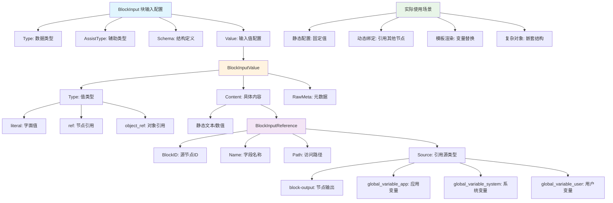

`BlockInput`结构如下所示

```go
type BlockInput struct {
    Type       VariableType     // 数据类型：string、number、object等
    AssistType AssistType       // 辅助类型：更具体的类型描述
    Schema     any              // 结构定义：复杂对象的内部结构
    Value      *BlockInputValue // 值配置：具体的数据来源
}
```

三种数据流来源：常量`literal`、节点引用`ref`、对象引用 `Object Ref`

1.  常量`literal`
    

```go
{
  "type": "string",
  "value": {
    "type": "literal",
    "content": "Hello World",
    "rawMeta": {"type": 1}
  }
}
```

2.  节点引用`ref` (最常用的)
    

```go
{
  "type": "string", 
  "value": {
    "type": "ref",
    "content": {
      "blockID": "100001",
      "name": "output",
      "source": "block-output"
    }
  }
}
```

3.   对象引用
    

```go
{
  "type": "object",
  "schema": [{"name": "name", "type": "string"}],
  "value": {
    "type": "object_ref",
    "content": {
      "blockID": "100001", 
      "name": "person",
      "source": "block-output"
    }
  }
}
```

#### 1.1.5 知识库节点 (RAG)

##### RAG完整流程图

一个完整的RAG流程如下：

查询重写优化 （小模型）-> 自然语言转SQL （NL2SQL）-> 向量检索 (语义搜索/混合搜索/全量搜索) -> 相似度过滤 (最小相似度阈值) -> 结果重排序 (Rerank) -> TopK结果截取 -> 构建新的上下文提示词

```mermaid
graph LR
    A[用户输入查询] --> B[查询预处理]
    
    B --> B1[UseRewrite: 查询重写]
    B1 --> B2[优化查询语义]
    B2 --> B3[UseNL2SQL: 自然语言转SQL]
    
    B3 --> C[向量检索阶段]
    C --> C1[文档向量化]
    C --> C2[查询向量化] 
    C1 --> C3[向量相似度计算]
    C2 --> C3
    
    C3 --> D[SearchMode: 搜索策略]
    D --> D1[0: 语义搜索<br/>Semantic Search]
    D --> D2[1: 混合搜索<br/>Hybrid Search]
    D --> D3[20: 全文搜索<br/>Full-text Search]
    
    D1 --> E[初步结果筛选]
    D2 --> E
    D3 --> E
    
    E --> E1[MinScore: 相似度过滤]
    E1 --> E2[过滤低质量结果]
    
    E2 --> F[UseRerank: 结果重排序]
    F --> F1[深度语义匹配]
    F1 --> F2[重新排序结果]
    
    F2 --> G[TopK: 结果截取]
    G --> G1[选择前K个最佳结果]
    
    G1 --> H{是否有合适结果?}
    H -->|有| I[构建增强上下文]
    H -->|无| J[NoRecallReplyMode处理]
    
    J --> J1[0: 使用自定义提示词]
    J --> J2[1: 其他处理模式]
    J1 --> K[返回无结果回复]
    J2 --> K
    
    I --> L[RAG生成阶段]
    L --> L1[组合查询+检索内容]
    L1 --> L2[LLM生成增强回答]
    
    L2 --> M[返回最终答案]
    K --> M
    
    style A fill:#e1f5fe
    style B fill:#fff3e0
    style C fill:#f3e5f5
    style D fill:#e8f5e8
    style F fill:#fce4ec
    style L fill:#e0f2f1
```

##### 向量检索规则

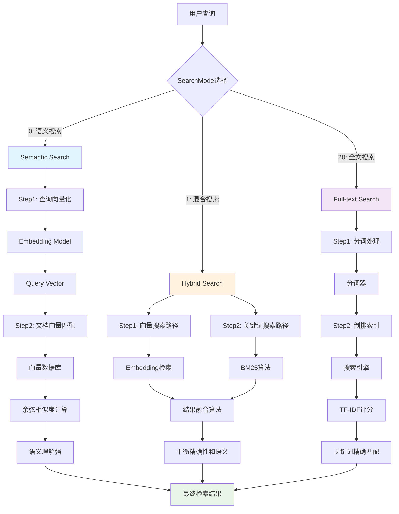

1.  语义搜索 （准）: 使用 Embedding 模型计算向量相似度，理解深层语义，处理同义词和概念匹配。
    
2.  混合搜索 （全面）: 结合向量搜索 + BM25 关键词搜索，平衡语义理解和精确匹配。
    
3.  全文搜索 （快）: 传统的倒排索引和TF-IDF，精确的关键词匹配，速度快
    

【算法说明】

*   Embedding向量检索：将文本通过编码器转为向量和DB中的向量计算cos相似度最后返回TopK的结果
    

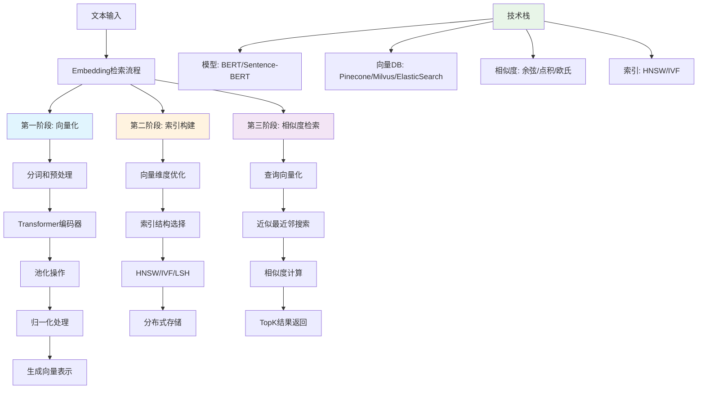

*   倒排索引：将文档切分成独立的词汇单元，建立从词汇到文档的映射索引
    

*   TF-IDF (词频-逆文档频率)：TF（词频）： 计算一个词在文档中出现的词次数， 用于衡量词汇的重要性。IDF （逆文档频率）：衡量词汇在整个语料库中的重要性。 
    

```python
TF(t,d) = 词汇t在文档d中出现的次数 / 文档d的总词数
IDF(t) = log(文档总数 / 包含词汇t的文档数)
TF-IDF = sigmoid (TF(t,d) * IDF(t))
```

缺点：不能考虑词汇的位置，忽略了词汇的相关性；不利于稀疏性 （短文档很多词汇 `TF-IDF=0`）

*   BM25 算法：在 `TF-IDF` (词频-逆文档频率) 基础上，解决了词频饱和问题和文档长度归一化问题。
    

##### ReRank 规则

Rerank就是根据多个检索方式得到的结果进行整合，然后根据RRF算法重新排序的过程

```python
RRF: score = 1/(rank + k) # 默认 k = 60 
```

rerank模型的时序图

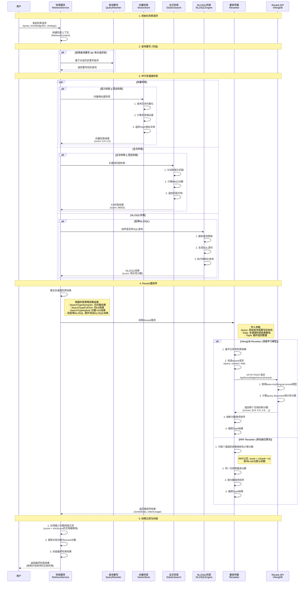

##### 知识库节点结构

```go
// Knowledge 知识库节点配置
// 用于配置独立的知识库检索节点，定义数据源参数和处理策略
// 与LLM节点中的KnowledgeFCParam不同，这是专门的知识库检索步骤
type Knowledge struct {
	// DatasetParam 数据集参数配置
	// 定义知识库的数据源配置，包括数据库连接、文件路径等信息
	// 每个Param包含具体的数据源配置项
	DatasetParam []*Param `json:"datasetParam,omitempty"`
	// StrategyParam 知识库处理策略参数
	// 定义文档解析、分块、索引等各个环节的处理策略和参数
	StrategyParam StrategyParam `json:"strategyParam,omitempty"`
}

// StrategyParam 知识库处理策略参数配置
// 定义知识库从文档解析到向量索引的完整处理流程策略
type StrategyParam struct {
	// ParsingStrategy 文档解析策略配置
	// 定义如何解析和提取不同类型文档的内容
	ParsingStrategy struct {
		// ParsingType 解析类型
		// 定义文档解析的方式，如自动识别、手动指定等
		// 常见值：auto（自动识别）、manual（手动指定）、custom（自定义）
		ParsingType string `json:"parsingType,omitempty"`
		// ImageExtraction 是否提取图片
		// 控制是否从文档中提取图片内容进行处理
		// true表示提取图片，false表示忽略图片内容
		ImageExtraction bool `json:"imageExtraction"`
		// TableExtraction 是否提取表格
		// 控制是否从文档中提取表格结构和数据
		// true表示解析表格结构，false表示将表格视为普通文本
		TableExtraction bool `json:"tableExtraction"`
		// ImageOcr 是否启用图片OCR识别
		// 控制是否对提取的图片进行光学字符识别
		// true表示对图片进行OCR文字识别，false表示忽略图片中的文字
		ImageOcr bool `json:"imageOcr"`
	} `json:"parsingStrategy,omitempty"`
	// ChunkStrategy 文档分块策略配置
	// 定义如何将长文档切分成适合向量化的小块
	ChunkStrategy struct {
		// ChunkType 分块类型
		// 定义文档分块的策略类型
		// 常见值：fixed（固定长度）、semantic（语义分块）、sentence（句子分块）
		ChunkType string `json:"chunkType,omitempty"`
		// SeparatorType 分隔符类型
		// 定义用于分块的分隔符类型
		// 常见值：auto（自动选择）、newline（换行符）、paragraph（段落）、custom（自定义）
		SeparatorType string `json:"separatorType,omitempty"`
		// Separator 自定义分隔符
		// 当SeparatorType为custom时，指定具体的分隔符字符串
		Separator string `json:"separator,omitempty"`
		// MaxToken 最大令牌数
		// 定义每个文档块的最大token数量，控制块的大小
		// 通常设置为模型的上下文窗口大小，如512、1024等
		MaxToken int64 `json:"maxToken,omitempty"`
		// Overlap 重叠比例
		// 定义相邻文档块之间的重叠比例，避免语义信息在边界处丢失
		// 取值范围0.0-1.0，常见值为0.1-0.2（10%-20%重叠）
		Overlap float64 `json:"overlap,omitempty"`
	} `json:"chunkStrategy,omitempty"`
	// IndexStrategy 索引策略配置
	// 定义向量索引的构建策略，如索引类型、参数等
	// 具体结构依赖于使用的向量数据库类型（如HNSW、IVF等）
	IndexStrategy any `json:"indexStrategy"`
}
```

### 1.2 如何从画布转换为后端类？如何转换为执行态？

前端传入画布的 DSL语言（JSON）给后端之后，会解析为上方的后端结构。画布中的每个节点都会变成 `canvas.go`中的 `Node`结构体。但是转换后的 `Node`结构体只是一个存储态，如果需要执行工作流还需要将 `Node`结构体从存储态转为运行态。后端 schema 的 `NodeSchema`结构体就是 针对用于表达工作流的运行态的

#### 1.2.1 转换流程图

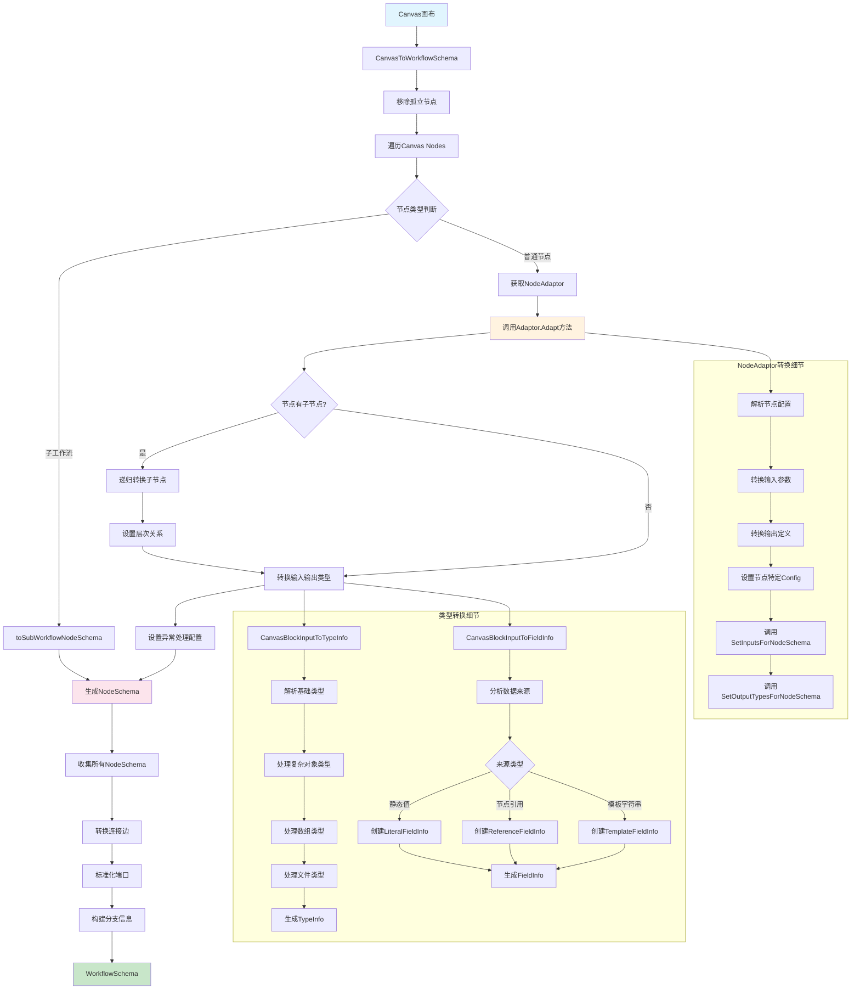

#### 1.2.2 转换后的NodeSchema结构

```go
// NodeSchema 工作流节点的统一描述和配置结构
// 包含实例化一个节点所需的所有信息，是Canvas Node转换后的后端执行结构
type NodeSchema struct {
	// Key 节点在Eino图中的唯一标识符
	// 节点在执行过程中可能需要这个信息，例如：
	// - 使用此Key查询工作流状态中属于当前节点的数据
	Key vo.NodeKey `json:"key"`

	// Name 节点在Canvas画布上指定的显示名称
	// 节点可能会在Canvas上显示这个名称作为输入/输出的一部分
	Name string `json:"name"`

	// Type 节点的类型标识
	// 对应entity.NodeType枚举，决定节点的具体行为和功能
	Type entity.NodeType `json:"type"`

	// Configs 节点特定的配置信息
	// 每个节点类型定义自己的配置结构体，不包含字段映射或静态值信息
	// 这些配置是节点实现的内部配置，与工作流编排无关
	// 实际类型应该实现两个接口：
	// - NodeAdaptor: 提供从vo.Node到NodeSchema的转换
	// - NodeBuilder: 提供从NodeSchema到实际节点实例的实例化
	Configs any `json:"configs,omitempty"`

	// InputTypes 节点输入字段的类型信息映射
	// 键为字段名，值为对应的类型信息，用于类型检查和验证
	InputTypes map[string]*vo.TypeInfo `json:"input_types,omitempty"`
	// InputSources 节点输入字段的映射信息
	// 定义每个输入字段的数据来源，如来自其他节点的输出或静态值
	InputSources []*vo.FieldInfo `json:"input_sources,omitempty"`

	// OutputTypes 节点输出字段的类型信息映射
	// 键为字段名，值为对应的类型信息，用于下游节点的类型推导
	OutputTypes map[string]*vo.TypeInfo `json:"output_types,omitempty"`
	// OutputSources 节点输出字段的映射信息
	// 注意：仅适用于复合节点，如NodeTypeBatch或NodeTypeLoop
	OutputSources []*vo.FieldInfo `json:"output_sources,omitempty"`

	// ExceptionConfigs 节点的异常处理策略配置
	// 包含超时、重试、错误处理类型等异常处理相关设置
	ExceptionConfigs *ExceptionConfig `json:"exception_configs,omitempty"`
	// StreamConfigs 节点的流式处理特性配置
	// 定义节点是否支持流式输入/输出等流处理能力
	StreamConfigs *StreamConfig `json:"stream_configs,omitempty"`

	// SubWorkflowBasic 子工作流的基本信息
	// 仅当节点类型为NodeTypeSubWorkflow时使用
	SubWorkflowBasic *entity.WorkflowBasic `json:"sub_workflow_basic,omitempty"`
	// SubWorkflowSchema 子工作流的完整Schema信息
	// 仅当节点类型为NodeTypeSubWorkflow时使用，包含子工作流的完整定义
	SubWorkflowSchema *WorkflowSchema `json:"sub_workflow_schema,omitempty"`

	// FullSources 节点输入字段映射来源的完整信息
	// 包含更详细的信息，如字段是否为流式字段，或字段是否为包含子字段映射的对象
	// 用于需要处理流式输入的节点
	// 在NodeMeta中设置InputSourceAware = true来启用此功能
	FullSources map[string]*SourceInfo

	// Lambda 直接设置节点为Eino Lambda
	// 注意：不可序列化，仅用于内部测试
	Lambda *compose.Lambda
}
```

#### 1.2.3 转换结构前后对比

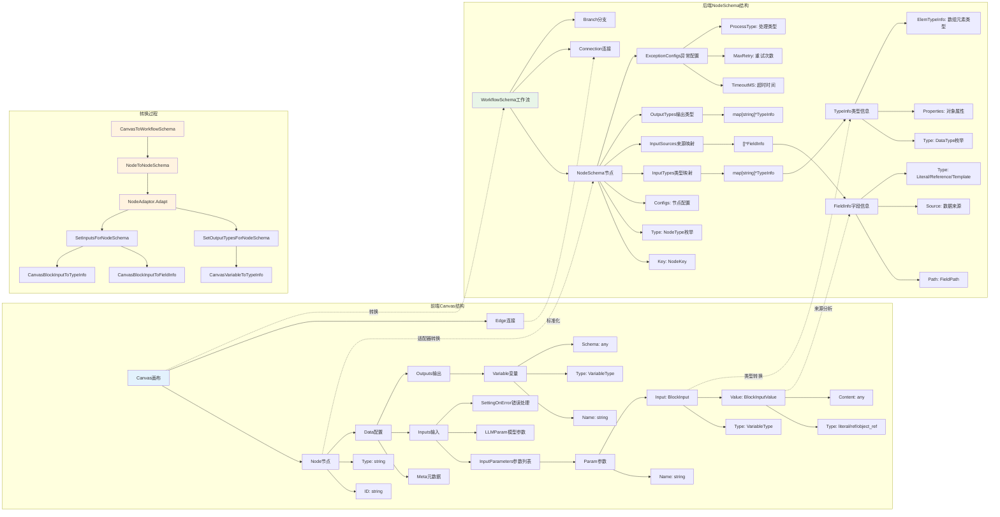

【转换过程】

`canvas`到 `NodeSchema`的转换过程是Coze Studio工作流系统中的核心架构设计，它通过适配器模式将前端面向用户的可视化画布结构转换为后端面向执行的标准化 `Schema`结构。在这个过程中，前端的 `Canvas`包含了用户在画布上拖拽配置的 `Node`节点和 `Edge`连接，每个`Node`节点包含字符串类型的`ID`和`Type`、用户配置的`Data`数据（包括输入参数、输出定义、元数据等），这些数据以灵活的 \`any \`类型和嵌套结构存储以适应前端的动态配置需求；而转换后的`NodeSchema`则采用强类型的结构化设计，将**节点类型**转换为**枚举**、将**输入输出**转换为 `TypeInfo`和`FieldInfo`的映射关系、将**数据来源分析**为**具体的引用路径**，并添加了执行时需要的 **异常处理配置**、**流式处理配置**等运行时信息。这个转换过程之所以必要，是因为前端Canvas需要保持高度的灵活性和可扩展性来支持用户的各种配置操作和UI交互，而后端执行引擎则需要严格的类型安全、明确的数据流向和优化的执行性能，两者的设计目标和约束条件完全不同，因此需要通过这个转换层来实现前后端的解耦，同时确保用户在画布上的每一个配置都能准确无误地转换为可执行的工作流逻辑，并且这种转换过程还支持复杂的节点类型（如子工作流、批处理节点）、数据类型推导、字段映射分析等高级特性，为整个工作流系统的稳定运行和功能扩展提供了坚实的基础。

### 1.3 工作流执行过程分析

##### 工作流执行图 (细节)

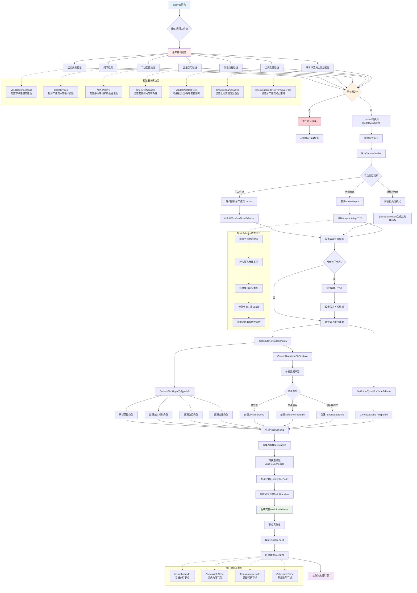

*   **前端交互层**：前端 `Canvas`层是用户交互的起点，`Canvas`画布承载着用户的可视化配置，其中包含 `Node`（以`vo.Node`结构体表示）和`Edge`连接关系，这里的关键问题是"节点样式：哪些固定字段？表单形式？"，实际上每个节点都有标准化的元数据定义（如节点类型、显示名称、图标等固定字段）和动态的配置表单（根据节点类型展示不同的参数配置界面），前端`schema`采用灵活的JSON结构来适应各种节点类型的配置需求。
    
*   **验证层**：验证层通过`CanvasValidator`对画布结构进行全面检查，包括节点连接完整性、循环依赖检测、配置合法性验证等多个维度，确保只有结构正确的工作流才能进入后续的转换和执行阶段，如果验证失败，系统会返回具体的错误信息给前端，帮助用户快速定位和修正问题。
    
*   **转换层**：转换层是整个架构的核心枢纽，负责"后端保存，workflow运行"的关键转换过程，通过`CanvasToWorkflowSchema`函数协调整个转换流程，其中最重要的是`NodeType`到节点`Config`的转换，这通过`NodeAdaptor`接口实现，每个节点类型都有对应的适配器负责将前端的灵活配置转换为后端的强类型`NodeSchema`结构，实现了"前端schema -> 后端schema"的标准化转换。
    
*   **节点实例化层**：实例化层通过`NodeBuilder`接口将抽象的`NodeSchema`转换为具体的可执行节点实例，这里的关键是`NodeSchema.Configs`字段必须实现`NodeBuilder`接口，从而能够根据配置信息创建实际的节点对象，实现了"后端schema -> 节点实例"的最终转换，为执行层提供了统一的节点实例接口。
    
*   **执行层**：执行层是整个流程的最终目标，节点实例通过实现`InvokableNode`等执行接口来提供具体的业务逻辑处理能力，工作流引擎负责按照既定的执行顺序调度各个节点，处理数据流转和状态管理，最终产生业务执行结果并返回给用户。
    

## 工作流校验

### 2.1 工作流验证流程

#### 2.1.1 核心验证流程

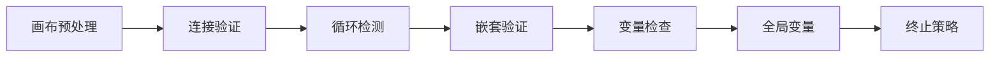

#### 2.1.2 完整验证流程

```mermaid
%% 点击 “绘图” 按钮即可预览
graph LR
    A["1. 画布预处理<br/>• JSON反序列化<br/>• 清理孤立节点<br/>• 创建验证器实例"] --> H["2. 连接关系验证<br/>ValidateConnections"]
    H --> H1["• 检查节点连接完整性<br/>• 验证端口连接正确性<br/>• 检查分支节点完整性"]
    H1 --> I{发现问题?}
    I -->|是| Z["返回验证错误"]
    I -->|否| J["3. 循环依赖检测<br/>DetectCycles"]
    
    J --> J1["• 构建依赖关系图<br/>• DFS算法检测环<br/>• 标识循环路径"]
    J1 --> K{发现循环?}
    K -->|是| Z
    K -->|否| L["4. 嵌套流程验证<br/>ValidateNestedFlows"]
    
    L --> L1["• 检查批处理节点嵌套<br/>• 验证循环节点嵌套<br/>• 防止过深嵌套"]
    L1 --> M{嵌套违规?}
    M -->|是| Z
    M -->|否| N["5. 引用变量检查<br/>CheckRefVariable"]
    
    N --> N1["• 验证变量可达性<br/>• 检查参数名规范<br/>• 验证作用域正确性"]
    N1 --> O{变量引用错误?}
    O -->|是| Z
    O -->|否| P["6. 全局变量验证<br/>CheckGlobalVariables"]
    
    P --> P1["• 验证变量类型匹配<br/>• 检查数组元素类型<br/>• 验证变量声明"]
    P1 --> Q{全局变量错误?}
    Q -->|是| Z
    Q -->|否| R["7. 子工作流终止策略<br/>CheckSubWorkFlowTerminatePlanType"]
    
    R --> R1["• 验证终止计划配置<br/>• 检查版本一致性<br/>• 验证子工作流存在性"]
    R1 --> S{终止策略错误?}
    S -->|是| Z
    S -->|否| T["主工作流验证完成"]
    
    T --> U["子工作流递归验证"]
    U --> U1["• 解析画布获取子工作流<br/>• 筛选项目级工作流<br/>• 批量获取工作流信息"]
    U1 --> U2["对每个子工作流<br/>重复验证流程"]
    U2 --> V["汇总所有验证结果"]
    
    V --> W["错误信息转换<br/>• Issue -> ValidateErrorData<br/>• 节点错误/路径错误分类"]
    W --> X["返回验证结果<br/>ValidateTreeResponse"]
    
    style A fill:#e1f5fe
    style H fill:#e8f5e8
    style J fill:#e8f5e8
    style L fill:#e8f5e8
    style N fill:#e8f5e8
    style P fill:#e8f5e8
    style R fill:#e8f5e8
    style U fill:#fff8e1
    style Z fill:#ffebee
```

#### 2.1.3 工作流验证流程技术实现总结

Coze Studio 的工作流验证采用**分层递进式验证架构**，从 API 层的 `ValidateTree` 接口开始，经过应用服务层的参数预处理，最终调用领域服务层的核心验证引擎 `validateWorkflowTree`。验证流程包含七个关键步骤：

**1. 画布预处理阶段** - 首先将 JSON 格式的画布结构反序列化为内存对象，然后调用 `adaptor.PruneIsolatedNodes` 清理没有连接关系的孤立节点，最后创建配置完整的 `CanvasValidator` 验证器实例并执行可达性分析，构建节点间的连通关系图。

**2. 连接关系验证** - `ValidateConnections` 方法通过遍历所有节点和边，构建出度映射表和端口映射表来实现。对于每个节点，检查其输出端口是否正确连接，特别是分支节点（如条件判断、错误处理）必须确保所有期望的端口都有连接。算法会递归验证嵌套节点的连接关系，确保数据流的完整性。

**3. 循环依赖检测** - `DetectCycles` 使用深度优先搜索（DFS）算法实现。首先构建反向依赖关系图（`controlSuccessors`），然后对每个未访问的节点启动 DFS 遍历。在遍历过程中维护当前路径栈，当发现路径中已存在的节点时，即检测到循环依赖，算法会提取并返回完整的循环路径。

**4. 嵌套流程验证** - `ValidateNestedFlows` 通过检查可达性分析结果中的 `nestedReachability` 结构实现。如果一个节点既有嵌套结构，又在其嵌套结构中还有更深层的嵌套（即 `len(nestedReachableNodes.nestedReachability) > 0`），则判定为违反嵌套规则，防止批处理和循环节点的过度嵌套导致执行异常。

**5. 引用变量检查** - `CheckRefVariable` 采用递归作用域分析算法。定义内部函数 `inputBlockVerify` 解析每个输入参数的引用信息，检查引用的节点是否在当前或父级作用域的可达范围内。通过 `combinedReachable` 映射表合并当前层级和父级可达节点，实现作用域继承机制。同时验证参数名称的规范性（必须以字母开头，只能包含字母数字下划线）。

**6. 全局变量验证** - `CheckGlobalVariables` 首先收集所有变量分配节点（`NodeTypeVariableAssigner`）的变量定义，然后通过 `VariablesMetaGetter` 获取应用或智能体的变量元数据进行对比。验证包括基础类型匹配和数组元素类型的深度检查，确保工作流中使用的全局变量与系统定义一致。

**7. 子工作流终止策略验证** - `CheckSubWorkFlowTerminatePlanType` 通过递归收集所有子工作流节点，分别获取草稿版本和已发布版本的画布信息。对每个子工作流，查找其结束节点的终止计划配置，与当前节点的终止类型进行匹配验证，确保子工作流的输出处理策略与调用方期望一致。

整个验证过程采用**快速失败策略**，任何步骤发现问题立即返回错误信息，同时支持**递归子工作流验证**，通过 `getAllSubWorkflowIdentities` 提取所有子工作流标识，对每个子工作流重复执行完整的验证流程，最终汇总所有验证结果，确保整个工作流树的结构完整性、逻辑正确性和执行安全性。