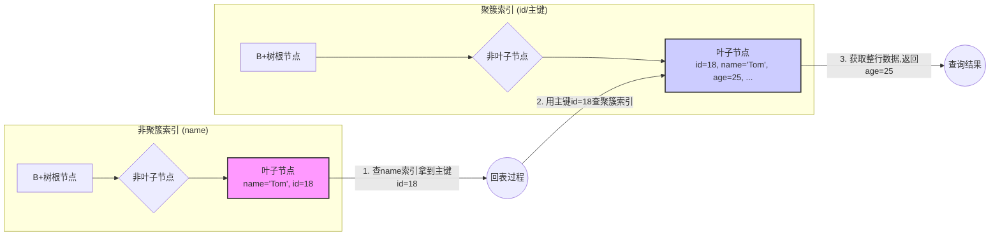
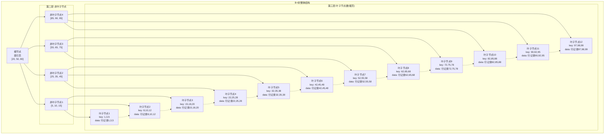
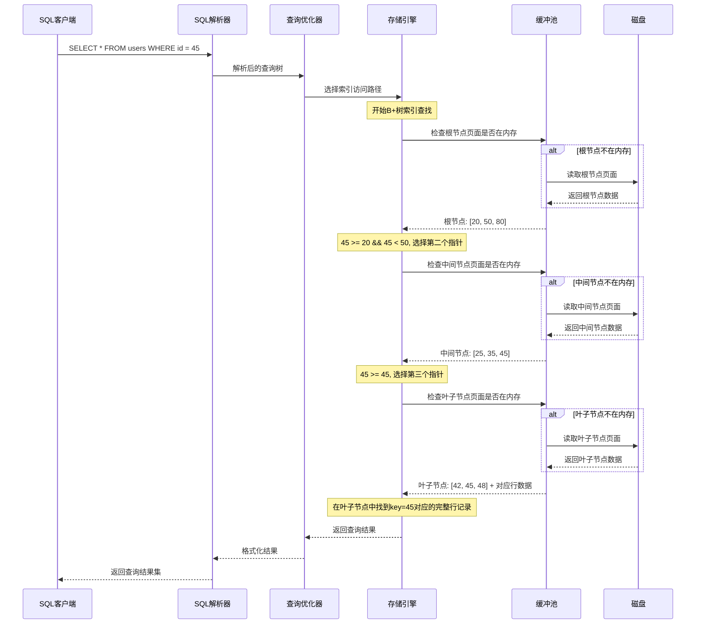

## 1.MySQL 中的数据排序是怎么实现的？

1.**排序方法**：索引排序和文件排序 (filesort)

2.**索引排序**：如果`order by xxx`的字段为索引字段，则利用索引进行排序。效率最高，索引默认有序。

3.**文件排序 (filesort)**：内存排序(单路排序和双路排序)和磁盘排序，具体取决于排序数据的大小。其中，内存排序使用单路排序或双路排序，取决于`max_length_for_sort_data`(默认为4096个字节)

4.**双路排序**：取`row_id`(如果有主键，则为主键)和`select a,b,c order by xxx`的`xxx`字段放入`sort_buffer`(排序缓存)中，将排序后的`row_id`回表查询`a,b,c`

5.**单路排序**: 直接把要查的所有字段放入`sort_buffer`里，排序后直接得到结果集合

6.**磁盘排序**（归并排序）:将数据分为多份文件，单独对文件进行排序，然后合并成一个有序的大文件

## 2. MySQL 的 Change Buffer 是什么？它有什么作用？

1.ChangeBuffer定义：Change Buffer是InnoDB缓冲当中的一块缓存区，用于暂存二级索引的修改，避免二级索引页修改产生的随机IO
2.ChangeBuffer注意事项：只能用于二级索引，不能用于其他任何索引，包括主键索引和唯一索引都不行。
3.如果ChangeBuffer挂了，更改操作未执行，是否会出现脏数据？
首先，ChangeBuffer也会保存在磁盘空间里面，redo log会记录Change Buffer当中的修改操作，确保数据一致性。

知识拓展1：一级索引和二级索引区别

>**一级索引（聚簇索引）**：数据表的主键索引，数据和索引存储在同一B+树的叶子节点中。每个表只能有一个一级索引。
>
>**二级索引（非聚簇索引）**：除主键外的其他索引，叶子节点存储索引列的值和对应的主键值。通过二级索引查询时，需要先通过二级索引获取主键值，再通过主键值查询数据，这个过程称为“回表”。

知识拓展2:  MySQL中有哪些常见索引？都有什么区别？

>在MySQL中，索引是提高查询效率的关键工具。常见的索引类型包括主键索引、唯一索引、普通索引、全文索引和空间索引。
>
>**1. 主键索引（Primary Key Index）**
>
>- **定义**：主键索引是一种特殊的唯一索引，用于唯一标识表中的每一行数据。每个表只能有一个主键索引，且主键列的值不能为空。
>- **特点**：主键索引的叶子节点存储完整的数据行，因此查询效率高。在InnoDB存储引擎中，主键索引是聚簇索引，数据存储与索引结构合并。
>
>**2. 唯一索引（Unique Index）**
>
>- **定义**：唯一索引确保索引列的每个值都是唯一的，但允许有空值。与主键索引类似，不同之处在于唯一索引允许列值为NULL。
>- **特点**：唯一索引的叶子节点存储索引列的值和对应的主键值。在InnoDB中，唯一索引是非聚簇索引，数据存储与索引结构分开。
>
>**3. 普通索引（Index）**
>
>- **定义**：普通索引是最基本的索引类型，没有任何限制。索引列的值可以重复，也可以为NULL。
>- **特点**：普通索引的叶子节点存储索引列的值和对应的主键值。在InnoDB中，普通索引是非聚簇索引，数据存储与索引结构分开。
>
>**4. 全文索引（Fulltext Index）**
>
>- **定义**：全文索引用于对文本数据进行全文搜索，适用于MyISAM存储引擎。它允许对文本字段进行复杂的搜索，如查找包含特定单词的记录。
>- **特点**：全文索引的叶子节点存储文档的词项信息。在MyISAM中，全文索引是非聚簇索引，数据存储与索引结构分开。
>
>**5. 空间索引（Spatial Index）**
>
>- **定义**：空间索引用于对地理空间数据进行索引，支持空间数据类型的快速查询。它适用于存储地理位置、地图等空间数据的表。
>- **特点**：空间索引的叶子节点存储空间数据的索引信息。在MyISAM中，空间索引是非聚簇索引，数据存储与索引结构分开。
>
>**总结**：
>
>- **主键索引**：用于唯一标识每一行数据，值不能为空。
>- **唯一索引**：确保索引列的值唯一，但允许有空值。
>- **普通索引**：最基本的索引类型，允许重复和空值。
>- **全文索引**：用于对文本数据进行全文搜索，适用于MyISAM存储引擎。
>- **空间索引**：用于对地理空间数据进行索引，支持空间数据类型的快速查询。

## 3. 详细描述一条 SQL 语句在 MySQL 中的执行过程。

1. 连接器判断用户是否成功建立连接，数据库连接的权限校验
2. 连接器会查询缓存，`key` 是 SQL 语句，`value` 是查询结果。如果命中，直接返回查询结果。(MySQL 8.0之后，就移除这个功能了)。
3. 分析器分析SQL语法和词法是否有误
4. 优化器生成SQL的执行计划，确定使用的索引和调整where的执行顺序（包括连表顺序）
5. 执行器判断当前用户是否有权限查询该表，然后执行该SQL语句


[参考文献] [执行一条 select 语句，期间发生了什么？](https://xiaolincoding.com/mysql/base/how_select.html)

## [补充] 3.  MySQL 日志：undo log、redo log、binlog 有什么用？

>undo log（回滚日志）：是 Innodb 存储引擎层生成的日志，实现了事务中的原子性，主要用于事务回滚和 MVCC。
>redo log（重做日志）：是 Innodb 存储引擎层生成的日志，实现了事务中的持久性，主要用于掉电等故障恢复；
>binlog （归档日志）：是 Server 层生成的日志，主要用于数据备份和主从复制；

直接看参考文献当中的七个问题和其解决方案

[参考文献] [MySQL 日志：undo log、redo log、binlog 有什么用？](https://xiaolincoding.com/mysql/log/how_update.html)

## 4. MySQL 的存储引擎有哪些？它们之间有什么区别？

`InnoDB` : 支持事务、**行锁**、外键; 高并发性能、支持高负载的OLTP应用 (银行交易、电子商务订单、库存管理等);  聚集索引存储，检索效率高

`MyISAM`: **表锁**、**不**支持事务和外键; 适用于读多写少的场景(数据仓库); 较高读性能和j较快的表级锁定

`MEMORY`: 存储在内存中，速度快，重启后数据丢失; 适用于临时数据存储和快速存储


## 5. MySQL 的索引类型有哪些？

| 划分方向 | 索引类型                                                     |
| -------- | ------------------------------------------------------------ |
| 数据结构 | B+树索引、Hash索引、倒排索引 (全文索引)、R-树索引 (多维空间树)、位图索引(Bitmap) |
| 物理存储 | 聚簇索引、非聚簇索引                                         |
| 字段特性 | 主键索引、唯一索引、普通索引(二级索引、辅助索引)、前缀索引   |
| 字段个数 | 单列索引、联合索引                                           |


## 6. MySQL InnoDB 引擎中的聚簇索引和非聚簇索引有什么区别？

>**聚簇索引**：就像是图书馆里按照书籍主题顺序摆放的书架。在这个书架（也就是聚簇索引）上，每本书（也就是数据库中的行数据）都是按照某个主题（通常是主键）来排列的。所以，当你想要找某一主题的书时，只要知道主题名（主键值），就能很快在书架上找到它，而且相邻主题的书也是挨在一起的，找起来很方便。但是，这种方式的缺点是，如果你想要改变某本书的主题（更新主键），可能就需要移动整本书到新的位置，甚至可能需要重新整理整个书架（数据页），这样就比较麻烦了。
>
>**非聚簇索引**：则更像是图书馆里的一个索引卡片箱。在这个卡片箱里，每张卡片（也就是非聚簇索引的节点）上都写着书籍的主题（索引列的值）和书籍在书架上的位置（主键值或ROWID）。当你想要找一本书时，可以先在卡片箱里找到对应的卡片，然后根据卡片上的位置信息去书架上找书。这种方式的好处是灵活，你可以为不同的书籍主题制作多张卡片，方便从不同的角度查找书籍。但是，坏处是每次找书都需要两步：先在卡片箱里找卡片，再去书架上找书，这样可能会比直接在书架上找书要慢一些。
>
>总的来说，聚簇索引和非聚簇索引的主要区别在于它们如何存储数据和索引，以及它们如何影响数据的查询和更新操作。聚簇索引将数据直接存储在索引上，查询效率高，但更新操作可能较复杂；而非聚簇索引则通过索引指向数据，提供了更多的灵活性，但查询时可能需要额外的步骤。在选择使用哪种索引时，需要根据具体的应用场景和查询需求来决定。

- **聚簇索引 (Clustered Index)**：它的叶子节点存储了 **完整的用户数据行**。可以理解为“数据就是索引，索引就是数据”。

- **非聚簇索引 (Non-Clustered Index)**，也叫二级索引(Secondary Index)：它的叶子节点存储的是 **索引列的值** 以及对应数据行的 **主键值**。

| 特性              | 聚簇索引 (Clustered Index)                                   | 非聚簇索引 (Non-Clustered Index / Secondary Index)           |
| ----------------- | ------------------------------------------------------------ | ------------------------------------------------------------ |
| **数量**          | 每张表只能有一个                                             | 每张表可以有多个                                             |
| **叶子节点存储**  | 完整的行数据                                                 | 索引列 + 主键值                                              |
| **数据存储方式**  | 数据本身按索引顺序物理存储                                   | 索引和数据分离存储                                           |
| **查询效率**      | 基于主键的查询和范围查询速度极快                             | 依赖“回表”，可能需要两次B+树查询，速度相对较慢（除非触发覆盖索引） |
| **插入/更新性能** | 插入速度依赖于主键的有序性，可能导致“页分裂”，维护成本较高   | 维护成本相对较低，只需要维护自身的B+树结构                   |
| **优点**          | 1. 主键查询快。<br>2. 范围查询性能好（数据物理连续）。       | 1. 结构更轻量。<br>2. 避免了频繁移动数据行。                 |
| **缺点**          | 1. 插入无序主键（如UUID）性能差。<br>2. 更新主键的代价极高。<br>3. 二级索引查询需要回表。 | 1. 查询可能需要回表，产生额外I/O。<br>2. 不适合进行大范围的范围查询。 |



## 7. MySQL 中的回表是什么？

1. 回表：用二级索引中的主键取聚簇索引中查找数据行的过程
2. 为什么需要回表：使用非聚簇索引的二级索引查询时，只能查到索引列的值和其主键值，无法获取其他数据
3. 回表的缺点：回表会带来随机I/O, 频繁回表会导致效率非常低。所以不推荐使用 `select *`
4. 回表的其他场景：当查询的部分列没有包含在索引中时，即便使用了索引，也需要会去获取缺失的列数据，称为覆盖索引缺失。
5. 覆盖索引缺失发送场景：`select` 语句当中包含了非索引列; 索引的类型为`Hash`和`full-text`索引 （不存储列的值），不支持覆盖索引。
6. 如何减少回表：MySQL5.6之后，引入了提高查询效率的优化技术，默认开启。允许MySQL用索引查找数据时，将部分查询条件下推到索引引擎层来过滤，减少了需要读取的数据行。

## 8. MySQL索引的最左前缀匹配原则是什么?


1. 最左前缀匹配原则的定义：使用联合索引的时候，查询的条件必须从索引的最左侧开始匹配。如果联合索引包含多个列，查询条件必须包含第一个列，然后是第二个列，以此类推。
2. 最左前缀匹配原则的原理：联合索引在B+树中的排列方式遵循从左到右的原则，例如联合索引(a, b, c)，在查询时，首先按照a的值进行排序，如果a的值相同，再查b的值，以此类推。
3. 常见场景：`=` 、`>=` 、`<=` 、 `BETWEEN` 、`like (xx%)` 都包含等值的情况，可以定位到某个数，然后进行范围扫描，不会出现停止匹配的现象。但是 `>` 和 `<` 则不行。
4. 部分不符合最左前缀匹配原则也能使用索引的原因：MySQL8当中引入了 Skip Can Range Access Method, 将缺失的左边的值查出来，如果左边缺失的列数据量少，则拼凑左边的索引，让SQL符合最左前缀匹配原则。

## 9. MySQL的覆盖索引是什么？

1. 覆盖索引定义：查询的所有字段都是二级索引，从而使查询可以直接访问二级索引二不需要访问实习的表数据(主键索引)。
2. 覆盖索引优点：减少I/O操作 ; 提高查询速度 (索引比表数据更加紧凑); 减少内存占用 (读取的索引页面而不是表数据页面) 

## 10. MySQL的索引下推 (ICP) 是什么?

1. 索引下推(ICP)定义: 减少回表查询，提高查询效率的行为。允许MySQL使用索引查找数据的时候，将部分查询条件下推到存储引擎层进行过滤，从而减少需要从表中读取的数据行，减少I/O。

2. 应用场景：比如当前表建了一个联合索引(a, b, c)，使用`where`条件的时候，由于b用得是 `like '%xxx%'` 需要回表查询 (`like 'xx%'` 不需要)。即先查询`a = '1' `的数据， 然后回表查询，最后进行`where`条件的过滤。如果使用索引下推之后 (MySQL 5.6)，在查询晚`a = '1'`的数据之后，可以先由存储引擎层进行`where`条件过滤，然后再回表查询， 减少回表查询的次数。

   ```SQL
   SELECT * FROM people
     WHERE a='1'
     AND b LIKE '%123%'
   ```

   >如联合索引index_name_age，假设数据库中有数据（张三，18）、（张三，28）、（张三，48）、（张三，8)
   >
   >【没有索引下推】查询name='张三'和age&gt;30的数据时，会先匹配有四条数据name='张三'匹配成功，回表四次查询出带有name='张三'的四条数据，然后再根据age&gt;30对这四条数据进行范围查找
   >
   >【使用索引下推】查询name='张三'和age&gt;30的数据时，会先匹配有四条数据name='张三'匹配成功，然后age&gt;30的数据，过滤完成后，再用主键索引去进行一次回表操作

## 11. MySQL建索引需要注意哪些事项？

**【索引适合场景】**

1. 频繁使用`where` 、`order by` 、`group by`、`distinct` 的字段 (加快操作速度)
2. 关联字段 (如果没有索引，连接的过程中，每个只都会进行一次全表扫描)

**【不适合场景】**

1. 字段频繁更新 (更新除了修改数据外，还需要维护索引信息 => 调整B+树会降低性能)
2. 字段值重复率高（区分度低，建立索引更加消耗资源）
3. 参与列计算的字段 (索引会失效)
4. 长字段 (`text`、 `longtext`) ：长字段占据的内存大，提升性能不明显。

【注】**索引不是越多越好**，因为每次修改都需要维护索引数据，消耗资源

## 12. MySQL中使用索引一定有效吗？如何排查索引效果？

【索引失效的情况】

- 联合索引不符合最左匹配原则
- 对索引列使用了运算(`where id + 3 = 8`)、函数 (`lower()`、`count()`)、`like '%xx%' ` 等操作
- 对索引列和非索引列使用 `or` 操作 (`where name = "swimmingliu" or age = 34`)
- 索引列类型不匹配导致的强制转换 (`where name = 1` ==> `where CAST(name AS signed int) = 1`)

【如何查看失效】

利用`explain`命令 (前面最好加上`analyse table xxx`)

`EXPLAIN` 的 `type` 表示查询的访问类型，影响查询的效率。常见的值：

1. **ref**: 使用索引，查找匹配某个单一列的值（比如通过外键查找）。比 `range` 更高效。
2. **range**: 使用索引扫描某个范围内的值，适用于 `BETWEEN`、`> <` 等条件。
3. **index**: 全索引扫描，扫描整个索引结构，不读表数据，通常效率比全表扫描好。
4. **all**: 全表扫描，没有使用索引

总结：`ref` > `range` > `index` > `all`。

## 13. MySQL的索引数是否越多越好？why?

索引不是越多越好，因为对索引字段进行更新操作，需要调整B+树的结构，会导致数据库增加开销。

【注】阿里巴巴规范上表示索引一般不超过16个

**【时间开销】**进行增删改操作的时候，索引也必须更新。索引越多，需要修改的地方就越多，时间开销大。B+树可能会出现页分裂、合并等操作，时间开销更大。

**【空间开销】** 建立二级索引，都需要新建一个B+树，每个数据页面都是16KB。如果数据大，索引又多，占用的空间不小。

## 14. 为什么 MySQL 选择使用 B+ 树作为索引结构？

**【B+树结构】**



**【B+树的优势】**

- **高效的查找性能**：B+树是一种自平衡树，每个叶子结点到根节点的路径长度相同。增删改查的事件复杂度都是O(logn)，且具有一定的冗余节点，删除节点的时候，树的结构变化较小。
- **I/O次数相对较少**：首先，B+树不会像红黑树一样，随着数据的增多树变得越来越高，它是多叉树。计算机访问数据时，往往具有局部性原理。当读取一个节点时，B树和B+树会将多个相关的数据加载到内存中，后续直接从内存反问，减少了磁盘的I/O。另外，相较于B树来说， B+树所有的数据都存放在叶子节点，而不像B树会在非叶子节点存储数据。B+树的非叶子节点仅存储索引值/主键和页面指针。
- **对范围查询友好**：B+树的叶子节点之间通过链表链接。当使用`between`语句时，会从根节点找到满足条件的起始记录。然后从起始记录，沿着叶子结点的链表进行顺序遍历。

【**B+树存在的部分缺点**】

当插入和删除节点，会触发分裂和合并操作，保持树的平衡，有一定的开销。

【**跳表**】

跳表其实就是一个多级链表，为了让链表更高效的查询。在不同的部分插入高级索引，让其能够缩小查找范围。有一种二分的思想在里面。其中，Redis的有序集合(sorted set)底层的结构就是跳表结构。


**【为什么MySQL不用跳表而用B+树】**

- **跳表的I/O效率低**：B+树通常只有3~4层，可以存储海量的数据。B+树的节点大小设计适配磁盘页的大小，磁盘页能够顺序存储大量数据。一次磁盘I/O操作就能读取节点的数据，减少I/O。跳表是多级索引的结构，虽然可以加速查找，但是其查找的过程当中会涉及到多次随机的I/O。
- **范围查询**： B+树的叶子节点是有序链表，在采用`between`时，能够找从叶子结点按照链表顺序遍历即可。跳表虽然支持范围查询，但是实现起来很复杂， 而且其多层的索引结构，范围查询时不能像B+树那样直接高效。
- **跳表维护成本高**：B+树在增删改的时候，有高效的算法平衡树结构，确保性能稳定。而跳表在新增和删除操作的时候，涉及多层链表的调整，开销较大，容易出现性能波动。
- **跳表内存占用大**：B+树的节点紧凑，非叶子节点只存储索引项和页面指针。而跳表除了每个节点存储数据以外，还需要额外的开销存储多层索引。相同数据量下，跳表的开销比B+树大得多。

**【B+树索引的SQL执行过程】**




## 15. MySQL 三层 B+ 树能存多少数据？

| 算法名称 | 数据页大小 | 叶子节点存储的数据记录大小 (假设) | 节点的索引值(主键大小) | 节点的页面指针大小 |
| -------- | ---------- | --------------------------------- | ---------------------- | ------------------ |
| B+树     | 16KB       | 1KB                               | 8B （`bigint`）        | 6B                 |

【三层B+树存储数据计算】

``` shell
nodesCount = 16 * 1024 / (6 + 8) = 1170 // 每个节点可以存多少个子节点
recordCount = 16KB / 1KB = 16 // 每个节点可以存多少条数据记录
dataCount = nodesCount * nodesCount * recordCount = 1170 * 1170 * 16 = 21,902,400 
所以如果一条数据为1KB大小，B+树大约能存2000w条数据
```

【拓展】

MySQL的InnoDB引擎中，B+树m每个节点的数据页大小可以通过调整`innodb_page_size`来修改 (一般为 4KB / 8KB / 16KB)

## 16. MySQL如何进行SQL调优

分为预防和解决慢查询两个角度阐述。总结起来就三点，命中索引、减少回表、减少I/O.

**【预防】**

- 合理设计索引，减少回表次数，减少I/O
- 避免 `select *` 操作。因为正常情况下，部分字段是没有二次索引的，它会用主键id或者`rowid` 进行回表查询，会增加系统的I/O。
- 避免让索引失效，比如对索引字段进行计算、聚合函数、非同类型比较 (强制转换)和范围查询 (`>`、`<`、`like %xxx%`)。还有联合索引不匹配最左前缀原则
- 避免对非索引字段，使用`group by`、`order by`、`dinstinct`等函数
- 连表查询的是否需要保持不同字段的字符集一致，不然也会导致全表扫描。比如A表用`utf-8`，B表用`latin1`，查询的是否需要进行字符集转换，需要额外的计算，不能使用索引。

**【解决慢查询】**

- 开启慢SQL日志记录功能，使用`set global slow_query_log = "ON"`， 默认是关闭的。设置一个查询延迟的阈值，把超过规定时间的SQL查询找出来。
- 利用`explain`关键字分析慢SQL的原因，比如看看是否有索引失效、`select *`等情况

## 17. 如何使用MySQL的EXPLAIN语句进行查询分析?

**【EXPLAIN查询结果解释】**

| 名称     | id               | select_type                                          | type                                       | key            | rows       | Extra                                                        |
| -------- | ---------------- | ---------------------------------------------------- | ------------------------------------------ | -------------- | ---------- | ------------------------------------------------------------ |
| 中文名称 | 查询的执行顺序   | 查询的类型                                           | 访问类型                                   | 关键索引       | 扫描行数   | 额外信息                                                     |
| 说明     | 值越大优先级越高 | `SIMPLE`简单查询、`PRIMARY`主查询、`SUBQUERY` 子查询 | const > eq_ref > ref > range > index > ALL | 实际用到的索引 | 值越小越好 | `Using index` 表示覆盖索引、`Using where` 表示where条件过滤、`Using temporary` 表示临时表、`Using filesort` 表示需要额外的排序步骤 |

**【type说明】**

- system: 表明查询的表只有一行 (系统表)

- const : 表明查询的表最多只有一行匹配结果。通常是查询条件为主键或唯一索引， 并且是常量比较。
- eq_ref: 表明对于每个来自钱一张表的行，MySQL只访问一次该表，通常发生在链接查询中使用主键或唯一索引的情况下。
- ref：MySQL 使用非唯一索引查询。查询的条件是非唯一的
- range: MySQL 会扫描表的一部分，不是全部行。通常出现在索引的范围查询中 (比如`>=`、`<=`、`BETWEEN`)
- index: 表示MySQL扫描索引中的所有行，但不是扫描表的所有行。
- all：表示需要扫描表的所有行，全表扫描。一般出现在没有索引的查询条件中。

## 18.  请详细描述 MySQL 的 B+ 树中查询数据的全过程

**【B+树查询过程】**

可以类比成去电影院 (`4号厅` ) 找位置  的过程

1. 买票进门，从根节点(`Page 20`)出发，主键值为`4`, 范围在`[1,5)`中间，需要到 `Page 2` 非叶子节点查询
2.  进入 `Page 2` 非叶子节点，主键值大于`3`，需要到`Page 5` 的叶子节点查询
3. 进入`Page 5` 的叶子节点，通过`Page Directory` 内的槽查找记录，使用二分法快速定位查询记录在那个槽。
4. 定位到槽之后遍历所有的记录，找到主键为 `4` 的记录


**【Page Directory 页目录查找过程】**

假如页目录当中有5个槽，现在需要查找主键值为`3`的记录。查找过程如下：

1. 二分查找定位到槽2
2. 槽2的最大记录是4，记录二分查找定位到槽1
3. 槽1的最大记录是2，因为`3 > 2`， 直接向前遍历查询到主键值为 `3` 的记录


**【B+树数据页的结构】**

`InnoDB` 当中B+树的每个节点以数据页(Page)为单位存储，每页默认大小为16KB。

- **文件头**： 记录叶子节点的上下页 (因为叶子节点是双向链表连接起来的)
- **最大和最小记录**：表示页面当中最小的记录和最大的记录 （虚拟的记录） 在真实行记录的两侧
- **页目录**: 数据页被分为若干个组，每个组对应一个槽 (Slot)。页目录内记录这些槽的位置，实现基于当前数据也的二分查找的快速定位。


**【B+树的优势】**

参见问题[14. 为什么 MySQL 选择使用 B+ 树作为索引结构？](https://swimmingliu.cn/posts/job/mysql-interview-questions/#14-%e4%b8%ba%e4%bb%80%e4%b9%88-mysql-%e9%80%89%e6%8b%a9%e4%bd%bf%e7%94%a8-b-%e6%a0%91%e4%bd%9c%e4%b8%ba%e7%b4%a2%e5%bc%95%e7%bb%93%e6%9e%84)

## 19. MySQL 中 count(*)、count(1) 和 count(字段名) 有什么区别？

**【效率层面】** `count(*) ≈ count(1) > count(唯一索引) > count(主键) > count(其他字段)`

**【具体区别】**

| 类型               | 统计内容                             | 说明                                                         |
| ------------------ | ------------------------------------ | ------------------------------------------------------------ |
| `count(*)`         | 表中所有记录，包括`NULL`值           | 直接统计表的记录数，不依赖字段内容。MySQL特定优化，开销最低  |
| `count(1)`         | 表中所有记录，包括`NULL`值           | 参数`1`被视为常量，不依赖字段内容。未优化，性能略低于`count(*)` |
| `count(唯一索引)`  | 唯一索引字段中的所有非 `NULL` 的记录 | 遍历非聚簇索引统计字段行数，因为没有`NULL` 值，所以结果和`count(*)`差不多 |
| `count(主键)`      | 主键字段中的所有非 `NULL` 的记录     | 遍历聚簇索引统计主键字段行数，因为没有`NULL` 值，所以结果和`count(*)`差不多。但是，有回表操作，会产生额外的I/O。 |
| ` count(其他字段)` | 其他字段中的所有非 `NULL` 的记录     | 读取字段值，判断是否未`NULL`。如果记录较大，性能较差。       |

## 20. MySQL 中 varchar 和 char 有什么区别？

**【主要区别】**

| 特点         | `char`                                                    | `varchar`                                                    |
| ------------ | --------------------------------------------------------- | ------------------------------------------------------------ |
| **长度**     | 固定长度，不足的用空格补齐 (`InnoDB`会自动忽略补齐的空格) | 非固定长度                                                   |
| **存储空间** | 始终占用固定长度空间                                      | 随着长度的变化而变化，还有`1~2`字节的额外空间，用于说明长度信息 |
| **性能影响** | 如果长度忽大忽小，可能浪费                                | 比较节省空间                                                 |
| **使用场景** | 存储长度固定且较短的字符串                                | 存储变化或稍微较长的字符串                                   |

**【注意事项】**

1. `varchar` 长度不要太大：因为MySQL在利用`order by`排序的过程当中，会用到 `sort_buff`。如果`varchar`所设定的长度过大，就会使用**双路排序**。而双路排序在对排序字段排序之后，只能拿到主键值和索引列的值。需要使用主键值再进行回表查询操作，会增加系统的I/O，降低系统性能。
2. `varchar(n)` 当中的`n` 表示的是字符数，而不是字节数。通常最大行长度是 `65535` 字节，如果允许未`null`， 需要额外一个字节标注是否未`null`。 而`varchar` 需要`1~2`个字节来标注字段的长度。所以，支持的最大长度为`65535-2 = 65533` 字节。一般情况下，`UTF-8`字符集占用`3个字节`。所以，最大字符数`n` 为 `65533 / 3 = 21844` 个字符

## 21. MySQL 是如何实现事务的？

**【事务四个特性 - AIDC】** 

- **原子性**：事务要么全部执行成功，要么全部执行失败
- **隔离性**：并发的事务之间相互是不干扰的，可见性由隔离级别进行控制。MySQL的默认隔离级别是RR，可重复读
- **持久性**：事务一旦提交，确保修改的数据会被永久保存
- **一致性**：事务执行前后，数据库要保持一直的状态，所有的业务规则、约束和触发器的规则必须满足。

【**如何实现事务**】

实现事务其实就是要确保满足事务的四个特性，如何满足呢？

- **原子性**：通过`Uodo Log` 实现，从事务开始的时候，`Undo Log` 里面会存储事务的反向操作。就是保存数据的历史版本把，用于事务的回滚，让事务执行失败之后可以恢复到之前的样子。
- **隔离性**: 通过锁和`MVCC` 多版本并发控制来实现的，主要是控制不同隔离级别下事务间的方法，确保事务之间不相互干扰。
- **持久性**：通过`Redo Log`来实现的，`Redo Log`会记录事务对数据库的所有修改操作。当MySQL发送宕机或崩溃的时候，可以根据`Redo Log` 里面的记录来恢复数据。满足事务的持久性。

- **一致性**： 其实事务的一致性就是AID实现的，也就是说事务是通过原子性、隔离性、持久性来满足一致性的。

## 22. MySQL有哪些锁的类型?

**【按粒度分类】**

1. **全局锁**: 对整个数据库进行加锁，处于只读的状态，一般用于数据库逻辑备份。这个时候所有的数据操作(增删改)和表结构操作(`ALTER` 和 `DROP`)都会被阻塞。
2. **表级锁**: 锁的是整张表。实现比较简单，资源消耗低。
3. **行级锁**：锁的是某一行。粒度最小，支持高并发。但是加锁的开销大，可能导致死锁。

**【按功能分类】**

1. **共享锁 (`S` 锁, share Lock)**: 读锁，顾名思义是共享的，所以可以共享锁之间可以兼容，一般用于事务读取数据的时候
2. **排他锁 (`X` 锁, exclusive lock)**：写锁，顾名思义是拒绝别人的，所以不允许多个事务同时获取，排他锁之间不兼容。一般用于事务修改记录的时候。

```sql
-- 添加共享锁
SELECT ... LOCK IN SHARE MODE;	
-- 共享锁
SELECT ... FOR SHARE 		# MySQL 8.x 版本
-- 排他锁
SELECT .... FOR UPDATE;
```

**【全局锁】**

直接锁住整个数据库，处于只读模式。业务只能读取数据，不能更新数据。

```sql
FLUSH TABLES WITH READ LOCK
```

**【表级锁】**

1. **表锁**

   - 表级共享锁：阻止其他会话对表的**写操作**，当前会话只能读该表，不能访问其他表
   - 表级排他锁：阻止其他会话对标进行任何操作（读和写），当前会话只能读该表，不能访问其他表

   ```sql
   # 添加表级共享锁
   lock tables user read;
   # 添加表级别排它锁
   lock tables user write;
   ```

2. **元数据锁**：事务执行`SELECT` 的时候，其他线程的DDL操作(`ALTER`、`DROP`)操作会被阻塞，直到事务提交

3. **意向锁**

   - 意向共享锁 (`IS`)：表明有意向对该表某些记录添加共享锁 (`S` 锁)
   - 意向排他锁 (`IX`)：表明有意向对该表某些记录添加排他锁 (`X` 锁)

   意向锁之间相互兼容，不会和行级别的共享锁和排他锁发生冲突。但是，意向排他锁和共享锁、排他锁之间是冲突的。

   | 锁名称 | S    | X    | IS   | IX   |
   | ------ | ---- | ---- | ---- | ---- |
   | **S**  | ✅    | ❌    | ✅    | ❌    |
   | **X**  | ❌    | ❌    | ❌    | ❌    |
   | **IS** | ✅    | ❌    | ✅    | ✅    |
   | **IX** | ❌    | ❌    | ✅    | ✅    |

4. **自增锁**

   用于主键自增的一种锁。事务向有自增列的表插入数据是会先获取自增锁，拿不到锁就被阻塞。但是可以通过修改`innodb_autoinc_lock_mode`自增锁模式进行调整，自增锁的具体实现方式：

   | 自增锁模式 | 介绍     | 说明                                                         |
   | ---------- | -------- | ------------------------------------------------------------ |
   | **0**      | 传统模式 | 采用`AUTO-INC` 锁，语句执行结束释放                          |
   | **1**      | 连续模式 | 对普通`insert`，自增锁申请后马上释放。对于批量插入，等语句执行结束之后释放 |
   | **2**      | 交错模式 | 申请自增主键后马上释放，无需等待语句执行完                   |

**【行级锁】**

1. **记录锁**

   - 事务对某条记录加`S`锁，其他记录也可以加，但是不能加`X`锁
   - 事务对某条记录加`X`锁，其他事务既不能加`S`锁也不能加`X`锁

   ```sql
   BEGINE;
   # 针对主键 id 为 2 的这条记录添加 X 型的记录锁；其他事务就无法对这条记录进修改
   SELECT * FROM user WHERE id = 2 FOR UPDATE;
   ```

2. **间隙锁**

   防止在可重复读的隔离级别下，出现幻读问题。

   比如，事务A开始读取数据, 发现是3条数据。然后，事务B加了一条数据进去。事务A在读去数据,发现是4条数据, 前后数据总数不一致就是幻读。

3. **临键锁**：记录锁 + 间隙锁的组合，既可以锁住记录，也可以防止幻读

4. **插入意向锁**

   意向锁用于快速判断是否可以对某张表加表锁，而无需判断表中具体行的锁定情况。

   插入意向锁的作用：

   - **标记插入意向图**：事务告诉`InnoDB`，它计划在某个间隙范围内插入新数据。
   - **允许多个事务并发插入不同位置**：也就是说如果插入的范围不同，插入意向锁之间互不从突。

   【注意】

   - 一个事务有间隙锁时，另外一个事务不能在相同范围内加插入意向锁
   - 一个事务有插入意向锁是，另外一个事务不能在相同范围内假如间隙锁

## 23. MySQL 中的 MVCC 是什么？

**【当前读和快照读】**

- 当前读：`select ... lock in share mode`、`select ... for update`、`insert/delete/upate` 有锁，会阻塞其他事务。当前读不会生成ReadView， 只会加上临键锁`next-key lock` (记录锁+间隙锁)
- 快照读：直接 `select`，普通的查询操作，不加任何锁，不会阻塞其他事务。会生成ReadView，不会有幻行


**【隔离级别】**

不同的隔离级别分别解决了脏读、不可重复读、幻读的问题。

| 隔离性     | 读未提交 RU | 读已提交 RC | 可重复读 RR | 串行读 |
| ---------- | ----------- | ----------- | ----------- | ------ |
| 脏读       | ❌           | ✅           | ✅           | ✅      |
| 不可重复读 | ❌           | ❌           | ✅           | ✅      |
| 幻读       | ❌           | ❌           | ❌           | ✅      |

【注意】只有读已提交 `RC` 和可重复读 `RR` 才会用到快照读

- 可重复读 `RR`，快照会在事务开始时生成，对数据进行更改才修改快照
- 读已提交 `RC` ，每次读取都会重新生成快照，总是读取行的最新版本，所以不可重复读


**【MVCC】** 

MVCC多版本控制并发主要是用来解决 **读-写并发** 所引起的问题的

1. **隐藏字段**：
   - `db_row_id`: 如果没有创建主键，就用这个字段来创建聚簇索引
   - `db_trx_id`：对该记录左最新一次修改的事务的ID
   - `db_roll_ptr`: 回滚指针，指向这条记录的上一个版本。其实是只想undo log当中上一个版本的快找地址


2. **Read View**: 隐藏字段和 `undo log`版本决定的是返回的数据，但是具体返回哪个版本，由`read view` 和版本链返回规则可见性算法控制

   - `trx_ids` :  表示生成readview是,当前系统中活跃的读写事务的事务ID列表
   - `low_limit_id`：应该分配给下一个事务的id值 (最大事务id + 1)
   - `up_limit_id`: 未提交的事务中最小的事务id (最小事务id)
   - `creator_trx_id`: 创建该readview的事务id

   

   什么情况是可以看见的?  `trx_id == creator_trx_id` (当前事务修改的)、`trx_id < up_limit_id` (事务已提交)，`up_limit_id < trx_id < low_limit_id` (如果`trx_id` 不在 `trx_ids` 里面，说明不是这条数据不是存活的事务掌控的，数据已经提交了) 都是可见的。 `trx_id > low_limit_id` 是不可以访问的

   如果发现当前的记录是不可见的，那么就需要找undo log日志的历史快照了，如果找不到，则返回空。

   
   
   **【不同隔离版本ReadView的产生时机】**
   
   - 读已提交 `RC`，每次`select` 都会获取一次Read View
   - 读未提交 `RR`， 只有第一次`select`才会获取Read View
   
   **【二级索引在索引覆盖通过的时候可以用MVCC吗？】**
   
   已知如果查询字段包含了所有的二级索引，那么就会走索引覆盖，而不会回表用主键或`row_id`去读主键索引的页记录。但是，版本链的头节点在主键索引当中 ( 版本链包含`row_id` ), 通过二级索引的记录没法儿直接找到版本链。这种情况如何用MVCC？
   
   二级索引中，用一个额外的`page_max_trx_id` 来记录修改过该页的最大事务id
   
   1. 如果查询到的`readview` 的最小未提交的事务id > `page_max_trx_id`， 说明在创建该readview时，最后一次更新二级索引的事务已经提交了，也就是说对当前查询是可见的，如果二级索引的记录没有被删除，就直接走索引覆盖。
   2. 如果最小未提交的事务id <= `page_max_trx_id`， 意味着数据可能被修改了。不能直接查询，需要回表，用聚簇索引进行查询。聚簇索引中，叶子结点行记录包含了版本链，可以用MVCC。
   
   【可重复读`RR`隔离级别是否可以解决幻读】
   
   `RR`隔离机制不能完全解决幻读的现象，虽然它用了间隙锁，在一定程度上可以解决幻度。
   
   但是，如果存在下面这种情况就不行。
   
   1. 事务A进行快照读, 然后事务B插入了一条记录并提交。此时，事务A是可以`update` 这条语句的，这样就出现了幻读。
   2. 当事务中**先执行快照读，再执行当前读**时，可能因读取最新数据而触发幻读
   
   ```sql
   -- 事务A（RR隔离级别）
   BEGIN;
   SELECT * FROM users WHERE age > 20; -- 快照读，返回空结果
   -- 事务B插入 age=25 的记录并提交
   SELECT * FROM users WHERE age > 20 FOR UPDATE; -- 当前读，返回事务B插入的记录
   ```

## 24. MySQL 中的日志类型有哪些？binlog、redo log 和 undo log 的作用和区别是什么？

1. **binlog 二进制日志**: binlog是MySQL的二进制文件，用于记录所有的增删改操作 (包括表结构和数据的操作)。binlog是在事务提交后生成的，可以用于恢复数据库和备份数据库。(一般MySQL都有主库+从库两个数据库，防止单台故障，binlog就是为了同步主库和从库的)
2. **redo log 重做日志**: redo log使用来恢复数据的，保证数据的一致性和持久性。当MySQL发生修改是，redolog会将这些操作记录下来，并写入磁盘。当数据库宕机时，可以通过重放redo log恢复数据
3. **undo log 回滚日志**: undo log是用于回滚操作的。当MySQL开始事务的时候，undo log会记录这些操作的反向操作。当需要回滚的时候，通过执行相反的操作，就可以回滚事务。

**【区别】**

| 日志名称     | 作用层级         | 作用                                                 | 内容                                     | 写入方式                                   | 写入时间点               |
| ------------ | ---------------- | ---------------------------------------------------- | ---------------------------------------- | ------------------------------------------ | ------------------------ |
| **binlog**   | Server层         | 记录所有操作，支持**备份恢复和主从复制**             | 记录**逻辑操作** (SQL语句 / 行的变化)    | **追加写入**，写满之后创建新文件，再写     | 事务提交完成后，写入一次 |
| **redo log** | InnoDB存储引擎层 | 保证数据的一致性和持久性，用于**故障恢复(断电宕机)** | 记录**物理修改** (数据页的修改)          | **循环写入**，固定大小，写完之后从头开始写 | 事务进行中，不断写入     |
| **undo log** | InnoDB存储引擎层 | 保证**事务的原子性**，用于回滚数据                   | 记录事务修改钱的数据，用于**回滚和MVCC** | 随事务变化生成，形成**版本链**             | 事务进行中，不断写入     |

**【undo log 结构图】**


**【Redo Log + Undo log 结构图】**


## 25. MySQL隔离级别有哪些?

MySQL的隔离级别包括四类: 读未提交 `RU`、读已提交 `RC`、可重复读 `RR`、串行化

- **读未提交 `RU` :** 顾名思义，如果有两个事务，事务A会在执行过程中读取,事务B还没有提交的修改数据。会出现脏读的情况， 就是读取了其他事务还没提交的数据。
- **读已提交 `RC`:** 顾名思义，如果有两个事务，事务A会在执行过程中，读取事务B提交之后的数据，若未提交不会读取。但是会出现不可重复读的现象，过程如下。
  1. 事务A第一次`select name where id = 1`读取的数据为 `小邓`
  2. 事务B `update user set name = '小刘'` 并提交
  3. 事务A再次`select name where id = 1`读取的数据为 `小刘` ，结果发生了变化 (你**的究竟是谁)
- **可重复读 `RR`:** 为了解决不可重复读的现象，`RR` 隔离级别下，事务A会只用第一次 `select` (快照读)的时候，生成`read view`。如果事务B修改同一行的数据并提交。事务A第二次`select` (快照读)的时候，会用第一次的查询结果。但是，它会出现幻读的现象，过程如下。
  - 事务A第一次`select count(*)` 读取的数据为 `10`， 采用的快照读
  - 事务B `insert xxx` 新增了一条数据并提交
  - 事务A第二次用`select count(*) for update`，采用当前读。读出来的数据为`11`条
- **串行化：** 可以理解成把`RR`隔离级别下，所有的快照读都替换成当前读。当前读的状态下，其他事务不能修改正在读取的数据，实现了读的一致性，避免了幻读。 但是并发性能很低。

**【不同隔离级别的特性】**

| 特性       | 读未提交 RU | 读已提交 RC | 可重复读 RR | 串行读 |
| ---------- | ----------- | ----------- | ----------- | ------ |
| 脏读       | ❌           | ✅           | ✅           | ✅      |
| 不可重复读 | ❌           | ❌           | ✅           | ✅      |
| 幻读       | ❌           | ❌           | ❌           | ✅      |
| 并发量     | 高          | 较高        | 较低        | 低     |

**【`RR` 隔离级别幻读的解决方案】**

只采用下面的某一种方式进行读，就不会出现幻读

1. 快照读 (MVCC机制)：利用MVCC多版本控制，不会出现幻读。
2. 当前读 (加锁查询)：通过临键锁`Next-key Lock` (记录锁 + 间隙锁)，避免其他事务修改数据，防止幻读。其实就是串行化隔离级别。

## 26. 数据库的脏读、不可重复读和幻读分别是什么？

| 名称       | 定义                                                  | 定义(整活版)                     |
| ---------- | ----------------------------------------------------- | -------------------------------- |
| 脏读       | 事务A读取到了事务B还没提交的数据                      | 骗子啊!!!                        |
| 不可重复读 | 事务A第一次读取的数据和后面读取到的数据不一致         | 谁**动我东西了?                  |
| 幻读       | 事务A第一次读取的数据总数和第二次读取的数据总数不一样 | 闹鬼了，进去前3个人，出来了4个人 |

整活版解释参见ID为 `小明` 的天才选手

## 27. MySQL 默认的事务隔离级别是什么？为什么选择这个级别？

MySQL默认的事务隔离级别是可重复读 `RR` 。

**【为什么选 `RR` 隔离级别】**

因为MySQL当中一般是有主库 + 从库两个数据库，为了避免一个库突然g了，数据库就全g了。主库和从库之间是采用binlog进行备份的，如果binlog是statement格式，在`RU`和`RC`的隔离级别下，主库和从库就会出现数据不一致的问题。


**【binlog 格式】**

| 格式名称      | 内容                              | 优点                               | 缺点                                               |
| ------------- | --------------------------------- | ---------------------------------- | -------------------------------------------------- |
| **statement** | 记录执行的SQL语句，发送到从库执行 | 日志量少，传输率高，简单操作       | `limit` 这种依赖环境的函数，可能出现数据不一致情况 |
| **row**       | 记录每行数据变化，发送到从库应用  | 准确复制数据，避免主从不一致的情况 | 日志量大，占用带宽和空间                           |
| **mixed**     | 结合语句和行复制，自动切换        | 日志量一般，主从一致性较高         | 自动切换操作复杂                                   |

**【`RU` 和 `RC` 导致主从不一致】**

| session1                          | session2                        |
| --------------------------------- | ------------------------------- |
| 事务A开始                         |                                 |
| `delete from user where age < 10` | 事务B开始                       |
|                                   | `insert into user value(5,...)` |
|                                   | 事务B提交                       |
| 事务A提交                         |                                 |

此时，binlog里面记录的如下，执行顺序显然和原始的不一样，从库里面`age = 5` 这条数据肯定没了

1. `insert into user value(10,...)`
2. `delete from user where age < 10`

**【为什么 `RR` 不会出现主从数据不一致】**

因为 `RR` 隔离级别不仅会对更新的数据行添加行级的记录锁， 还会添加间隙锁和临键锁。如果有这两个锁的话，在事务B执行`insert`的时候，会被阻塞的。

**【为什么大厂一般用 `RC` 】**

先来对比一下`RC` 和 `RR` 隔离级别的区别

| 特性           | `RC`                                         | `RR`                                                         |
| -------------- | -------------------------------------------- | ------------------------------------------------------------ |
| **binlog格式** | 只能用`row`, 用`mixed`也会自动切换未`row`    | `statement`、`row`、`mixed`                                  |
| **锁机制**     | 只有行级的记录锁                             | 记录锁、间隙锁、临键锁                                       |
| **读机制**     | 当前读：每次都生成新的快照，读取行的最新版本 | 同时支持当前读和快照读，默认`select`是快照读                 |
| **并发性**     | 并发性高                                     | 并发性低：因为有间隙锁、临键锁，会导致锁竞争加剧，降低系统的并发性能。 |

用`RC`的原因有两个:

1. 提高并发：因为相较于`RR`，`RC` 的并发率更高
2. 减少死锁：因为`RR` 当中的间隙锁和临键锁会使得锁的粒度变大，死锁的几率会变大。

**【 `RC` 如何解决不可重复读问题】**

如果只是单纯的不可重复读，其实还好，只要后面修改数据不基于这个值。所以，在修改核心表的时候，增加乐观锁的标记。更新的时候带上乐观锁进行版本判断之后，再更新。

## 28. MySQL 事务的二阶段提交是什么？/ MySQL里面的 `Redolog` 和 `BinLog` 怎么保持一致? 

首先，事务的二阶段提交就是为了让MySQL中的 `binlog` 和 `redo log` 保持一致。

**【为什么需要两阶段提交】**

如果没有两阶段提交，可能会导致`binlog`和`redo log`不一致，可以参考下面两种情况

- **情况一：**先写完 `redo log`，再写`binlog`：如果写完`redo log`后，MySQL突然宕机了，`binlog`还没写入数据。此时，MySQL重启后，根据 `redo log` 恢复事务的修改，但是`binlog`没有本次事务提交的数据。所以通过`binlog`恢复的时候，这次事务的修改就丢了。

- **情况二：**先写完`binlog`，再写`redo log`：如果写完`binlog`之后，突然MySQL宕机了，`redo log`还没写入数据。重启后因为`redo log`里面没有记录，所以没法儿恢复事务的修改。但是`binlog`记录了本次事务提交的数据，后续用`binlog`恢复数据的时候，就导致和原库不一样了。(`binlog`是用来给从库复制的)

为了避免上面的两种情况发生，就把单个事务的提交拆分为2个阶段：**准备阶段(prepare)** + **提交阶段(commit)**

**【事务的二阶段提交过程】**

1. **`prepare` 准备阶段**: `InnoDB` 将内部事务id `XID` 写入`redo log`，并将其标记为 `prepare` 状态。然后将`redo log` 持久化到磁盘或者写入`redo log buffer`，具体取决于 `innodb_flush_log_at_trx_commit` 参数
2. **`commit` 提交阶段**：将内部事务id `XID`写入到`binlog`，调用`write()`函数写入到文件系统的`Page Cache`。当`binlog`写入磁盘成功就认为事务就是执行完成了，就算`redo log `还是`prepare`状态也没事儿。

如何解决的上面提到的两种情况呢？

- **情况一：** 写完 `redo log` 之后，还处于`prepare`状态，还没写入`binlog`， 突然宕机了。
  1. MySQL重启后，会顺序扫描`redo log`文件，如果还处于`prepare`状态，就查看`redo log`当中的内部事务ID`XID`在`binlog`中是否存在
  2. 如果`binlog`不存在内部事务id`XID`，表明`redolog`已经刷盘(写入磁盘了)，但是`binlog`还没有刷盘，直接回滚事务，就当这条事务执行失败
- **情况二：** 写完`bin log`之后，还处于`prepare`状态，还没`commit`， 突然宕机了。
  1. MySQL重启后，会顺序扫描`redo log`文件，如果还处于`prepare`状态，就查看`redo log`当中的内部事务ID`XID`在`binlog`中是否存在。 (一般都是先扫描`redolog`，再看`binlog`)
  2. 如果`binlog`里面有当前内部事务id`XID`，说明`redolog`和`binlog`都刷盘了，直接提交事务就好了。


**【两阶段提交有没有什么问题】**

两阶段提交确实会导致磁盘I/O次数增高和锁的竞争变得激烈

1. **磁盘I/O的次数增高**: 每次事务提交都会进行两次写入磁盘 `fsync`，一次`redolog`刷盘，一次`binlog`刷盘
2. **锁竞争激烈**：为了保证单事务的两个日志内容一致，所以需要在提交流程上，添加锁保证两阶段的原子性。确保日志里面的顺序，不受多事务提交的影响。

**【优化二阶段提交：组提交】**

为了减少二阶段提交的I/O次数和锁的竞争，MySQL新增了组提交机制，可以让多个事务提交时合并多个`binlog`，只进行一次刷盘操作。组提交版本的二阶段提交只有`commit`提交部分有些变化：

1. **flush阶段**：多个事务按照顺序将`binlog`从Cache写入到文件 (不刷盘)， 为了支撑`redo log`组提交
2. **sync同步阶段**：对`binlog`进行写入磁盘`fsync`操作，多个事务的`binlog`一并写入磁盘，为了支撑`binlog`的组提交
3. **commit阶段:** 所有事务按照顺序进行commit提交操作

每个阶段都有队列维护，锁针对队列进行保护，减小锁的范围的同时，提高效率。

**【binlog刷盘时间】**

1. 事务执行过程中，线写日志到`binlog cache` (Server层的cache)
2. 事务提交的时候，从`binlog cache` 写入到 `binlog`文件。单个事务的binlog不能拆开，只能一次性写入。

​    MySQL分配了一片内存用于缓冲`binlog `，就是`binlog cache`。可以用`binlog_cache_size`修改它的大小。


## 29. 什么是 Write-Ahead Logging (WAL) 技术？它的优点是什么？MySQL 中是否用到了 WAL？

`WAL` 是用来确保在修改真正的数据之前，先将修改记录写入日志的技术。为了当系统宕机的时候，通过日志也可以恢复数据，MySQL的`redo log`就是依靠的 `WAL`技术。它的核心就是, **先写日志，再写数据**

MySQL事务从开启到提交的过程，大致如下：

 开启事务 -> 查询数据到内存 -> 记录`undo log` -> 记录`redo log`(prepare阶段) -> 更新内存 -> 记录`binlog` -> 记录`redo log` (commit之后)

## 30. MySQL 中如果发生死锁应该如何解决？

**【如何处理MySQL死锁】**

1. **设置MySQL死锁自动检测机制**

   MySQL自带死锁检测机制`innodb_deadlock_detect`，开启即可。如果检查到死锁的发生，数据库会自动回滚一个持有资源较少的事务，然后另一个事务就可以执行了。

   ```sql
   -- 查看主动死锁检测是否开启
   show variable like '%innodb_deadlock_detect%'
   -- 开启主动死锁检测 (默认为ON)
   set global innodb_deadlock_detect='ON'
   ```

2. **设置锁等待超时参数**

   可以设置获取锁的等待时间(默认为`50`s)，如果超过了这个时间，就会主动释放锁，让事务回滚

   ```sql
   -- 事务等待锁的超时时间 (默认为50s)
   show variable like '%innodb_lock_wait_timeout%'
   ```

3. **KILL死锁事务**

   如果MySQL已经上线了，且没有设置那些检测，可以直接把死锁的事务kill掉。kill之前，需要查看一下执行的事务和表信息，用`show engine innodb status`

   ```sql
   -- 查看死锁日志
   -- 查看正在执行的事务, 和相关的表信息
   SHOW ENGINE INNODB STATUS
   -- 通过线程ID, 手动KILL死锁事务
   kill 线程ID
   ```

**【如何避免死锁的发生】**

1. **避免大事务**: 大事务占用的时间比较长，容易导致死锁发生。可以把大事务拆解成多个小事务，就可以降低死锁的发生概率。
2. **更改数据库的隔离级别**：MySQL的默认隔离级别是`RR`，它包含间隙锁和临键锁。如果改成`RC`，可以减少死锁的概率。
3. **合理加索引，减少加锁范围**：命中索引会对该行加上行锁，没有命中则会对整张表加上表锁。表锁的冲突概率比较大，容易导致死锁。

## 31. MySQL 中如何解决深度分页的问题？

1. **深度分页问题定义**：深度分页是指当用户需要查询很久以前的数据，比如早年某个范围的订单。 SQL语句当中的 `limit` 偏移量变得非常大，MySQL性能直线下降的现象。

2. **为什么会性能下降:** 因为MySQL会选择全表扫描，而不用索引扫描，导致效率低下。当 `limit` 偏移量偏大的时候，查询流程如下：

   1. 扫描偏移量之前的1000000行，丢弃不符合条件的结果
   2. 每一次查询都需要用 `age` 列查到的主键值去回表，效率很低。(MySQL优化器就选择了，全表扫描 + 文件排序)
   3. 返回符合条件的最终记录

   ```sql
   select * from user  where sex = '女' order by age  limit 1000000, 10 
   ```

**【如何解决深度分析带来的性能问题】**

1. **记录上一次的最大ID，修改为范围查询** (如果能够保证 `id` 连续递增)

   查询的过程中，会走主键索引，加快查询速度。但是高并发的情况下，可能出现数据重复或者遗漏的情况。

   ```sql
   # 可以通过记录上次查询结果的最后一条记录进行下一页的查询
   SELECT * FROM user WHERE id > 1000000 LIMIT 10;
   ```

2. **子查询**

   通过子查询来获取 `id` 的起始值，把 limit 2000000 的条件转移到子查询。 查询过程如下：

   1. 子查询语句利用id的主键索引快速找到这条记录，然后定位到 `1000001` 这条记录的主键
   2. 主查询语句将子查询返回的起始 `ID` 作为过滤条件，然后使用查询条件过滤掉前面的数据

   可以减少全表扫描，提高性能。但是，子查询会生成临时表，复杂场景会导致性能下降。

   ```sql
   SELECT * FROM user WHERE id >= (
       SELECT id FROM user order by id limit 1000000,1
     ) LIMIT 10;
   ```

3. **延迟关联**

   和子查询类似，将`limit` 操作转移到主键索引上，让其减少回表次数来优化查询 (只查询`id`不用回表)。然后将子查询中的结果合并到主查询当中，避免创建临时表。整体性能比子查询好。查询过程如下:

   1. 子查询语句利用 `id` 的主键索引来快速找到符合条件的前10条记录的`id`
   2. 通过`inner join` 内连接将`id` 和 主表进行关联，获取完整记录

   ```sql
    select user.* from user t1
    inner join
    (SELECT id FROM user order by id limit 1000000, 10) t2
    on t1.id = t2.id
   ```

4. **覆盖索引**：

   覆盖索引包含所有需要查询的字段(都是索引的，可以避免回表操作

   ```sql
   -- 覆盖索引查询
   SELECT id, name FROM user by id limit 1000000, 10
   ```

| 优化方法     | 适用场景                     | 优点                           | 缺点                                                         |
| ------------ | ---------------------------- | ------------------------------ | ------------------------------------------------------------ |
| **范围查询** | 主键或索引字段，连续性高     | 简单高效，减少扫面范围         | 不适用于非主键字段; 如果有高并发，可能会出现数据重复或者遗漏的情况。 |
| **子查询**   | 偏移量大，索引列存在         | 利用索引快速定位，减少全表扫描 | 需要创建临时表，增加开销，复杂场景性能下降                   |
| **延迟关联** | 主键索引存在，查询字段多     | 减少回表次数                   | 查询逻辑复杂                                                 |
| **覆盖索引** | 需要查询字段都包含在索引里面 | 无需回表查询，查询效率高       | 只能用于简单字段查询，查询的字段有优先                       |

**【如果出现表分页怎么办】**

假如出现表分页，比如现在有表1和表2。表1中按`score`字段排序为`100,90,80`，表2中按`score`字段排序为`95,85,75`。然后适用`select score from student_info limit 1, 2 ` 查询出来的是 `90` (表1) 和 `85` (表2)的合并结果。

**解决方案**：将分页条件改写为`limit 0, 3`，取出所有前两页数据，再结合排序条件计算出正确的数据。如果遇到表分页的情况，必须从`offset = 0`的地方开始查询，避免漏掉数据。


## 32. 什么是 MySQL 的主从同步机制？它是如何实现的？

1. **主从同步机制**: 将主数据库上的数据同步到多个从数据库中的技术
2. **为什么会有主从同步?**: 因为如果MySQL只有一个数据库，当数据库文件损坏了，所有的数据都没了。为了防止这种单台故障，就有了主从数据库。主从数据库之间为了保持数据一致，就有了主从同步。

**【主从同步的流程】**

1. **从服务器创建线程**: 从服务器开启主从复制之后，创建I/O线程和SQL线程
2. **从服器和住服务器建立连接**：从服务器的I/O线程和主服务器建立连接，主服务器的`binlog dump` 线程和从服务器进行交互
3. **从服务器告知同步位置**：从服务器的I/O线程会告知住服务器的 `dump` 线程从哪里开始接受 `binlog`。
4. **主服务器更新`binlog`：**主服务器把所有的更新记录从`Page Cache` 写入`binlog` 文件 (有三种格式：`statement`、`row`、`mixed`)
5. **`dump`线程控制`binlog`传输：** 主服务器的`dump`线程检测到`binlog`变化，从指定位置读取。从服务器的I/O线程开始拉取`binlog` 文件，采用拉取模式有利于从库管理同步进度和处理延迟
6. **中继存储到`relay log`：** 从服务器的I/O线程将接收到的来自`binlog`中的内容，存储到`relay log`
7. **重放`relay log`，写入数据**：从服务器的SQL线程读取`relay log` 内容，解析成具体操作之后写入到对应的表中


**【主从同步的三种方式】**

| 同步模式           | 说明                                                         | 优点                   | 缺点               |
| ------------------ | ------------------------------------------------------------ | ---------------------- | ------------------ |
| **异步复制(默认)** | 主库执行完事务马上给客户端返回，从库异步进行复制操作。       | 性能高                 | 数据一致性低       |
| **同步复制**       | 主库执行完事务等待从库复制完的信息，然后再给客户端返回       | 数据一致性高           | 性能较差，延迟大   |
| **半同步复制**     | 主库执行完事务等待指定个数的从库复制完信息，然后给客户端返回 | 数据一致性和性能都居中 | 仍有丢失数据的可能 |

下面图片就是半同步复制/同步复制的过程，半同步复制可以设置检查从库的个数


**【从数据库的并行复制】**

从数据库默认是按照顺序逐条执行`binlog`的日志指令(也就是重放`relay log`)，但是串行执行可能导致从库的复制数据赶不上主库，所以就出现了下面的几种并行复制模式

| **并行复制模式**         | 特点                                                         | 优缺点                                                       |
| ------------------------ | ------------------------------------------------------------ | ------------------------------------------------------------ |
| **MySQL 5.6 库级别并行** | 将不同数据库`db1`和`db2`的事务同时分开执行                   | 事务都在同一个库时，失效                                     |
| **MySQL 5.7 组提交事务** | 将组提交的事务当作独立的事务，多线程并行执行                 | 如果事务的`last_commited`相同，则说明再同一个组提交的，即便不冲突，也不能并发执行 |
| **MySQL 5.7 逻辑时钟**   | 给`prepare`阶段的不存在锁冲突的事务打上时间标记`sequece_number`，后面直接提交 | `sequence_number`就是`last_commited`，假如这个值相同，不冲突，也不能并发 |
| **MySQL 8.0 WriteSet**   | WriteSet可以通过哈希算法对主键生成标识，来判断事务之间是否冲突，不冲突就可以并行复制 | 可能实现起来比较复杂                                         |

## 33. 如何处理 MySQL 的主从同步延迟？

首先，MySQL的主从同步是一定存在延迟的。主从同步延迟是指主库更新完成之后，从库还没来得及更新，导致主从数据不一致。这种延迟对一些实时数据需求高的业务场景(比如金融系统)会造成影响。

**【为什么有主从同步延迟】**

从整体上看，有下面两个原因：

1. **`relay log`赶不上`binlog`**: 从库接受`binlog`的速度跟不上主库写入`binlog`的速度，从库的`redo log`就会比主库的`binlog`滞后
2. **SQL执行赶不上`relay log`**: 从库SQL线程执行`relay log`的速度比不上I/O线程接受`binlog`的速度，导致从库滞后`relay log`

导致上面两个情况发送的原因可能是：

1. **从库性能不足**：CPU、内存、磁盘I/O比主库差一些，同步速度慢
2. **从库读请求多**：要分配一部分资源去满足读请求，影响同步的效率
3. **主库提交太多大事务**：从库去同步一个大事务需要较长的时间
4. **从库数量过多**：主库推送`binlog`开销大，导致延迟
5. **网络延迟**：主库和从库之间的网络延迟比较大，导致同步速度受限制
6. **复制模式**：默认采用异步复制模式，主库不等待从库完成复制，肯定有延迟

**【避免延迟的方法】**

1. **强行把写入后的读请求交给主库处理 （不推荐）**: 把写入后的读请求给主库处理，可以避免主从延迟，但是主库承受的压力也会增大

2. **用半同步复制**：半同步复制可以保证至少有一个从库复制完成了

   ```sql
   SET GLOBAL rpl_semi_sync_master_enabled = 1;
   SET GLOBAL rpl_semi_sync_slave_enabled = 1;
   ```

3. **优化主从结构**

   - 提升从库性能：配好一点的CPU、内存、磁盘I/O
   - 减少从库数量：减少主库的同步开销
   - 拆分读流量：把读请求负载均衡到多个从库上

4. **`sleep`方案**：假设主从库的延迟为`1s`，可以每次执行一个 `select sleep(1)`， 保证拿到最新的数据。

## 34. MySQL中的长事务可能会导致哪些问题？

1. **长时间的锁竞争，阻塞资源**：长事务持有的锁时间比较长，容易导致其他事务再获取相同锁的时候，发送阻塞，增加系统的等待时间和降低并发性能。业务线程会因为长时间的数据库请求而被阻塞，部分业务的阻塞会影响到其他的业务，导致产生雪崩。最终可能会让服务全面崩盘，导致严重的线上事故。
2. **死锁风险**：长事务更容易产生死锁，因为可能存在多个事务在互相等待对方释放锁，导致系统死锁。
3. **主从延迟**：长事务容易导致主从延迟，因为长事务需要主库花更长的时间执行，然后通过`binlog`传给从库。从库读取`relay log`的时候，重发操作又需要一长段时间，可能导致一大段时间数据是不同步的。
4. **回滚导致时间浪费**：如果事务执行了很长一段时间，突然执行出错，需要事务回滚，之前的执行都浪费了，耗费时间。
5. **版本链过长**：假如事务A对某条数据执行了`10000`次修改操作，在没有提交之前，事务B进行`select` 操作，会需要耗费很长的时间。

**【长事务的SQL如何处理】**

1. **拆分长事务SQL**: 把单条SQL拆分为多条短事务SQL

   ```sql
   # 假如需要删除2021年的数据(4.8亿条)，共5亿条数据
   delete from yes where create_date > " 2020-12-31" and create_date < "2022-01-01";
   # 按照日期进行拆分成多条事务
   delete from yes where create_date > " 2020-12-31" and create_date < "2021-02-01";
   ....
   delete from yes where create_date > " 2021-11-31" and create_date < "2022-01-01";
   ```

2. **反向操作减轻事务时间**：把需要旧表删除的数据转成新增到新的表，然后用新表替换旧表就可以了。
